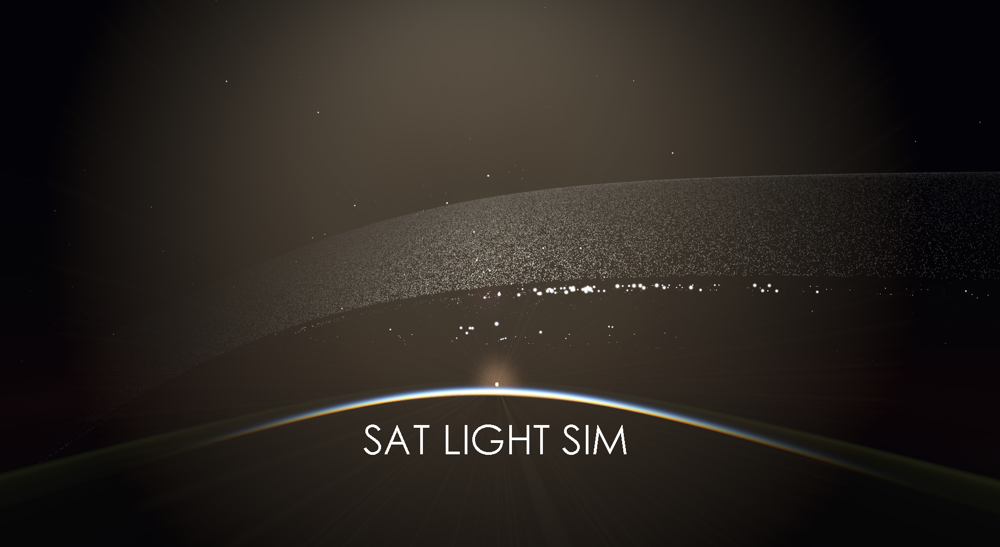

# SAT LIGHT SIM

A real-time GPU visualization of future satellite megaconstellations, seen from any point near Earth. Physically-based photometry, atmospheric scattering, volumetric clouds, terrain, ocean,
aurora, all rendered through Vulkan.


---


  


---

## Prerequisites

| Dependency | Notes |
|------------|-------|
| [Vulkan SDK](https://vulkan.lunarg.com/) | Sets `VULKAN_SDK`. On macOS/Linux run its `setup-env.sh` |
| CMake 3.20+ | `winget install Kitware.CMake` / `brew install cmake` / distro package |
| Visual Studio 2022 (Windows) | C++20 + MSBuild |
| Xcode Command Line Tools (macOS) | Clang + the macOS SDK |

GLFW, GLM, Clay (UI), stb (fonts/images), miniaudio, and nlohmann/json are fetched automatically at
configure time via CMake FetchContent.

Nothing machine-specific is committed: `VULKAN_SDK` and `cmake` are found through the environment
and `PATH`. Per-developer overrides belong in `CMakeUserPresets.json` (gitignored), never in
`CMakePresets.json` or `.vscode/`.

---

## Build

```bash
cmake -B build -S .
cmake --build build
```

Or open the folder in **VS Code** with the CMake Tools extension — **F5** to build + debug, **F7**
to build only.

Shaders are auto-detected by CMake, compiled by `glslc`, and copied next to the executable. No
manual shader step needed. The built executable is named `SAT_LIGHT_SIM_V_<version>` (tracks the
`VERSION` file), e.g. `build/Debug/SAT_LIGHT_SIM_V_1_1_0.exe`.

### Presets (CMake 3.21+)

`CMakePresets.json` carries the per-platform configurations, so no flags need remembering:

```bash
cmake --preset windows                  # or: linux / macos
cmake --build --preset windows
```

### Release packaging

```bash
cmake --preset windows-release
cmake --build --preset windows-release --parallel
cmake --build --preset windows-package     # → dist/SAT_LIGHT_SIM_v<ver>_Windows.zip
```

`release.bat` wraps the Windows and (via WSL) Linux legs of that. The `package-release` target
stages exactly what ships — the copy list lives once in `cmake/PackageRelease.cmake`, and CI uses
the same target, so a local archive and a tagged release have identical layouts.

macOS builds are produced by GitHub Actions as a **universal binary** (arm64 + x86_64, deployment
target 11.0) — push a `vX.Y.Z` tag. Packaging on macOS also bundles the Vulkan loader + MoltenVK
and writes a launcher `.command`, since macOS has no system Vulkan.

---


## Constellations

Fully moddable via `constellations.json` next to the executable. The JSON Schema that ships with it
(`constellations.schema.json`) is the field reference — VS Code gives autocomplete off it — and
`data/custom/` holds worked examples (a legacy two-surface type, its explicit `attitude_groups` twin,
a gimbaled-wing V2 Mini, a minimal ~124k roster, stress rosters). Every launch also writes
`satellite_types_resolved.json` to the user data folder: each loaded type in explicit form, pasteable
straight back into `constellations.json`.

The prose guide is **`docs/CONSTELLATION_MODDING.md`** — types (legacy two-surface and geometry
models), attitude groups, materials and presets, orbital shells, limits and a troubleshooting table.

---

## Project structure

```
src/
├── main.cpp                    ← pick simulation here (one line)
├── App.h / App.cpp             ← window + frame loop (drawFrame order)
├── VulkanContext.h / .cpp      ← Vulkan boilerplate + helpers (device limits, blit filter)
├── Simulation.h                ← abstract base class
├── UIRenderer.h / .cpp         ← Clay UI → Vulkan pipeline (text/icons/UIImage elements)
├── AudioSystem.h / .cpp        ← miniaudio wrapper
├── Log.h / .cpp                ← log file (satlight_log.txt) next to the exe
├── Paths.h / .cpp              ← exe dir / user data dir resolution
├── Camera3D.h                  ← camera basis (ground, orbital, follow/free)
└── simulations/
    ├── SatelliteSim.h/.cpp/SatelliteSimUI.cpp  ← primary simulation (this project)
    ├── SatModel.h/.cpp         ← geometry models, materials, attitude tree (lighting Phase 3)
    ├── SatPhotometry.h/.cpp    ← CPU photometric evaluator (lobes, magnitudes, occlusion)
    ├── SatMesh.h/.cpp          ← render tessellation built from a SatModel (Phase 4b)
    ├── SatMeshRenderer.h/.cpp  ← mesh scene pass, model viewer, mesh bloom (Phase 4c-4f)
    ├── SatEnvProbes.h/.cpp     ← cube probes: mesh reflections + SH ambient (Phase 4c)
    ├── SatBench.h/.cpp         ← simulate a published photometry campaign (benchmarks M5)
    ├── SatBenchmark.h/.cpp     ← benchmark dataset loading (data/benchmarks/)
    ├── SatTrace.h/.cpp         ← satellite-light-sim-trace/1 CSV in/out (M9)
    ├── star_catalog.h          ← generated BSC5 table (mag <= 6.5, 8404 entries)
    ├── GameOfLife.h / .cpp     ← Conway's Game of Life (legacy)
    ├── Particles.h / .cpp      ← GPU particle system (legacy)
    └── Scene3DDemo.h / .cpp    ← 3D mesh + SDF rendering (legacy, uses src/Scene3D.*)
shaders/
    sat_orbit.comp               ← GPU orbital mechanics + attitude + occluders + candidate list
    sat_flare.comp               ← photometry compute: visibility, sprite size, glow histogram
    scene_depth.comp             ← shared terrain/ocean/mesh depth buffer (half-res, R32F)
    cloud_march.comp             ← half-res volumetric clouds/cirrus/aurora/airglow
    beam_self_march.comp         ← Reflect Orbital beam cloud occlusion (per beam)
    sat_point.vert/frag          ← satellite point sprites (additive blend)
    sat_sky.vert/frag            ← sky background: atmosphere + terrain + ocean + sun + moon
                                   (+ mesh composite, Phase 4c) — build variants:
                                   -DSKY_LITE (Planetarium) and -DSKY_ENV (env probes)
    sat_sky_minimal.frag         ← Potato-tier closed-form sky (own file, ~60 FPS on GCN1)
    sat_mesh.vert/frag           ← satellite mesh surface, depth and scene variants
    sat_mesh_bg.vert/frag        ← model viewer's sky background (SKY_ENV render)
    mesh_bloom.frag              ← mesh over-white → flare-source bloom seed
    glare.vert/frag              ← per-satellite glare sprite (sharp rays)
    glare_find.comp              ← lists mesh glints for glare_mesh.vert/frag
    env_probe_sh.comp            ← cube-probe SH irradiance
    star_point.vert/frag         ← star catalog + planet points
    trail_*                      ← long-exposure trail splat / fade / composite
    flare_source/blur/composite  ← render-to-texture lens flare pipeline
    ui.vert/frag                 ← Clay UI quads + text + icons
    include/                     ← shared GLSL headers (common, terrain, cloud_params, depth,
                                   darksky, earth_env, glare, glint_list, point_style,
                                   reflect_beam, sat_mesh_common, atmosphere)
data/
    constellations.json           ← satellite types + constellation definitions (moddable)
    constellations.schema.json    ← JSON Schema for the above (autocomplete + validation)
    satellite_models/<id>.json    ← geometry models referenced by "model": "<id>" (shipped)
    reflector_targets.json        ← real solar-farm sites for Reflect Orbital mirrors
    benchmarks/                   ← published photometry datasets + KNOWN_RESIDUALS.md
    custom/                       ← example / stress rosters (source tree only, not shipped)
assets/
    textures/                    ← Earth day/night/elevation/clouds, moon, Milky Way
    noise/                       ← tiled RGBA noise (cloud/aurora seed)
    sound/                       ← music tracks, flare SFX, UI sounds
    icons/ui/                    ← PNG icon sprites packed into GPU atlas
tools/
    sat_model_tool/              ← SatModelTool: load/bake/validate/OBJ-export models,
                                   selftests, benchmarks, trace replay (EXCLUDE_FROM_ALL)
    check_cloud_params.py        ← GLSL↔C++ CloudParams mirror check (run after touching either)
    parse_bsc.py                 ← regenerates src/simulations/star_catalog.h from BSC5
    benchmarks/, perf_analysis/  ← report plotting / GPU-profile analysis helpers
cmake/
    PackageRelease.cmake          ← the one "what ships" copy list (CI + release.bat drive it)
    AccuracyGate.cmake            ← the photometric gate (SatModelTool selftests + benchmarks)
docs/
    CONSTELLATION_MODDING.md      ← modding guide: types, geometry models, materials, shells
    screenshots/                  ← the images used above
.plans/                           ← local design docs, untracked (CLAUDE.md links to these)
```

AI Code was used in this project.
See `CLAUDE.md` for the full architecture writeup (frame loop order, GPU buffer layouts, subsystem
design notes) and `THIRD_PARTY_NOTICES.txt` for third-party licenses.

---


