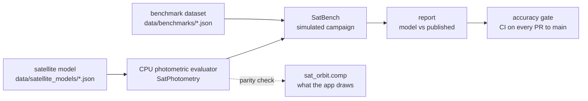

# Accuracy

This section is for a reader who wants to know whether SAT LIGHT SIM's satellite brightness numbers can be
trusted, and how far. It describes what is compared against what, how the comparison is run, the current
results, and where every number in the satellite models comes from. It does not explain the reflectance
model itself; that is [Satellite photometry](../simulation/photometry.md).

## What "accuracy" means here

The quantity under test is the **apparent visual magnitude** of a satellite seen from the ground, the number
an observer would write down. Published observation campaigns report it in one standard form, the
**1000-km magnitude** \( m_{1000} \): the above-atmosphere magnitude \( m \) at range \( r \), reduced to a
common distance by the inverse-square law,

\[
m_{1000} = m - 5 \log_{10}\!\left(\frac{r}{1000\ \text{km}}\right).
\]

Removing the range this way leaves the dependence on geometry (the phase angle, the satellite's attitude
relative to Sun and observer) and on the satellite's surfaces, which is what a brightness model has to get
right. The simulator's own magnitudes follow the same convention: \( m = -26.74 - 2.5\log_{10}(I/r^2) \),
where \( I \) is the satellite's radiant intensity per unit solar irradiance (m² sr⁻¹) and \(-26.74\) is the
Sun's V magnitude at 1 AU. A satellite with \( I/r^2 = 10^{-12} \) is magnitude 3.26; one seen at
magnitude 5.92 from 550 km has \( m_{1000} = 7.218 \). Both values are checked by the self-tests.

Accuracy is therefore a statement about **populations**, not single passes: "over the geometries the
observers actually saw, the model's mean \( m_{1000} \) is within 0.3 mag of theirs". No published dataset
gives the attitude of an individual satellite at the instant it was measured, so a per-pass comparison
cannot be made honestly.

## The chain of evidence

1. **Model.** Each satellite is a geometry model: primitives with materials, mounted on attitude groups
   that point at the Sun, nadir or a ground site. Every part carries a provenance entry saying whether its
   numbers are sourced, derived, estimated or calibrated. See [Model provenance](provenance.md) and
   [Satellite models](../modding/satellite-models.md).
2. **Evaluator.** `evalSatPhotometry()` computes one satellite's magnitude at one instant in double
   precision: closed-form orbit, attitude, facet lobes, Earth shadow, earthshine and occlusion between
   parts. It is the CPU mirror of the GPU shader that lights the satellites the app draws, and the only
   code that produces a number for measurement.
3. **Benchmark dataset.** A published campaign transcribed into a JSON file: the paper's printed statistics,
   how the observations were taken, and the observations themselves when the paper lists them. A file is
   only trusted once its own rows reproduce its printed statistics. See [Benchmark datasets](benchmarks.md).
4. **SatBench.** Simulates the campaign: draws observing sites, twilight times and satellites of the shell
   the way the observers did, evaluates each with the evaluator, applies the paper's censoring rule, and
   summarises the result the way the paper summarised its data. See
   [SatBench and the accuracy gate](satbench.md).
5. **Gate.** The `accuracy-gate` build target runs every model's self-tests and every benchmark, and fails if
   any gated metric leaves its tolerance. CI runs it on pushes and pull requests to `main`.

The accepted gaps that remain are listed with their causes in
[Results and known residuals](results.md).

## What is validated, and what is not

| Claim | Status | How |
|---|---|---|
| Mean \( m_{1000} \) of eight satellite designs against published campaigns | seven within 0.3 mag; one (Guowang) known to miss and not gated | SatBench + gate, [Results](results.md) |
| Phase-curve shape of VisorSat | weighted RMS 0.16 mag, but the visor's size is fitted to this curve | per-pass data, phase-curve RMS |
| Difference between two designs (VisorSat minus V1.0) | validated, 1.09 vs 1.29 mag | differential benchmark |
| Evaluator geometry (Sun position, orbit, angles, magnitude conventions) | exact or to almanac precision | `--selftest` known-value checks |
| Facet lobes reproduce per-triangle reflectance | to < 0.001 mag | `--selftest` brute force |
| Occlusion between parts | p95 ≤ 0.17 mag against a ray-cast reference | `--selftest` |
| Earthshine, atmospheric extinction | ≤ 3% of irradiance, ≤ 2% of the column | `--selftest` against brute-force integrals |
| The magnitude the app draws equals the evaluator's | to 0.02 mag, checked every frame for the selection | GPU parity check |
| Scatter (standard deviation) of a population | **not** matched: attitude is fixed, real satellites jitter | reported, not gated |
| Individual passes, flares at a given instant | **not** validated | no data with known attitude |
| Stations, debris, Starlink V3, Reflect Orbital, the AI satellite | **no benchmark**; render-level estimates | provenance lists the estimates |

Three boundaries are worth stating plainly.

**Legacy satellite types are not physical.** A satellite type described by the older two-surface model (a
primary and secondary surface with Phong exponents, no geometry) produces a brightness in tuned display
units. It has no magnitude, cannot be traced or exported, and is outside every check in this section. Only
geometry-model types are measured. The shipped roster flies geometry models throughout.

**Rendering is not photometry.** The mesh a satellite is drawn with when it is close
([Satellite meshes](../rendering/satellite-meshes.md)), its reflections of the environment, the bloom and
glare around its point ([Points, bloom and glare](../rendering/points-bloom-glare.md)) and the display
exposure are all downstream of the magnitude and are not validated by any of this. What is validated is the
magnitude the point sprite is drawn from. The mesh renderer uses the same BRDF and is normalised so that its
total flux matches the lobe model, but only the lobe model is benchmarked.

**The atmosphere and the Earth are simple.** Benchmarks compare above-atmosphere magnitudes, as the papers
do. Earthshine assumes a uniform Lambertian Earth of albedo 0.3 with no clouds, oceans or glint. Satellites
in penumbra are excluded, as the papers exclude them.

## Map of this section

| Page | Contents |
|---|---|
| [Benchmark datasets](benchmarks.md) | the `sat-light-sim-benchmark/1` format, the transcription rule, every dataset |
| [SatBench and the accuracy gate](satbench.md) | campaign simulation, determinism, reports, self-tests, traces, bulk export, the gate and CI |
| [Results and known residuals](results.md) | per-benchmark numbers, pass/fail margins, accepted residuals and their causes |
| [Model provenance](provenance.md) | the `sources` block, every shipped model's confidence, what is calibrated against what |

## Where in the code

- `src/simulations/SatPhotometry.h/.cpp`: the CPU evaluator, earthshine, extinction, time and frames.
- `src/simulations/SatBenchmark.h/.cpp`: loading and checking benchmark files.
- `src/simulations/SatBench.h/.cpp`: campaign simulation, the samples CSV, bulk export.
- `src/simulations/SatTrace.h/.cpp`: magnitude traces and their CSV.
- `tools/sat_model_tool/`: `SatModelTool`, the command-line front end (`main.cpp`, `bench_run.cpp`).
- `cmake/AccuracyGate.cmake`: the list of gated checks.
- `data/benchmarks/`: the datasets and `KNOWN_RESIDUALS.md`.
