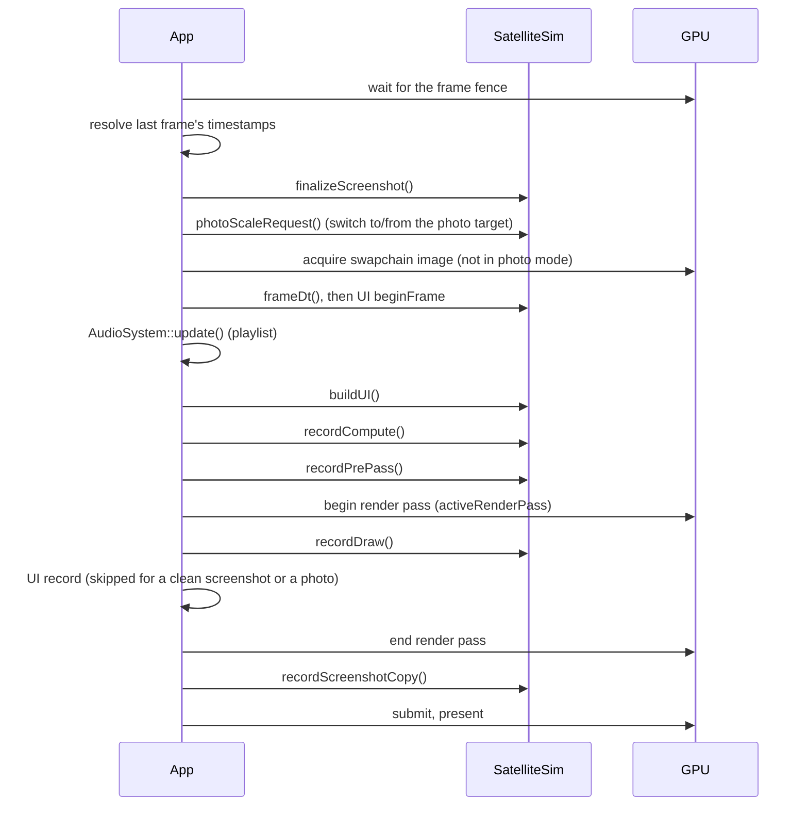

# Code architecture

How the C++ code is organised: the three layers, the interface a simulation implements, what happens in one
frame, how SatelliteSim is split across files, the loading screen, and which work runs off the main thread.
The rendering passes themselves (what each shader computes and in what order) are described in
[Rendering](../rendering/index.md).

## Three layers

| Layer | Files | Role | Changes |
|---|---|---|---|
| Platform | `src/VulkanContext.h/.cpp` | instance, device, swapchain, render passes, depth buffer, command buffer, sync objects, timestamp queries, pipeline cache, and small helpers | rarely |
| Framework | `src/App.h/.cpp`, `src/Simulation.h`, `src/UIRenderer.h/.cpp`, `src/AudioSystem.h/.cpp`, `src/Harness.h/.cpp`, `src/Log`, `src/Paths` | the window, the frame loop, UI rendering, audio, the harness's command language | occasionally |
| Simulation | `src/simulations/SatelliteSim*` and its helpers | everything the app actually does | constantly |

`main.cpp` parses the harness flags (they decide where logs and settings live), initialises the log, changes
the working directory to the executable's directory (assets are loaded with relative paths), and constructs
`App` with one `Simulation`. Switching simulations is a one-line change there.

`Paths::exeDir()` is where the read-only game data lives. `Paths::userDataDir()` is where settings, logs,
snapshots, caches and exports are written: the executable's directory when it is writable (a portable,
self-contained install), otherwise the per-user directory (`%APPDATA%\SatLightSim` on Windows,
`$XDG_DATA_HOME/SatLightSim` or `~/.local/share/SatLightSim` on Linux,
`~/Library/Application Support/SatLightSim` on macOS). A harness run overrides it with its own run folder.

## The `Simulation` interface

`src/Simulation.h` is the contract between `App` and a simulation. The main hooks:

| Hook | Called | Purpose |
|---|---|---|
| `init(ctx)` | once, after Vulkan is ready | create every GPU resource |
| `onResize(ctx)` | after a swapchain rebuild or a switch to or from the photo target | rebuild what depends on the extent (graphics pipelines bake the viewport; compute pipelines do not) |
| `buildUI(dt, ui)` | every frame, between `UIRenderer::beginFrame()` and `record()` | declare the Clay layout; read input |
| `recordCompute(cmd, ctx, dt)` | every frame, before the render pass | simulation update and all compute and offscreen work |
| `recordPrePass(cmd, ctx, dt, imgIdx)` | after compute, before the render pass | offscreen work blitted into the swapchain image |
| `activeRenderPass(ctx)` | before the render pass | `ctx.renderPass` (clears colour) or `ctx.renderPassLoad` (keeps what the pre-pass blitted) |
| `recordDraw(cmd, ctx, dt)` | inside the main render pass | the scene's draws; `App` owns begin and end |
| `recordScreenshotCopy(cmd, ctx, image)` | after the render pass ends | copy the finished frame to a staging buffer if a screenshot is pending |
| `finalizeScreenshot()` | after the next frame's fence wait | read that staging buffer back |
| `photoScaleRequest()` | each frame | a factor > 0 makes `App` render into an offscreen target that many times the window size |
| `onKey`, `onChar`, `onCursorPos`, `capturesKeyboard()` | input callbacks | `capturesKeyboard()` true keeps `App` from closing the window on Esc |
| `setAudio(audio)`, `setWindow(window)` | once after init | |
| `frameDt(realDt)`, `wantsQuit()` | each frame | harness hooks: a fixed time step, and leaving the loop when a script ends |
| `virtualCursor(x, y, lmb)` | before `beginFrame()` | the gamepad's virtual cursor overrides the mouse for the UI pass |
| `targetFpsCap()`, `consumeSwapchainRebuildRequest()` | each frame | frame limiter and present-mode changes |
| `setBootStatus()` / `bootStatus(line)` | during `init()` | the loading screen ([below](#the-loading-screen)) |

## One frame

There is **one command buffer and one frame in flight**. `App::drawFrame()` waits on the frame fence at the
top, so everything the previous frame wrote is complete and readable on the CPU at that point: timestamp
queries, screenshot copies and host-visible readback buffers are all read there or later in the frame.

In SatelliteSim:

- **`buildUI()`** starts by publishing the previous frame's CPU timings (`beginCpuFrameTiming()`), then runs
  the harness (`harnessTick()`) and the cinematic player (`cineTick()`), so a scripted command's effect is in
  the frame it ran in. Then it builds the HUD and windows and handles camera look and picking.
- **`recordCompute()`** reads last frame's GPU timings, polls the gamepad, applies movement, advances sim
  time and updates the Sun, Moon, observer frame, stars, planets and ambience on the CPU. It then records the
  GPU work: the satellite mesh pass, the shared scene-depth pass, the orbit and photometry compute passes, the
  cloud passes, the flare and glare passes, trails and the model viewer. The order and the data flow are on
  [Rendering](../rendering/index.md).
- **`recordPrePass()`** renders the background offscreen when it needs to (temporal anti-aliasing, or a render
  scale below 100%) and blits it into the swapchain image.
- **`recordDraw()`** draws the background (sky, terrain, sea, cloud composite), then satellite points, stars,
  planets, the bloom composite, glare and trails.

`App` writes GPU timestamp slots 0 (frame start), 7 (after `recordDraw()`) and 8 (after the UI); SatelliteSim
writes slots 1 to 6. The slot table lives in `VulkanContext.h`; see [Profiling](profiling.md#gpu-timestamp-buckets).

While the HQ photo target is active, `App` neither acquires nor presents. A few times a second it presents a
progress frame instead (`App::photoProgressFrame()`): it blits the photo image down into a swapchain image and
draws the UI over it, so a long export shows progress rather than a frozen window.

## SatelliteSim's files

`SatelliteSim` is one class (`src/simulations/SatelliteSim.h`) whose member functions are spread over several
source files by subject:

| File | Owns |
|---|---|
| `SatelliteSim.cpp` | `init()` and resource creation, texture loading, `recordCompute()`, `recordPrePass()`, `recordDraw()`, positions, beams readback, the playlist (`setAudio()`), screenshots and photos, key handling |
| `SatelliteSimUI.cpp` | all Clay UI: HUD panels, the tabbed settings window, the satellite info and 3D view windows, text fields; settings persistence (`loadSettings()`, `applySettingsJson()`, `buildSettingsJson()`); graphics presets; perf snapshots and the knockout sweep |
| `SatelliteSimCloudsV2.cpp` | the volumetric clouds: init-time noise and weather bakes, the clouds UBO, the per-frame cloud passes, weather evolution |
| `SatelliteSimHarness.cpp` | every harness command (`harnessExec()`), the state JSON written beside captures, the console |
| `SatelliteSimAmbience.cpp` | the ambience's context drivers, tonality, thunder, the music fades ([Sound](../sound/index.md)) |
| `SatelliteSimCinematic.cpp` | cinematic playback and export |
| `SatelliteSimTutorial.cpp` | the first-run tutorial |
| `UIPalette.h` | the UI colour palette shared by the UI files |

Helpers with their own classes: `SatModel` (geometry, materials, attitude, lobe bake), `SatPhotometry` (the CPU
photometric evaluator), `SatMesh` / `SatMeshRenderer` / `SatEnvProbes` (satellite meshes, the model viewer,
environment probes), `SatBench` / `SatBenchmark` / `SatTrace` (benchmarking and traces), `Ambience`,
`Cinematic`. `SatModel`, `SatPhotometry`, `SatBenchmark`, `SatBench` and `SatTrace` have no Vulkan
dependency, which is what lets `SatModelTool` compile them without the app.

## The loading screen

Initialisation takes seconds (textures, satellite models, noise bakes, pipelines). Instead of a blank window,
`App::run()` creates the UI **before** `init()`, with its pipeline built against `ctx.renderPassBoot`, a third
variant of the main render pass with the same attachment formats (so it works with the same framebuffers).
It installs a callback with `setBootStatus()`. SatelliteSim calls `bootStatus("<step>")` before each step of
`init()` (and per texture and per satellite model); each call appends a line, logs
`boot: <step> (<ms since launch>)` to `satlight_log.txt` and presents one frame (`App::bootFrame()`).

!!! warning "Invariant"
    `bootStatus()` presents a frame, so it may only be called from the main thread during `init()`.

After `init()`, `App` waits for the device to go idle and then rebuilds the UI pipeline against
`ctx.renderPass` (`UIRenderer::rebuildPipeline()`). The wait matters: the last loading frame may still be
executing with the old pipeline, and destroying a pipeline a pending command buffer uses is undefined.

Boot frames reuse the frame loop's command buffer, fence and semaphores but never touch the timestamp slots.
Key and cursor callbacks are ignored until `init()` returns (Esc still closes the window); a resize during
`init()` is deferred to one `onResize()` after it. Text fades on a perceptual curve (alpha =
brightness^2.2), because the UI blends linearly into an sRGB swapchain. Setting the environment variable
`SATLIGHTSIM_BOOT_SCREEN=0` restores a plain launch with no loading screen.

The `boot:` lines in the log are the first place to look when startup slows down.

## The pipeline cache

`VulkanContext` keeps its own pipeline cache, `pipeline_cache.bin`, next to the executable (or in the user
data folder if that is not writable). Every `vkCreate*Pipelines` call passes `ctx.pipelineCache`. It is loaded
at device creation, saved right after `init()` (so a crash or a killed run keeps what init compiled) and at
exit, and discarded once it passes 256 MB. The driver's own cache has a size cap shared by every build of the
app; once it is full, every launch would recompile every changed shader. With the app's cache a warm start is
a few seconds.

`VK_PIPELINE_CREATE_CAPTURE_STATISTICS_BIT_KHR` is requested only during the harness's `shaders reload`
(`ctx.capturePipelineStats`), because it keeps a pipeline out of the caches.

## Threads

The renderer and the simulation run on the main thread. Work moved off it:

| Thread | Work |
|---|---|
| miniaudio's audio thread | mixing; synth voices render there and read their parameters once per 64-frame block |
| music analysis worker (`music::Library`) | analyses the soundtrack at startup, cache first; synchronous in a harness run so the key is deterministic |
| bulk export worker | the photometry bulk export (Settings, Photometry tab), over snapshots of the type and orbit data |
| screenshot encoder | PNG encoding of a screenshot or capture; the next `finalizeScreenshot()` joins the previous encode |
| `parallelFor()` | short-lived threads that evaluate the satellite mesh instances' photometry and poses each frame |
| harness watchdog | hard-exits a harness run past its `--timeout` |

## Where in the code

| File | What |
|---|---|
| `src/main.cpp` | flag parsing, log, working directory, simulation choice |
| `src/App.cpp` | `run()`, `drawFrame()`, `bootFrame()`, `bootStatus()`, `photoProgressFrame()`, GLFW callbacks |
| `src/Simulation.h` | the interface |
| `src/VulkanContext.h/.cpp` | platform layer, timestamp slots, `beginPhotoTarget()`, pipeline cache |
| `src/Paths.cpp` | `exeDir()`, `userDataDir()` |
| `src/simulations/SatelliteSim.h` | the class, all members and GPU struct mirrors |
