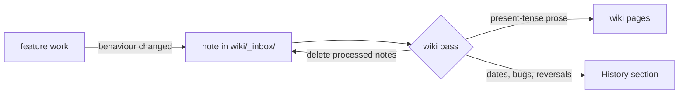

# Working on this wiki

The wiki is the project's maintained reference. It is written in passes, not edited a sentence at a time
alongside every code change. During development you leave short **notes**; a **wiki pass** later folds them
into the pages as finished prose. This keeps pages from turning into changelogs.



## Layout

| Path | What |
|---|---|
| `mkdocs.yml` | site config and the **nav**: every page must be listed here |
| `wiki/` | the pages (published) |
| `wiki/_inbox/` | pending notes (committed, **not** published) |
| `wiki/history/` | the only place for dates, bugs, reversals and version history |
| `tools/wiki/check.py` | strict build + history-leak lint + inbox report |
| `.github/workflows/wiki.yml` | builds on every push; deploys to GitHub Pages on manual dispatch |

## Previewing

```bash
python -m venv tools/wiki/.venv
tools/wiki/.venv/Scripts/pip install -r tools/wiki/requirements.txt   # bin/pip on Linux/macOS
tools/wiki/.venv/Scripts/mkdocs serve                                 # http://127.0.0.1:8000, live reload
tools/wiki/.venv/Scripts/python tools/wiki/check.py                   # what CI runs
```

## Notes: recording a change during development

Write a note when a change alters something a wiki page describes or should describe: behaviour, a
technique, a file format, a setting, a default, a measured accuracy number. Pure refactors and fixes that
restore documented behaviour don't need one.

One file per change: `wiki/_inbox/YYYY-MM-DD-<slug>.md`.

```markdown
---
pages: [rendering/sea.md, using/graphics-settings.md]   # pages to update ("new: <path>" for a new page)
code: [shaders/sat_sky.frag, src/simulations/SatelliteSim.cpp]
---
## Now
The Sun glint on the sea is a Beckmann microfacet lobe whose slope variance is Cox & Munk's
(0.003 + 0.00512 W) plus the slope the footprint filter removed. New slider "Far sea ripple"
(`clouds.ocean_far_ripple`, default 1).

## History (optional)
Replaced a Phong lobe that narrowed as waves were filtered, which removed the glitter path.
```

**Now** is written in the present tense: it is raw material for the page. **History** is optional and
goes to [Design notes](../history/design-notes.md) or [Known issues](../history/known-issues.md) at the next pass.
Notes are cheap: two or three sentences is usual. Several notes may touch the same page; the pass merges them.

The `wiki-note` Claude Code skill writes these notes.

## Wiki passes: folding notes into the pages

A pass is a dedicated session (the `wiki-pass` skill), run when the inbox has built up, before a release,
or when a page is visibly stale. For each affected page:

1. Read every note that names it, then **read the code** the notes point to. The code is the authority.
2. Rewrite the affected sections as finished prose that follows the [style guide](style-guide.md). Rewrite
   the section; don't append a paragraph. Remove anything the change made untrue.
3. Move the History parts into `history/design-notes.md` (dated, under the subsystem's heading) or
   `history/known-issues.md`.
4. Delete the processed notes.
5. Run `tools/wiki/check.py`. It must pass: strict build, no history leaks, every page in the nav.

A pass is also the time to check whole pages against the code, not only the parts the notes touch.

## Releases

Before a version is tagged, run a wiki pass so the inbox is empty, then deploy (Actions → *wiki* → Run
workflow). `history/changelog.md` includes `CHANGELOG.md` directly, so keep writing the changelog there.
