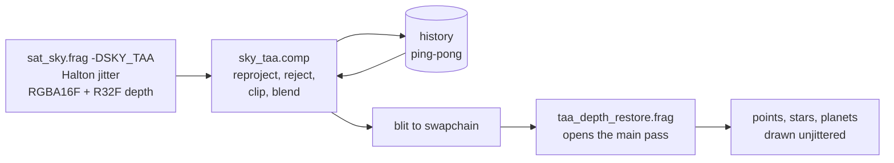

# Atmosphere and sky

`shaders/sat_sky.frag` draws one fullscreen triangle and produces the background of the frame: atmosphere,
terrain, sea, satellite meshes, clouds, Sun, Moon, Milky Way and zodiacal light, tonemapped. It is also the
**compositor**: it reads the results of every earlier pass and writes the unified depth that point sources are
tested against. This page follows `main()` in order. Terrain, sea, clouds, aurora and the Moon have their own
pages; here they appear only where the sky pass consumes them.

## Inputs

- **Push constant** `SatDrawPC` (exactly 128 bytes): the camera matrix, field of view, aspect, GMST, wave
  time, the Sun and Moon directions in observer ENU, and the observer's ECEF direction plus height offset.
- **`CloudParams` UBO** (binding 9): every other per-frame uniform, including the knockout mask, the sky
  render-target size, the exposure scale and the eclipse geometry.
- **Results of earlier passes:**

| Binding | From | Holds |
|---|---|---|
| 0 | `sat_flare.comp` | the 64-bin satellite sky-glow histogram |
| 10 / 11 | `cloud_march.comp` | `cloudTargetA` (cloud light, signed-km distance) / `cloudTargetB` (transmittance, ground shadow), ½ res |
| 19 | `scene_depth.comp` | `sceneDepthTex`, ½ res, metres |
| 20 | `sat_flare.comp` | the ocean-glint list |
| 21 | CPU | Reflect-beam ground spots and solar park sites |
| 22 / 23 | mesh scene pass | mesh radiance / distance, full res (`imageLoad`) |
| 26 | `scene_depth.comp` | `terrainFrame.x`, the eye's detailed ground height |
| 29 | `cloud_v2_far.comp` | the far cloud layer, full res (`imageLoad`) |

"½ res" means half of the render-scaled extent (see [Resolution scaling](#resolution-scaling)). The
sampled-image bindings sit exactly at the Vulkan per-stage minimum of 16 (see
[Weak-hardware tiers](hardware-tiers.md#the-hardware-floor)), which is why the newer full-resolution inputs are
storage images read with `imageLoad`.

## The ray and the first surface

1. **View direction.** The interpolated, unnormalised ENU direction from `sat_sky.vert`. Under `SKY_TAA` it
   is offset by the frame's sub-pixel jitter through its screen derivatives, which are exact because the ray
   varies linearly across the fullscreen triangle.
2. **Eye.** `obsEffH = terrainFrame.x`, the same detailed ground every pass uses; the eye is 2 m above it.
3. **Terrain.** The full-resolution terrain march, seeded from `sceneDepthTex`, gives `tSurface`
   (see [Terrain](terrain.md)); a ray that misses falls through to the sea-level sphere and the water test
   (see [The sea](sea.md)).
4. **Mesh.** `tMesh` from the full-resolution mesh distance. If it is nearer than the terrain or sea,
   `tSurface = tMesh`: from here on the atmosphere loop, every disc gate and the depth stop at the mesh.

## Reading the clouds

The half-resolution cloud targets are read **before** the atmosphere loop, because the loop needs to know where
the cloud is. The cloud pipeline itself is on [The cloud march](clouds/march.md) and
[Temporal resolve and the far layer](clouds/temporal.md).

**Upsampling.** A bilinear tap at the pixel's UV. The clouds' temporal resolve already anti-aliases their
silhouettes, so nothing is blurred. Where a **surface** edge crosses the half-res grid (the log depth range
over the 2×2 texels exceeds 0.1), the colour is re-averaged joint-bilaterally:

\[
w_k = b_k \, \exp\!\left(-6\,\left|\ln d_k - \ln t_\text{surface}\right|\right)
\]

with \(b_k\) the bilinear weight and \(d_k\) the half-res scene depth of texel k. A ridge against cloud then
keeps the full-resolution silhouette instead of half-res stair-steps.

**Far cloud layer.** Above about 600 km of eye altitude the far layer is blended behind the half-res
composite by `farBlend`:

```glsl
cloudA.rgb += farBlend * L_far * cloudB.rgb;
cloudB.rgb *= mix(1.0, T_far, farBlend);
```

**Distances.** The target's alpha is a signed distance in **kilometres** (`include/cloud_occlusion.glsl`):
≥ 0 is an opaque cloud, < 0 the transmittance-weighted mean distance of translucent cloud.

- `tCloudOcclude` is the opaque distance (or −1). It gates the Sun and Moon discs and feeds the depth.
- `tAirFrontM`, the **air split**, is where the air "in front of" the cloud ends: the four gathered texels'
  distances weighted by bilinear share × opacity, ignoring texels with no real distance, falling back to the
  nearest real cloud. A far-layer share uses the far sphere's distance.
- `tCloudFrontM` is the nearest real cloud, for the city glow split.

## The atmosphere: single scattering

**Range.** From the ray's **entry** into the atmosphere (`tStart`, 0 from inside it) to
`min(atmosphere exit, tSurface)`. The atmosphere is a shell 100 km thick (`R_ATMOS`). Starting at the entry
matters from orbit, where nearly every step from the eye would fall in vacuum; measured at 2000 km it cut the
sky pass from 16.5 ms to 4.9 ms with images within about 1/255.

**Steps.** A uniform midpoint march whose step length is held at about \(100\,\text{km}/N_\text{min}\):

\[
N_\text{VIEW} = \operatorname{clamp}\!\left(\left\lceil \frac{t_\text{end} - t_\text{start}}{100\,\text{km} / N_\text{min}} \right\rceil,\ N_\text{min},\ N_\text{max}\right)
\]

A grazing ray therefore gets more steps than a steep one from the same altitude, instead of a coarser step.
The Sun's column at each step comes from `optDepth()`, a midpoint march of `N_LIGHT` ("Light samples") steps
to the atmosphere boundary.

**Media.** Rayleigh with \(\beta_R = (5.8, 13.5, 33.1) \times 10^{-6}\,\text{m}^{-1}\), scale height 7994 m,
phase \(\tfrac34(1+\cos^2\theta)\). Mie with \(\beta_M = 2.1 \times 10^{-5}\,\text{m}^{-1}\), scale height 1200 m,
Cornette-Shanks phase with g = 0.26, and extinction 1.1 × scattering for aerosol absorption. Both coefficients
are multiplied by the "Rayleigh gain" and "Mie/haze gain" sliders. The sky march has no ozone term (the
clouds' sun path and the eclipse sky light do).

Per step, with \(\tau_\text{cam}\) the column back to the eye:

- **Sunlit sample** (the Sun is not behind the Earth from it):
  \( a = \exp(-[\beta_R(\tau^R_\text{cam} + \tau^R_\text{sun}) + 1.1\beta_M(\tau^M_\text{cam} + \tau^M_\text{sun})]) \),
  accumulated into Rayleigh and Mie in-scatter weighted by the local densities, then multiplied by:
    - the **orbital terminator gate**, above 40 km of eye altitude only, weighted by the sample's own
      geographic Sun elevation. It is a deliberate tone-mapping correction rather than physics: the twilight
      tail of the scattering integral is correct but survives the tonemap far more visibly than in orbital
      photographs. Daylit samples are untouched.
    - the **cloud-hidden Sun**: `cloud.sunCloudT` (the eye's transmittance toward the Sun) for air below
      8-14 km, within about 50 km along the ray and about 3 km of the eye's line to the Sun. One cumulus in
      front of the Sun must not darken the whole sky, but under a storm the haze's forward peak must not draw
      a bright Sun-shaped glow where the disc is hidden.
    - the **eclipse**: see [Moon and eclipses](moon-and-eclipses.md#the-sky-in-the-moons-shadow).
- **Sample in the Earth's shadow**: accumulated as *shadowed air* instead. After the loop it is lit as
  isotropic in-scatter of half the zenith sky's radiance at its density-weighted mean point
  (`skyZenithSky()`), faded over the first few degrees of Sun depression there. Single scattering alone leaves
  the air beyond the terminator black, and the horizon facing away from a just-set Sun would read as a dark
  band. Off from orbit, where the terminator gate owns the twilight air.
- **City glow**: the night map under the sample, attenuated toward the eye.
- **Airglow**: the green (96 km) and sodium (90 km) bands, gated by the sample's own geographic night. The red
  band is marched at half resolution in `cloud_march.comp`. See [Aurora and airglow](aurora-airglow.md).
- **Front copies**: the share of each step in front of `tAirFrontM` also goes to separate "front"
  accumulators, and the city glow in front of the nearest cloud to `accumCityFront`.

After the loop:

```glsl
color    = pR*βR*accumR + pM*βM*accumM + shadowed-air term + city dome + airglow + ...
airFront = pR*βR*accumRF + pM*βM*accumMF + shadowed-air front term
cityGlowFront = (city glow in front of the nearest cloud) * smoothstep(40 km, 150 km, tCloudFront)
```

`color` holds the air along the **whole** path to the surface, including the stretch in front of any cloud.

## Surfaces and pre-tonemap terms

In order of `main()`:

- **The Moon's disc**, drawn at its true topocentric position and size and occluded by any surface or opaque
  cloud. See [Moon and eclipses](moon-and-eclipses.md).
- **Satellite sky glow.** The 64 bins of `sat_flare.comp`'s histogram (8 azimuth sectors × 8 elevation bands,
  each holding the brightest satellite in it) are drawn as wide Gaussians (σ = 0.9 rad). Each is weighted by
  the **smaller** of two air columns: along the pixel's ray, and between the eye and the bin's direction (from
  the eye's height, or the tangent height of a downward path, Chapman airmass capped at about 35). The glow is
  the satellite's light scattered by that air; weighting by the pixel's ray alone would light the whole limb
  around every bright satellite seen from 40 km up. Knockout bit 65536 skips the loop.
- **The surface**: land or sea shading × \(\exp(-\tau_\text{cam})\). A mesh pixel adds the mesh radiance × the
  same transmittance. Reflect-beam ground spots are part of the surface shading.
- **Flat 2D cloud layers** (`evalCloudLayer()`). In the main view these draw only when the volumetric march is
  knocked out (bit 32768). They are the clouds of environment probes, sharp reflections, SKY_LITE and Potato,
  read from the same evolving weather cube the volumetric clouds are built from.

## The cloud composite

```glsl
if (meshHit && abs(cloudA.a) * 1000.0 > tMesh) { cloudB.rgb = vec3(1.0); cloudA.rgb = vec3(0.0); }
color = color * cloudB.rgb + cloudA.rgb + (cityGlowFront + airFront) * (1.0 - cloudB.rgb);
```

Reading it:

- `color · B` attenuates everything behind the cloud: the surface, and the air **including** the stretch in
  front of the cloud.
- `airFront · (1 − B)` puts that front stretch back, so it ends up unattenuated, as it should be.
- `cloudA.rgb` is the cloud's own light, already attenuated by the air in front of it, plus everything else
  `cloud_march.comp` carries: aurora, red airglow, lightning, rain drops, beam shafts and lines.

**Why split the air this way.** The cloud march outputs no airlight of its own. The air in front of a cloud is
the sky pass's own integral, so a cloud on the horizon sits in exactly the same haze as the clear sky beside
it. A separate airlight in the march reads darker than the sky's at a grazing Sun and turns horizon clouds into
dark silhouettes. The city glow in front of a cloud is kept out of its attenuation for the same reason;
otherwise night clouds along a lit horizon form a black band.

**The mesh test.** The march clamps only to the half-resolution scene depth, which misses a mesh's thin parts
(panels, trusses), and the far layer has no depth test at all. A mesh pixel whose cloud is farther than the
mesh skips the composite.

## Exposure

**The sky's exposure.**

\[
E = \operatorname{mix}(10,\ 1.8,\ \text{dayness}^{0.4}) \cdot 2^{\,\text{EV}},
\qquad \text{EV} = \text{"Exposure (EV)"} + \text{EV}_\text{auto}
\]

with dayness \(= \operatorname{clamp}((\sin \text{el}_\odot + 0.2)/1.2)\). During a solar eclipse dayness is
also multiplied by the share of sky light left at the observer (`moonEclipseSkyObs`, carried as
`cloud.moonMisc.y` = 1 + that share while an eclipse is possible), so the eye adapts as it does at twilight:
totality is shown at about twilight's exposure and the stars come out. The factor \(2^{\text{EV}}\) is the
**global exposure** (`globalExposureEV()`, uploaded as `cloud.exposureScale`). It also scales the point sources
(their reference and limit magnitudes shift by \(2.5 \log_{10} 2^{\text{EV}}\), so stars and satellites dim with
the sky) and every display-space term below. `SatelliteSim::skyExposure()` is the CPU mirror, eclipse term
included, used by the mesh bloom threshold, the environment probes and the post-tonemap terms, so the sky pass
and every other consumer agree on the exposure in and out of an eclipse.

**Auto exposure** (`readExposureMeter()`) is a closed loop on the **displayed** frame:

1. `recordScreenshotCopy()` blits the central 60 % of the presented image to 64 × 36 every frame while auto
   exposure is on; the CPU reads it the next frame.
2. **Near the ground** it steps the offset toward a linear mean luminance of 0.32, darkening harder when more
   than 4 % of pixels clip. It only darkens (down to −3 EV × "Auto exposure (day)") and only by day: full
   control above about 6° of Sun, easing back to 0 at night.
3. **From orbit** (blended in from 100 to 1500 km) it becomes a **spot meter on the lit Earth**: the mean of
   pixels brighter than 0.04, toward 0.47, with clipping counted against the lit pixels only, down to −5 EV,
   gated by lit Earth in view rather than the Sun at the observer. A whole-frame mean counts black space and
   would never darken a small bright Earth.
4. It eases with τ = 0.8 s when darkening and 1.6 s when brightening.

The 0.47 target and the orbit grade below were fitted to Artemis II photographs of the Earth, in which sunlit
cloud is about ten times the open sea in linear light.

## Tonemap and colour

In order, at the end of `main()`:

1. **White balance.** The colour is divided by the colour of sunlight at the observer (the Chapman column of
   both species, luminance-normalised, clamped to 0.4-2.5 per channel), scaled by "White balance" and faded
   out between 11.5° and 1° of Sun. A low Sun's colour is the look; adaptation is for a Sun well up, where
   without it every cloud reads beige. Near the horizon the sunlight's colour swings with altitude, and
   dividing by it would flip the same clouds gold to white as the observer climbs.
2. **Tonemap.** With \(x = E \cdot c\):
   \[ c' = \operatorname{mix}\!\left(1 - e^{-x},\ 1 - \frac{1}{1 + x + x^2/2},\ r\right) \]
   where r is "Highlight roll-off". The second curve equals the first to second order (same toe and
   midtones) but has a long shoulder: at x = 4 it is 0.92 against 0.98, so sunlit cloud and the sky around the
   Sun keep their gradations.
3. **Orbit colour grade.** Weighted by "Orbit colour grade" × a ramp from 30 to 300 km of eye altitude, and
   per pixel by the Sun's elevation at the surface point (or the limb's tangent point), from −6° to +3°:
   \( g = \min(1.16\,c'^{2.2}, 1) \), desaturated 30 %. It applies only on the sunlit Earth: on the night side
   its power curve would crush city light, moonlit cloud, airglow and aurora about tenfold.
4. **Night floor**: a faint bluish lift, `(0.0008, 0.001, 0.002)` × nightness.

## Display-space terms

These are added after the tonemap and multiplied by `cloud.exposureScale`, so they read at a consistent
brightness whatever exposure the HDR scene needed that frame.

### Milky Way

The panorama `milkyWayTex` is read in the galactic frame (`cloud.mwBasisRow*`). Its visibility is the product
of:

- night and the CPU-eased Sun glare gate (`cloud.skyGlareVisibility`), blended toward "no sky" by the eye's
  altitude between 40 and 100 km;
- the **dark-sky gate** (`include/darksky.glsl`): the sky background's surface brightness in this direction
  (light pollution dome, twilight) against this texel's own surface brightness. Because the gate is per texel,
  the faint outer arms drop out as the sky brightens while the core hangs on: a suburban sky makes the Milky
  Way thinner, not uniformly dimmer;
- moonlight (up to 95 %) and a nearby Reflect beam's sky glow (up to 99 %);
- line-of-sight extinction (`atmExtinctionMag()`, shared with satellites and stars);
- the Sun's glare: zero within about 7° of a Sun above the horizon, full beyond about 29°;
- not behind a surface or the Moon's disc;
- cloud transmittance cubed (a "mostly opaque" 0.25 must hide it).

### Zodiacal light and gegenschein

An analytic cone in the ecliptic: an inner fade clear of the solar corona (0.09-0.17 rad), an outer fade at
"zodiacal outer fade" (80°), a Gaussian in ecliptic latitude whose width ("Zodiacal width") narrows with
elongation, plus a dim gegenschein patch (7 % of the cone) opposite the Sun. Its colour is a pale warm white.
Its visibility uses the same gates as the Milky Way except the Sun glare, through the same dark-sky model with
its own surface-brightness anchor (0.01 ↦ 21.6 mag/arcsec²), so it drops out one step earlier on a brightening
sky, as in reality. Cloud transmittance squared.

### Moonlight, Moon glow

A faint moonlit ambient (× the Moon's elevation and light, × the air column), a tight corona at the disc and a
wide diffuse halo, both scaled by the air the ray crosses so they vanish above the atmosphere.

### Sun disc, glare and corona

Drawn when the Sun is above the limb (`limbZ`, the sine of the horizon's depression from the eye's altitude):

- the **disc**, drawn about 1.8 times its true radius for visibility away from the Moon, with colour by
  elevation;
- three stacked **glare** lobes \(\cos^{1800}\), \(\cos^{320}\), \(\cos^{55}\) (σ ≈ 0.024, 0.056, 0.135 rad) that
  bridge the disc to the dim wide **corona**; without them the disc steps straight down to the corona and reads
  as a dark ring after the tonemap;
- the whole term × `min(cloud transmittance, cloud.sunCloudT)` and hidden by any surface or opaque cloud on
  the pixel's own ray (`sunGate`), including the wide corona.

Near the Moon the disc takes its true radius and is hidden under the Moon's disc, the glare and corona follow
the visible share of the Sun, and at totality the solar corona is drawn. See
[Moon and eclipses](moon-and-eclipses.md#solar-eclipses).

### Lens flare

`lensFlare()` draws ghosts and a starburst for the **Sun only**, in screen space. Its visibility is tested at
the Sun's own screen position, not the pixel's: the cloud transmittance there, `cloud.sunCloudT`, the half-res
scene depth (a ridge hides it), and the share of the Sun seen past the Moon. Satellites have no lens flare;
their glow is the bloom and glare of [Points, bloom and glare](points-bloom-glare.md).

## Depth output

```
t = terrain hit, else sea / far-land hit, else opaque cloud distance;  t = min(t, tMesh);  else the Moon's distance
gl_FragDepth = t >= 0 ? sceneDepthFromDistance(t) : 1.0
```

`SKY_TAA` writes the same value to an R32F colour copy; `SKY_ENV` has no depth attachment. The encoding and
the rule it serves are on the [Rendering overview](index.md#two-depth-representations).

## Sky TAA

Temporal anti-aliasing of the whole background (terrain silhouettes, detail normals, far textures, city
glitter, the sea), all of which alias because the sky pass shades one ray per pixel. Below 100 % render scale
the same pass is a **temporal upscaler** (see [Resolution scaling](#resolution-scaling)). It runs when
`skyTaaWanted()` holds: "Temporal anti-aliasing" on, the swapchain supports transfer-destination use, and
neither weak-hardware sky tier is selected. The render scale does not enter the test.



1. **Render.** The background renders offscreen with a Halton (2, 3) sub-pixel jitter (`cloud.taaJitter.xy`,
   in input pixels) into an RGBA16F colour target and an R32F copy of its depth. The cycle is 8 phases at 100 %
   and 16 when upscaling, since each output pixel then needs more input positions. The input images are
   full-size; below 100 % the pass draws only their top-left `skyTaaInExtent()` through a dynamic viewport, so a
   change of scale recreates nothing.
2. **Resolve** (`sky_taa.comp`, 16 × 16 workgroups, one thread per **output** pixel):
    - **This frame's estimate and neighbourhood.** At 100 % the estimate is the pixel's own sample. When
      upscaling it is a Gaussian (σ = 0.6 output pixels) of the 3 × 3 input samples around the pixel, each at
      its jittered position. Either way the 3 × 3 samples give the YCoCg mean and standard deviation, and the
      mean luma **without the brightest sample** for the flash rule below. Non-finite samples are dropped (read
      as black): one NaN would otherwise spread through the history's Catmull-Rom taps into a growing block.
    - **Reprojection**, exact for a static world: the pixel's *unjittered* ray, its distance from the depth,
      the eye's motion and last frame's camera, all computed on the CPU in double in this frame's ENU. Sky
      pixels (depth 1) reproject by rotation alone.
    - **Disocclusion**: the depth the point should have had must lie within the **range** of the 2 × 2
      history depths around its old position, ± 0.004. At a silhouette the jittered samples alternate between
      sky and ground, so a test against a single texel would reject every edge pixel every frame and
      anti-alias nothing. When nothing moved this frame (below) the range also takes in this frame's 3 × 3
      depths, which hold both surfaces of an edge: a pixel on a crest seen at a low angle hits the ridge in some
      jitter phases and whatever lies beyond it in others, and last frame's 2 × 2 need not hold the depth this
      phase hit. In motion the range is the history's alone; widened by the current spread it would let history
      ghost through cloud edges while climbing.
    - **History**: a 9-tap Catmull-Rom read (bilinear alone blurs a little more every frame).
    - **Variance clip** toward the mean, a box of 1.25 σ, so anything that moves on its own (waves, clouds,
      beams, twinkling lights) cannot ghost. It is skipped when nothing moved (below).
    - **Weight**: the new sample's weight goes from "still" (0.1) to "moving" (0.35) over 0.5-4 px of
      reprojection motion. When the neighbourhood's mean brightens past the history (lightning, a sprite) the
      new frame is taken at once; at weight 0.1 a flash a few frames long would come out about ten times
      dimmer. When upscaling, the weight is then multiplied by the Gaussian weight of the nearest input sample:
      a sample that landed far from the pixel moves it little, and over the 16 phases every output pixel
      converges to its own value.
    - **Validity**: history is dropped on a change of field of view or aspect, an eye jump over 20 km, a
      cinematic cut, or a frame that did not use TAA.
3. **Blit** the resolved, full-size image into the swapchain.
4. **Depth restore.** The main pass (`renderPassLoad`) opens with `taa_depth_restore.frag`, which writes the
   resolve's full-resolution depth back with colour writes off. Stars, planets and satellites then draw
   unjittered, sharp and depth-tested over the anti-aliased background, at any render scale.

**When nothing moved.** The CPU tells the resolve through `eyeDelta.w` whether the whole camera is stationary:
the eye moved less than 1 cm, the view did not turn, and sim time has advanced by at most 1.5 times the frame's
duration since the last resolve (w = 2, or 3 when sim time has not changed at all; 1 otherwise, 0 without
history). Both tests read the sim time itself rather than the pause flag or the time scale: a cinematic or a
harness `path play` holds the pause flag while it sets the sim time every frame, and that is motion. When still,
the history is **not clipped**, the disocclusion range takes in this frame's depths, and the flash rule compares
against the mean without the brightest sample. A light smaller than a pixel is caught by only
some jitter phases; clipped against an otherwise dark 3 × 3 box, its accumulated light would be thrown away in the
other phases and it would blink on the jitter cycle. A lone glint on a wave facet does not raise the robust mean,
so it does not count as a flash. The decision is per frame, not per pixel: judged from each pixel's own
reprojection motion, slowly moving distant clouds would count as still while the camera climbs, and leave
trails. In motion the resolve behaves as in the steps above.

**The sea.** `sat_sky.frag` marks sea pixels in the colour target's alpha (0.5 × (1 − trail share); 1 elsewhere).
The waves move while the camera is still, so the sea keeps its clip when nothing moved and drops it only when
sim time has not changed since the last resolve (w = 3), when the waves are frozen too. On a stormy sea the **trail share** ("Storm sea
trails" × a ramp on the sea state, × the share not covered by cloud in front) deliberately keeps an unclipped
history: the clip is blended toward none, the weight is held at the still weight however the view moves, and in
motion the flash rule leans toward the robust mean. The crests then smear into trails like blown spray. "Storm
sea trails" at 0 turns this off.

**Unjittered city lights.** City lights are pixel-sized points that their inputs switch on and off (the night map
near zero at a city's fringe, the terrain contour, the glitter pattern), so under the jitter a light could be lit
in only one or two phases. Where the unjittered ray meets the ground at more than about 12° (\(|\cos| > 0.2\)),
the city lights read the night map, the terrain contour and their own pattern at the **unjittered** pixel's point
on the hit's tangent plane (`uvTaa0`, `taaDn`). Toward a grazing horizon that point slides kilometres for half a
pixel, so there the lights stay jittered. When upscaling, glitter points are at least one input pixel wide, so
every jitter phase sees each point.

The half-resolution cloud composite is inside this image, so cloud edges are averaged on screen too. Measured
cost at 100 %: about +1.1 ms still and +0.8 ms panning at 1600 × 900. The upscaler costs about 1 ms more than a
plain stretch.

!!! warning "Invariant"
    The main render pass's three variants (clear, load, boot) share one dependency list
    (`mainPassDependencies`). Render-pass compatibility includes dependencies; if they diverge, every draw of a
    load or boot frame is invalid against framebuffers and pipelines made with the clear pass. Run with
    `VK_INSTANCE_LAYERS=VK_LAYER_KHRONOS_validation` after touching any of this.

## Resolution scaling

"Render scale" (50 %-100 %, Display tab) shrinks the background, not the point sources: satellites, stars,
planets, city light sprites, satellite meshes and the UI always render at native resolution. What it scales,
how the presets set it, the measured gains and the **automatic render scale** (`updateDynamicResolution()`,
off by default: 5 % steps that keep the GPU frame under 0.9 × the target frame time) are on
[Weak-hardware tiers](hardware-tiers.md#render-scale). For the sky pass:

- **The compute passes follow it.** With "Clouds follow render scale" on (the default), `scene_depth.comp`,
  the cloud march targets and the clouds' screen images are sized by `computeHalfExtent()`, half of the
  **scaled** extent, and rebuilt by `recreateComputeScaledTargets()` when it changes. The cloud march keeps
  filtering its noise at the 100 % pixel, so the clouds keep their texture, only softer. The sky pass reads these
  targets by UV or by their own size, so it needs nothing extra.
- **With the sky TAA** the background is upscaled temporally ([Sky TAA](#sky-taa)). `cloud.skyScreenW/H` is the
  input extent the pass renders into, while its detail level (terrain detail and textures, city patterns, the
  pixel footprint) follows the **output** pixel, `cloud.skyLodScreenH`, so most of the full-resolution detail
  survives.
- **Without it** (TAA switched off, or SKY_LITE and Potato), `recordPrePass()` renders the background into an
  offscreen target of the scaled size and blits it (filter chosen per format by
  `VulkanContext::bestBlitFilter()`, since linear blit filtering is an optional feature) into the swapchain
  before the main pass, which then uses `renderPassLoad` so the blit survives. Depth is not blitted
  (depth-format blits are not guaranteed), so the point draws do a manual test against the half-res
  `sceneDepthImg` (`PointDrawPC::manualTerrainTest`) and occlusion by terrain is half-resolution on this path.
- **`gl_FragCoord` is relative to the current target.** Any normalised UV in `sat_sky.frag` derived from
  `gl_FragCoord` divides by `cloud.skyScreenW/H` (the size of whatever target this draw renders into), never
  by an assumed full-resolution constant.

## Shader variants

`sat_sky.frag` is compiled several times with defines (`CMakeLists.txt`):

| SPIR-V | Defines | Use |
|---|---|---|
| `sat_sky.frag.spv` | none | the main view without TAA, and the plain low-res prepass below 100 % render scale |
| `sat_sky_taa.frag.spv` | `SKY_TAA` | the main view with temporal AA or upscaling: jittered, and writes the R32F depth copy |
| `sat_sky_lite.frag.spv` | `SKY_LITE` | the Planetarium tier: see [Weak-hardware tiers](hardware-tiers.md) |
| `sat_sky_env.frag.spv` | `SKY_ENV` | environment-probe cube faces and the model viewer's background, rendered from a satellite's position |
| `sat_sky_refl.frag.spv` | `SKY_ENV SKY_REFL` | sharp mirror reflections, per mesh instance |
| `sat_sky_minimal.frag.spv` | (own file) | the Potato tier |

**SKY_ENV** renders the sky from another position (`pc.obsECEFDir` = the satellite's direction, w its
altitude). Everything screen-space is cut: the half-res cloud, depth and mesh targets, the sky-glow bins, the
ocean glints, the beam ground spots. The flat cloud layers draw at full weight, the aurora gets a short march
of its own, the Sun disc and lens flare are left out, and the output is pre-exposure HDR. The display-space
terms (Milky Way, zodiacal light, stars) follow the rules of **the view that will show the result**: they are
divided back by that view's exposure and gated by its Sun glare, both packed into `sunDirENU.w`. Stars are drawn
by the shader itself here (`envStars()`, from a binned copy of the catalogue), since the main view's stars are
point sprites no probe would see.

**SKY_REFL** additionally reads the mesh reflection G-buffer and discards every pixel that is not a
mirror-smooth pixel of the current instance; its view direction is the reflected ray stored there. See
[Satellite meshes](satellite-meshes.md#sharp-mirror-reflections).

## Settings

| UI label (tab) | `settings.json` key | Default |
|---|---|---|
| Rayleigh gain (Atmosphere) | `clouds.atmos_rayleigh_gain` | 0.98 |
| Mie/haze gain (Atmosphere) | `clouds.atmos_mie_gain` | 1.0 |
| View samples (min) (Atmosphere) | `clouds.view_samples_min` | 6.5 |
| View samples (max) (Atmosphere) | `clouds.view_samples_max` | 160 |
| Light samples (Atmosphere) | `clouds.light_samples` | 2.4 |
| Zodiacal gain (Atmosphere) | `clouds.zodiacal_gain` | 0.01 |
| Zodiacal width (deg) (Atmosphere) | `clouds.zodiacal_width_deg` | 10 |
| Orbit colour grade (Atmosphere) | `clouds.orbit_grade` | 1.0 |
| Exposure (EV) (Clouds) | `clouds_v2.exposure_ev` | 0 |
| Highlight roll-off (Clouds) | `clouds_v2.highlight_rolloff` | 0.5 |
| Auto exposure (day) (Clouds) | `clouds_v2.auto_exposure` | 1.0 |
| White balance (Clouds) | `clouds_v2.white_balance` | 0.6 |
| Extinction (Photometry) | `photometry.extinction_coeff` | 0.079 |
| Temporal anti-aliasing (Display) | `display.sky_taa` | on |
| (no UI) | `display.sky_taa_weight` / `display.sky_taa_weight_moving` | 0.1 / 0.35 |
| Render scale (Display) | `display.render_scale` | 1.0 (the preset sets it) |
| Clouds follow render scale (Display) | `display.clouds_follow_render_scale` | on |
| Storm sea trails (Ocean) | `clouds.ocean_storm_trails` | 1.0 |

The graphics presets override the sample counts and render scale; see
[Graphics settings](../using/graphics-settings.md). The automatic render scale's settings are listed on
[Weak-hardware tiers](hardware-tiers.md#settings).

## Where in the code

- `shaders/sat_sky.frag`: `main()`, `optDepth()`, `skyZenithSky()`, `evalCloudLayer()`, `lensFlare()`,
  `solarCoronaAt()`.
- `shaders/sky_taa.comp`, `shaders/taa_depth_restore.frag`, `shaders/taa_fullscreen.vert`.
- `shaders/include/darksky.glsl`, `shaders/include/atmosphere.glsl`, `shaders/include/common.glsl`.
- `src/simulations/SatelliteSim.cpp`: `buildSkyDrawPC()`, the `CloudParams` fill in `recordCompute()`,
  `recordPrePass()`, `recordSkyTaa()`, `skyTaaWanted()`, `skyTaaInExtent()`, `computeHalfExtent()`,
  `recreateComputeScaledTargets()`, `updateDynamicResolution()`, `readExposureMeter()`, `skyExposure()`,
  `recordScreenshotCopy()`.
