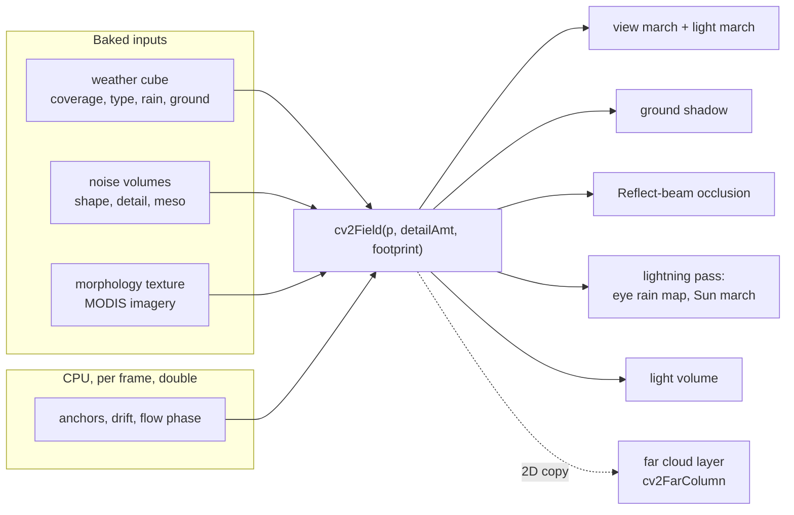

# The cloud field

The volumetric clouds are a procedural extinction field \( \sigma(\mathbf{p}) \), in 1/m, defined everywhere
on the planet. This page describes that field: its inputs (a weather cube baked from a real cloud map, tiling
noise volumes, a morphology texture made from satellite imagery), how it moves and evolves, and how the low,
mid and high layers and the cumulonimbus towers are built from them. How the field is ray-marched and lit is in
[The cloud march](march.md); how the march is accumulated over frames, and the far-orbit stand-in, are in
[Temporal resolve and the far layer](temporal.md); rain, lightning, fog and dust are in
[Weather, rain, lightning, fog](weather.md).

## One field for every consumer

Every pass that needs to know "is there cloud here" calls the same function, `cv2Field()` in
`shaders/include/clouds_v2.glsl`. There are no hand-kept copies, so the clouds a Reflect beam is blocked by, the
shadow on the ground and the cloud on screen are the same cloud.



| Consumer | Shader | `detailAmt` | Footprint |
|---|---|---|---|
| View march, fine steps | `cloud_v2_march.comp` | 1 near, fading to 0 between 13 and 52 km | pixel width at the sample's distance |
| View march, coarse steps | same | −1 (no erosion: an upper bound) | same |
| Light march (first two steps) | same, `lightAmbOD()` | as the view sample | the view sample's |
| Light march (other steps), sky probe, beam steps | same | 0 (mean erosion) | the view sample's |
| Ground shadow | `cloud_march.comp`, `cloudGroundShadowV2()` | 0 | the shadow step's length |
| Reflect-beam occlusion | `beam_self_march.comp` | 0 | 60 m |
| Eye rain map, eye Sun march | `cloud_v2_lightning.comp` | −1 / 0 | 40 m / half the step |
| Light volume (god rays) | `cloud_v2_lightvol.comp` | 0 | half the step |
| Far cloud layer | `cloud_v2_far.comp` | 2D column only (`cv2FarColumn()`) | pixel ground footprint |

The `detailAmt` argument decides erosion: a positive value fetches the detail volume at that strength, 0 uses
the detail volume's **mean** value without fetching it (so lighting and shadows see the same optical depth as
the eroded clouds on average), and a negative value skips erosion entirely, which only removes density and so
gives an upper bound for the march's coarse steps. The footprint is how wide the sample is in metres; every
noise read is mip-mapped at that footprint, so detail finer than a pixel averages instead of aliasing.

!!! warning "Invariant"
    Every consumer must bind the same inputs that decide **where** cloud is: the weather cube, the shape and
    meso volumes and the morphology texture (`CV2_MORPH_BINDING`). A pass that omits the morphology texture
    places its clouds somewhere else. Only the detail volume is optional: it changes the clouds' texture, not
    their placement, and passes that omit it use the mean erosion.

!!! warning "Invariant"
    `cv2FarColumn()` is a hand-kept 2D copy of `cv2FieldLow()`'s placement (same flowed weather lookup, same
    coarse fraction, same cell and imagery blend). A change to the low layer's placement must be made in both,
    or the far layer and the march disagree across their cross-fade.

## Coordinates and anchors

No absolute ECEF position is ever formed in float. Everything is measured from the observer's **sea-level
point**, and each sample carries only a small offset from it. `cv2Pos(relENU, eyeH, enuToEcef)` turns an
offset from the eye into the forms the field needs:

| `CV2Pos` member | Meaning |
|---|---|
| `h` | altitude above sea level, computed as \( (|s_{xy}|^2 + s_z(2R + s_z)) / (|p| + R) \), which does not cancel |
| `rSeaE` | offset from the sea-level point, ECEF axes (m) |
| `seaProjE` | its radial projection onto the sea-level sphere (m), also cancellation-free |
| `dirE` | unit ECEF direction from the Earth's centre |

Each noise volume is read through an **anchor**: the CPU computes, in double precision, the observer's
drifted sea-level point divided by the volume's period, adds a wind offset, and passes the fractional part.
A sample then adds `offset / period`. This is the terrain detail's scheme too (see
[Terrain](../terrain.md)), and it is why nothing swims or pixelates however far the observer is from the origin.

| Anchor | Default period | Wind multiple (of "Wind", 8 m/s) |
|---|---|---|
| shape | 1900 m | 1.0 |
| detail | 1800 m | 1.6 |
| cell (meso) | 32 km | 0.85 |
| cluster (meso) | 256 km | 0.6 |
| storm / storm detail | shape / detail period × "Storm feature size" (12) | 1.0 / 1.6 |
| mid layer | 5300 m | 1.0 |
| morphology | 320 km | 0.6 |

Each volume moves at its own rate, so the shape slides through the cells and the detail through the shape:
clouds evolve on top of the map's drift instead of sliding as one rigid sheet.

!!! warning "Invariant"
    A different scale of the same volume always gets its **own** anchor (hence the separate storm anchors).
    Scaling an anchored coordinate, `fract(a) / k`, jumps whenever the observer crosses a period.

### Drift: the map moves with the wind

The source cloud map drifts in longitude. One angle drives every consumer (the volumetric field, the flat
layers, cirrus, beam occlusion, the ambience's cloud driver):

\[
\phi_\text{drift} = \text{rate} \times (t - t_\text{epoch}) + \text{offset} \pmod{2\pi}
\]

computed by `SatelliteSim::cloudDriftPhase()`. The rate is "Map drift" (`clouds.drift_rate`, default
6.5e-6 rad/s, about 16 deg of longitude in 12 h); the epoch is a fixed start-of-scenario instant; the offset
is session state (a snapshot or a cinematic shot restores it). Measuring from a nearby epoch rather than from
J2000 keeps the phase small, so a change of rate does not throw the map to an unrelated longitude.

The **whole field** is read in the drifted frame: `cv2Drift()` rotates an Earth-fixed vector about the pole
by the drift, and both the weather cube and the noise anchors are read through it, so the clouds move with the
map as one body and the temporal resolve can reproject that motion exactly. The one exception is the ground
height (`cv2Ground()`), read at the Earth-fixed direction, because the terrain does not drift.

!!! tip
    Because the map drifts, the clouds over a place depend on the time. Pick benchmark views at a fixed time
    (`tools/harness/find_cloud_spots.py <ISO time>`), and hand over locations as snapshots, which carry the
    drift phase.

## The weather cube

`cv2WeatherTex` is a cube map, 1024 × 1024 RGBA8 per face with 8 mips, baked by `cloud_v2_weather.comp` from
the 8K equirectangular cloud map, the water map and the DEM. A cube rather than the equirect source means no
`atan`/`asin` per sample, no seam at the antimeridian and no pinching at the poles. Mip 0 is about 12 km per
texel at a face centre and about 6 km near the corners; the source map's own texels are about 5 km at the
equator. Each mip is baked directly from the source at a matching source mip, not box-filtered from the
level above.

| Channel | Meaning | How it is made |
|---|---|---|
| R | coverage, stored as map brightness | Mip 0: the map's brightness, 2 × 2 supersampled. Mips ≥ 1: a brightness chosen so that the coverage formula below returns the **true mean coverage** of the N × N fine taps under the texel |
| G | cloud type, 0..1 across the type table | classified (below) |
| B | precipitation, 0..1 | deep cloud × convective-to-Cb type, plus some from deep stratiform |
| A | ground height / 8 km | the DEM, 2 × 2 supersampled at the mip's scale; read Earth-fixed |

**Coverage.** Every consumer turns R into a cloud fraction the same way:

\[
\text{cov} = \operatorname{clamp}\!\left(\frac{r \cdot \text{gain} - \text{clear}}{\text{full} - \text{clear}}, 0, 1\right)
\]

with gain 0.84, clear 0.12 and full 0.54. The remap exists because thin cloud is grey in the imagery and an
overcast is not pure white: the raw brightness used as a fraction never reaches overcast.

**Why the coarse mips store a remapped brightness.** If a coarse texel held the mean brightness, its coverage
would be the coverage *of the mean*, which is wrong wherever a field is broken (half clear, half bright texels
average to a brightness near the threshold). Storing the brightness whose coverage equals the mean coverage
makes a coarse read a real cloud fraction, which the low layer's placement and the far layer rely on.

**Type classification.** The imagery carries no cloud type, so the bake infers one. Starting at 0.25
(stratocumulus), the type rises with convective texture (the local standard deviation of brightness over about
8 texels), with deep (bright) convective cloud, more so in the tropics and over land, and falls for smooth cloud
over cold ocean (stratus). The result is rough by construction, which is why the type is always interpolated
across the table rather than switched.

**Read paths.** The cube is read four ways, chosen by what the read feeds:

| Function | Filtering | Used for |
|---|---|---|
| `textureLod` | hardware | early-outs; mid, high, anvil and fog lookups |
| `cv2WeatherSmooth()` | C1-smooth: the fractional texel coordinate is smoothstep-remapped before one fetch | the low layer's mip-0 lookup (linear filtering of coarse texels draws flat facets with straight creases, which tall clouds extrude into walls) |
| `cv2WeatherBilinear()` | four texel-centre fetches blended in float | Cb tower strength at mip 3 |
| `cv2Ground()` | alpha × 8000 at mip 1.5, cached once per field sample | terrain-relative bases |

!!! warning "Invariant"
    Never read a displacement, or anything multiplied up by a large factor, through a hardware-filtered 8-bit
    texture. Hardware bilinear uses 8-bit sub-texel weights, so a mip-3 read (~40 km texels) moves in ~150 m
    steps. Scaled to a 15 km tower radius, that draws vertical flutes up the tower wall; this is why tower
    strength uses `cv2WeatherBilinear()` and why the flow field is analytic.

### Weather evolution

The cube is re-baked as sim time advances (`SatelliteSim::recordWeatherEvolution()`): one face per frame,
with all its mips, whenever a face lags by about 300 m of evolution wind drift (between 5 and 120 s of sim
time) or the evolution settings change. Inside the bake:

- **Advection.** The map is read through **two copies** advected backward along a slow analytic curl wind
  (eight waves of about 4000 km, turning over a day). Each copy lives over its own window P ("Weather evolution
  window", 3 h); the two are offset by P/2 and weighted by \( \sin^2 \) of their phase, so the weights sum to
  1 and each copy fades out before it resets. This is the flow-map double-phase technique: the map moves
  locally but never drifts away from itself (the displacement is at most wind × P).
- **Growth and decay.** Coverage is raised or lowered by a smooth field of about 1500 km whose waves cycle over
  10 to 30 h. The type and precipitation are classified from the new coverage, so storms strengthen and weaken.
- **Afternoon land convection.** Over land where the Sun stood high three hours ago and the map has cloud
  nearby, coverage rises by up to 0.2 and the type is pushed toward congestus and cumulonimbus. The map is one
  moment's clouds; this supplies the diurnal cycle it cannot carry.

Setting the evolution wind, growth and diurnal terms to 0 reproduces the static map. The rigid drift above
applies on top. A face bake costs about 0.1 ms.

## Noise volumes

Three RGBA8 volumes, 128³ with 8 mips, baked once at start-up by `cloud_v2_noise.comp`. Every cell count is
a power of two and wraps with a bit mask, so each volume tiles exactly.

| Volume | R | G | B | A |
|---|---|---|---|---|
| shape | Perlin-Worley | inverted-Worley fBm, 4/8/16 cells | inverted-Worley fBm, 8/16/32 | Perlin fBm |
| detail | smooth-F1 inverted-Worley fBm, 4/8/16 (no creases) | same, 16/32/64 | Perlin fBm | Perlin fBm |
| meso | cluster: Worley lifted by Perlin | cumulus cells: three sizes of domed blobs (8/16/32 per period), soft-unioned, Perlin-warped and clumped | closed cells: Voronoi rims (0 on the rim, 1 inside) | Perlin fBm |

The meso volume is read on the sea-level sphere, so it is constant along a vertical: it decides where clouds
are, the shape and detail volumes decide their 3D form.

!!! note "The baked Perlin is narrow"
    The meso volume's Perlin channel is 0.50 ± 0.057 (1 to 99 percent: 0.37 to 0.63). Every threshold on it
    is set against that spread; a threshold chosen for a 0..1 range draws nothing.

**Level of detail.** `cv2Lod(footprint, 1/period) = max(0, log2(footprint · 128 / period))` is the mip whose
texel equals the footprint.

## Morphology texture

`assets/textures/cloud_morph.rgba8`, made by `tools/make_cloud_morph.py` from four MODIS scenes, holds one
real-world cloud organisation per channel: R closed cells (stratocumulus decks), G open cells (cold-air
outbreaks), B cloud streets (convective rolls), A clustered cumulus. Each channel is made seamless (Moisan's
periodic component) and rank-equalised to a uniform distribution, so thresholding at \(1 - c\) covers exactly
the fraction \(c\).

`cv2MorphZ()` reads it triplanar through a cube projection of the drifted sphere and returns a normal deviate,
weighting the channels by regime: stratiform cloud takes the closed cells, convective cloud over sea poleward of
about 30 deg the open cells, some convective regions the streets, and the rest clustered cumulus. A fine term
(the cumulus channel at a quarter of the period) adds structure below about 10 km. Without the file a mid-grey
texel is used and the imagery contributes nothing.

## Flow

`cv2FlowDisp()` is a smooth displacement field: the curl of eight smooth waves on the drifted unit sphere,
period "Flow scale" (6000 km), slowly evolving. A curl field is divergence-free, so it swirls the clouds without
bunching them into folds. Its amplitude is "Flow warp" (0.025 of the period, capped at 0.1).

- It bends the **weather lookup** and the **cluster field**, so weather systems curve into bands and swirls.
- It **never** bends the cells or the lobes: any displacement stretches every field read through it by its
  shear, and stretched cells extrude into fins. Local convection is placed by the flow, not deformed by it.
- `cv2Field()` evaluates it once per sample (`gCv2FlowSet`); every layer that follows the low cloud's weather
  reads the same flowed direction (`cv2FlowWeatherDirAt()`), or it would sit up to ~100 km from its systems.

!!! warning "Invariant"
    Keep a warp's shear (\( |\nabla D| \approx A \cdot 2\pi/\lambda \)) well under 1. Above 1 the warp folds the
    field, and folded coverage extrudes into planar walls.

## Structure of `cv2Field`

```text
cv2Field(q, detailAmt, footprint):
    flow   = cv2FlowDisp(drifted dir)          once per sample (gCv2FlowD)
    ground = cv2Ground(dirE)                   once per sample (gCv2Ground)
    col    = cv2ColumnSigma(q)                 Cb towers; sets the rain core and storm proximity
    f      = cv2FieldLow(q, ..., col.prox)     low layer, stratus .. Cb regions, rain shafts
    f     += cv2MidSigma(q) × (1 − storm)      altocumulus / altostratus
    f     += col                               towers
    f     += cv2AnvilSigmaP(q)                 map-fed anvil shield (off by default)
    f     += cv2HighSigma(q) × (1 − anvil)     cirrus family; f.thin = its share
```

The towers run first because the low layer needs their proximity and the rain core under them. The result is
a `CV2Field`; layers combine through `cv2Add()`, where extinctions sum, `topH` takes the maximum and `deck` is
a density-weighted mean.

| Member | Meaning | Read by |
|---|---|---|
| `sigma` | extinction, 1/m | everyone |
| `hf` | height fraction within this cloud, 0 base to 1 top | powder, ambient, ground bounce |
| `msBright`, `ambient` | per-type multiple-scattering and ambient multipliers | march lighting |
| `deck`, `topH` | stratiform share; the cloud top's altitude | the march's grazing-light shadow on decks |
| `thin` | share of extinction that is high-layer ice | cheap lighting, ice phase, delta scaling |
| `rain` | 1 for a rain-shaft sample | rain phase, the eye's rain map |

!!! warning "Invariant"
    The march inlines `cv2Field()` at each call site, and its speed is set by register allocation (see
    [The cloud march](march.md#design-constraints)). Adding anything to `cv2Field()` or `CV2Field`, even an
    unused struct member, can push the march from 128 to about 224 registers and cost 20 to 60 percent. This
    is why fog and dust are a separate function with their own march.

## The low layer

`cv2FieldLow()` draws everything from stratus to the cumulus around storms, plus nimbostratus and rain shafts.

### Cloud types

A five-row table (`cv2Types` in `SatelliteSim.h`), interpolated linearly by the weather cube's G channel:

| Type | base / top (m) | flatness | extinction (1/m) | erosion | billow | convective | precip loading |
|---|---|---|---|---|---|---|---|
| stratus | 400 / 1300 | 1 | 0.030 | 0.35 | 0.3 | 0 | 0.5 |
| stratocumulus | 900 / 2200 | 0.7 | 0.040 | 0.55 | 0.6 | 0.5 | 0.5 |
| cumulus | 1000 / 3200 | 0 | 0.050 | 0.75 | 1 | 1 | 0.5 |
| congestus | 1000 / 7000 | 0 | 0.060 | 0.8 | 1 | 1 | 1 |
| cumulonimbus | 900 / 11500 | 0.15 | 0.080 | 0.7 | 0.9 | 0.9 | 2 |

The vertical span is scaled by `cv2Tropo()`, the tropopause height by latitude: ×1.35 in the tropics down to
×0.8 at the poles. Nimbostratus is a stratiform deck thickened by up to 3.5 km where the map rains.

### Terrain-relative heights

Bases and tops follow the ground, smoothed over tens of km. The regional ground (mip 4, about 80 km, never
above the local value) lifts the clouds in full; only the relief above it lifts them partially, by 0.6 for
decks to 0.9 for convective cloud. A plateau is the ground its boundary layer rides on, so decks over Tibet sit
above the plateau, while a single ridge still pokes into a deck. Tops rise with the base but not past the
cumulonimbus top.

Around storms the low layer's tops are adjusted by the towers (see [Storm cumulus](#storm-cumulus)).

### Placement: where cloud is

One placement serves every distance; a wider footprint only filters it.

1. **Weather lookup.** The flowed direction, plus a small warp of a few km from the smooth Perlin channels
   ("Weather warp", 7 km) that hides the cube's texels, read C1-smooth: this gives `cov`. A coarse fraction
   `covF` is read at mip 2 (about 20 km), and the threshold uses `covT = max(cov, 0.5·covF)`, so scattered
   cloud can appear inside a clear 5 km texel of a broken region.
2. **Field value.** A convective field built from the cumulus cells (the coarse cells for deep types, giving
   wider towers), clustered by the cluster channel; a stratiform field built from the closed-cell rims and
   cells; mixed by the type's convective weight.
3. **Mesoscale term.** The cluster Perlin at 1×, 4× and 16× (a normal deviate `fz`) is mixed with the imagery
   (`cv2MorphZ()`) by "Morphology (orbit)" (0.8) and added as `0.3 · Imagery share · clamp(z, ±2.5)`
   ("Imagery share" 0.5). The share is fixed, so the cumulus masses seen up close and the imagery's structure
   seen from orbit are one placement.
4. **Threshold.** `thr = 1 − covT`, and the cloud strength is `e = clamp((field − thr) / 0.55, 0, 1)`: 0 at a
   cloud's edge, 1 well inside. Everything vertical is expressed in the **same units as e**, which is what lets
   noise move a cloud's side outward: noise added to a top height barely moves a steep wall.
5. **Sub-pixel cells.** Where the cells are smaller than the footprint, thresholding the mip-averaged field
   would erase them, so presence becomes partial cover,
   `presFar = clamp(0.5 + (field − thr) / (2.5 σ_U))`, where σ_U is the cell variance the mip averaged
   away. This is a haze of the right opacity at the same place, never a second placement.

### Shape: a 3D margin, not a heightfield

A heightfield cannot bulge or undercut, so a cloud built as "2D presence under a top height" is a can with
vertical sides and a flat bottom. Here cloud exists where a margin is positive:

\[
m = m_0(e, z) + 2A \cdot \text{lobes}(x, y, z) - \frac{g_\text{base}(h)^2}{0.3} > 0
\]

- **Convective profile** (cumulus to Cb). Each **cell** is one cloud. Its top T comes from the cell-scale
  strength (the cells read two mips coarser, four for deep types), at most "Tower top" (0.85) of the span, at
  least 0.25 so weak cells read as puffs. The strength a column needs to reach height \( \zeta = z/T \) is
  parabolic about the cloud's widest point (0.55 to 0.65 of T): more at the base (a narrower stem, scaled by
  "Top-heavy", 1.0, for tall cells only), 1 at the top (a round dome). The column's strength is capped by the
  cells' own dome with a smooth minimum, so a dense field keeps a turret over each cell instead of a flat mesa.
- **Stratiform profile.** `e − 1.2 · smoothstep(0.3, 1, z / zTop)`: a flat base and a lumpy top. A deck's
  thickness and base follow a km-scale variation (`deckVar`, from the closed cells and Perlin), so a thicker
  part hangs lower and an overcast seen from below shows texture in the light it transmits.
- **Lobes.** Inverted-Worley octaves of the shape volume, in field units: cauliflower lobes, overhangs and
  necks. Decks use "Lobes (3D)" (0.32). On convective types the strength instead tapers with height from
  "Cumulus lobes (bottom)" (0.2) to "(top)" (0.07), multiplied by 2.5, giving lumpy bases under smoother
  domes. Lobes fade at large footprints and are damped near the base by "Base flatness" (0.8). Deep types read the
  storm-scale shape volume.
- **Base.** \( g_\text{base} \) curls the base up toward the cloud's edge, so there is no square corner. Bases
  are bumped in 3D by the lobes by up to about 2.2 × an amplitude of 40 m (cumulus) to 220 m (stratus) times
  "Base roughness" (0 by default).
- **Surface.** `Ph = clamp(m · "Surface hardness") · smoothstep(0, 60 m, height above the bumped base)`.

### Density, erosion and edges

- **Base density:** `d = Ph · mix(0.75, 1, shape.r)`.
- **Erosion** (when `detailAmt ≥ 0`): the detail volume is read through a small distortion by the shape
  volume (and blended with the storm-scale detail for deep types). Its value fades with distance **toward its
  mean (0.45)**, not toward zero, so erosion keeps its average strength at every distance and only its texture
  fades. Near the base it bites lumps (wispy); higher up it bites the cracks between them (billows). The
  strength is the type's erosion × "Erosion detail" (0.15), reduced to "Interior erosion" (0.25) deep inside
  dense cloud (full erosion holes the interior), and multiplied by "Storm erosion" (1.5) on deep convection. Cumulus bases
  keep less of it, so bases read flat.
- **Edge sharpness:** after erosion, `d` is multiplied by "Edge sharpness" (1.0) and clamped at 1; the gain
  relaxes toward 1 as the footprint grows, so unresolved surfaces are not hard cut-outs.
- **Final:** `d` grows with height (cloud water) and with precipitation loading at the base, then
  \( \sigma = d \cdot \text{type extinction} \cdot \) "Density" (1.1).

### Rain shafts

Below a cloud's base, where the map precipitates, the low layer returns rain instead of cloud:

```text
rate    = max(rain · smoothstep(0.3, 0.8, e) · mix(0.4, 1, convective),  rainCore)
σ_rain  = rate · shaft · 0.0012 · (1 + rainCore)
```

`shaft` is the shape volume read in a frame compressed 85 percent vertically (streaks that fall) and slanted
downwind below the base, read 1.5 mips coarser so curtains are soft; sub-pixel curtains fade to a mean of 0.45.
`rainCore` (`gCv2RainCore`) is heavy rain under each anvil-reaching tower, 2.5 times longer downwind, set by
the tower search. Rain samples are marked `rain = 1`. The shell floor drops to 0 m whenever rain, fog or ice fog
is enabled, so rain reaches the ground. How rain is seen is in [Weather](weather.md#rain-shafts).

## The mid layer: altocumulus and altostratus

`cv2MidSigma()` adds an independent layer so clouds overlap in altitude.

- **Lens.** Base 3.0 to 5.6 km plus 0.8 × the ground, thickness 450 to 1200 m, from the cluster Perlin
  stretched to ±2 σ (read raw it would be one flat sheet).
- **Regime.** Where the cluster field (blended with the closed-cell morphology) crosses a threshold biased by
  coverage over about 80 km ("Layer spread", 0.7: 0 ties it to the low cloud below, 1 spreads it over whole
  systems), scaled by "Mid layer (Ac/As)" (1.0). It fades in with coverage and is never switched on by
  `cov > 0` alone, because the source map is a JPEG whose 8 × 8 blocks hover around the clear threshold.
- **Forms.** Altocumulus cloudlets (the shape volume at "Mid layer period", 5300 m) where the low cloud is
  broken; a translucent altostratus sheet where it is stratiform. Past a 400 to 3000 m footprint cloudlets
  become a haze of their area fraction, drawn from the closed-cell morphology.
- **Storms.** It gives way wherever Cb towers can stand, or it would slice each tower with a flat plate.
- Extinction 0.035 (Ac) or 0.004 (As) × "Mid layer density" (1.3).

## The high layer: cirrus, cirrostratus, cirrocumulus

`cv2HighSigma()` draws optically thin ice (\( \tau \) about 0.1 to 3) at about 0.74 of the local tropopause.

- **Regime.** Two octaves of Perlin at "Cirrus field size" (1200 km), in a frame displaced by the low flow ×
  "Cirrus flow" (1.5), biased toward the coverage of the surrounding weather systems (mips 2 and 4): cirrus
  lives with fronts and convective outflow. "High layer amount (Ci/Cs/Cc)" (1.0) scales it; above 1 it widens
  the regime.
- **Streaks.** The shape volume is read with an along-wind coordinate of drifted longitude × R, at a period
  that divides the equator a whole number of times (a multiple of 4), so there is no antimeridian seam. The
  along-wind axis is stretched ("Cirrus stretch", 15, of "Cirrus fibre period", 11 km), sheared with height
  for fall streaks, gathered into bundles (a 4× coarser read) and combed into fibres (a 9× finer read). The
  jet moves the fibres east at "Cirrus wind" (30 m/s).
- **Other forms.** Cirrostratus veils where the map is stratiform; cirrocumulus patches by a cluster channel.
- **Distance and inside views.** Fibres far below a pixel become a banded haze; from inside the layer (view
  footprint under 20 m) they become the layer's mean haze, since an observer in cirrus sees a soft veil.
- **Interactions.** It gives way under anvils, which are the high cloud around a storm. No erosion is applied,
  and it sets `thin`, which makes the march light it cheaply.
- Extinction 0.0008 (Ci), 0.0003 (Cs) or 0.0016 (Cc) × "High layer density" (0.11).

## Cumulonimbus towers

Deep convection is drawn as discrete towers by `cv2ColumnSigma()`, not by the low layer's margin, because a
field thresholded per height cannot narrow to a waist and flare out again into an anvil.

```text
 lid (tropopause − 250 m)  ┌───────── flared head = the anvil ─────────┐   ← overshooting dome (1/3 of towers)
                           └───┐                                     ┌──┘
                               │   waist (Cb waist × radius)        │
                               │                                      │
 base (900 m + ground)     ────┴──── base radius (Cb tower radius) ──┴────   storm cumulus around it
```

**Lattice.** Towers stand on a 2D lattice on an equal-angle cube map of the drifted sphere. The cell is at
least "Cb spacing" (30 km) and at least the tower's full reach / 1.12, where the reach counts the flared head,
its downwind drift and lean; with the defaults (15 km radius, flare 1.6) cells are about 42 km. Centres are
jittered over 0.15 to 0.85 of a cell, which makes a 2 × 2 search exact to 0.65 cell and a 3 × 3 search exact to
1.15. The 3 × 3 search runs only above mid-height, where a flared head can reach that far. A point searches only
its own cube face, so towers near a face edge fade out: a tower-free band, never a cut.

**Gating.** Tower strength is the float-bilinear weather at mip 3: type at least about 0.6 with coverage.
"Cb sparsity" (0.35) thins towers toward a storm's edge.

**Storm cells.** Lattice cells are grouped in 3 × 3 blocks (`cv2CbRole()`, shared with the lightning pass). A
block holds a storm cell with probability "Cb fill" (0.57): one **dominant** tower that reaches the anvil, plus a
flanking line of 0 to 2 towers stepping down beside it (height × 0.7 and × 0.5). With the default cell size,
storm cells stand about three cells (~125 km) apart. "Cb columns" (1.5) multiplies the towers' density.

**Shape of a tower.**

- A weaker tower is shorter, not thinner: its top sinks from just under the lid at full strength to its base.
- Only anvil-reaching towers get the waist ("Cb waist", 0.7), the head flare under the lid ("Cb head flare",
  1.6, which *is* the anvil), downwind head drift ("Cb head drift", 6 km) and, on about a third of them, an
  overshooting dome up to "Cb overshoot" (0.8 km) above the lid.
- The outline bulges into turrets (3rd and 5th angular orders, turning with height, within about 23 percent so
  the search still covers it). The top rounds off over 1.5 km (dominant) to 3 km (others), and a head stays
  about 300 m inside the lid unless it overshoots.
- Storm-scale lobes ("Cb lobes", 0.18, and "Cb head lobes", 0.12, on the head), faded near the lid so the head
  reads smooth under the anvil's thin top; storm-scale erosion; a surface ramp of about 300 m whatever the size.
- The tower leans downwind by "Tower lean" (0.15 m per m of height).

**Outputs** (`CV2Col`): `sigma` (× "Cb columns"), `topH` (the tower's top over this point, so the deck shadow
term is local), `prox` (proximity to a tower's edge), `near` (under a dominant head, used by the anvil shield),
`storm` (tower strength, used by the mid and high layers to give way), and the rain core.

### Storm cumulus

The map types whole regions hundreds of km wide as cumulonimbus. Away from towers such a region is capped at
the ordinary cumulus top. Within "Storm cumulus reach" (10 km) of a tower's edge, the low layer's tops rise
toward "Storm cumulus top" (5.5 km), varied by region by ± "Storm cumulus variation" (0.8). The proximity is
computed at every height, including below the tower base, so the low tops do not step there.

### Map-fed anvil shield

`cv2AnvilSigmaP()` is an optional smooth ice shield under the tropopause, fed by Cb-typed weather at the point
and 12, 25 and 40 km upwind and thickened under dominant heads ("Anvil thickness" 0.95 km, "Anvil hang"
2.4 km). It is off by default ("Anvils" 0): with the default tower settings the flared heads are the anvils.

## Debug views

Set `clouds_v2.debug_view` (Clouds tab, or harness `set`). The field-related views:

| View | Shows |
|---|---|
| 4 | the weather cube where the ray enters the shell: R coverage, G type, B precipitation |
| 7 | optical depth per layer: red low (with rain), green mid, blue anvil and towers, white high |

View 7 is the first thing to check when a cloud artifact has an unknown owner. The march and temporal views are
listed on their pages.

## Settings

All keys are under `clouds_v2` unless shown otherwise. The Clouds tab holds the field; the Weather tab holds
storms and weather evolution.

**Clouds tab, "Coverage & layers"**

| Label | Key | Default |
|---|---|---|
| Map coverage gain | `coverage` | 0.84 |
| Map clear below | `cover_clear` | 0.12 |
| Map overcast above | `cover_full` | 0.54 |
| Density | `density` | 1.1 |
| Weather warp (km) | `weather_warp_km` | 7 |
| Flow warp (curved systems) | `flow_warp` | 0.025 |
| Flow scale (km) | `flow_period_km` | 6000 |
| Layer spread (mid/high) | `layer_spread` | 0.7 |
| Mid layer (Ac/As) | `mid_amount` | 1.0 |
| Mid layer density | `mid_density` | 1.3 |
| Map drift (1e-6) | `clouds.drift_rate` | 6.5e-6 |
| Wind (m/s) | `wind_mps` | 8 |

**Clouds tab, "Shape"**

| Label | Key | Default |
|---|---|---|
| Erosion detail | `detail` | 0.15 |
| Edge sharpness | `edge_sharpness` | 1.0 |
| Lobes (3D) | `wobble` | 0.32 |
| Tower lean | `lean` | 0.15 |
| Surface hardness | `column_edge` | 4.0 |
| Interior erosion | `interior_erosion` | 0.25 |
| Base roughness | `base_roughness` | 0 |
| Top-heavy (cumulus) | `top_heavy` | 1.0 |
| Tower top (0 = old cones) | `tower_top` | 0.85 |
| Base flatness (cumulus) | `base_flatness` | 0.8 |
| Cumulus lobes (bottom) / (top) | `cumulus_lobes_bottom` / `_top` | 0.2 / 0.07 |

**Clouds tab, "Cirrus (high layer)"**

| Label | Key | Default |
|---|---|---|
| High layer amount (Ci/Cs/Cc) | `high_amount` | 1.0 |
| High layer density | `high_density` | 0.11 |
| Cirrus field size (km) | `cirrus_field_km` | 1200 |
| Cirrus flow (x low flow) | `cirrus_flow` | 1.5 |
| Cirrus stretch | `cirrus_stretch` | 15 |
| Cirrus wind (m/s) | `cirrus_wind_mps` | 30 |
| Cirrus fibre period (m) | `cirrus_period_m` | 11000 |

**Clouds tab, "Noise scales"** (the far-layer rows are on [the temporal page](temporal.md#settings))

| Label | Key | Default |
|---|---|---|
| Shape period (m) - low cloud | `shape_period_m` | 1900 |
| Mid layer period (m) | `mid_period_m` | 5300 |
| Detail period (m) | `detail_period_m` | 1800 |
| Cell period (m) | `cell_period_m` | 32000 |
| Cluster period (m) | `cluster_period_m` | 256000 |
| Morphology (orbit) | `morph_orbit` | 0.8 |
| Imagery share | `imagery_share` | 0.5 |
| Morphology period (km) | `morph_period_km` | 320 |
| Far-field sharpness | `far_sharpness` | 0 |

**Weather tab, "Storms (cumulonimbus)"**

| Label | Key | Default |
|---|---|---|
| Cb fill (share of cells) | `cb_fill` | 0.57 |
| Cb columns (0 = old cores) | `cb_columns` | 1.5 |
| Cb spacing (km) | `cb_spacing_km` | 30 |
| Cb tower radius (km) | `cb_radius_km` | 15 |
| Cb waist (x radius) | `cb_waist` | 0.7 |
| Cb head flare (x radius) | `cb_flare` | 1.6 |
| Cb head drift (km) | `cb_head_drift_km` | 6 |
| Cb lobes / Cb head lobes | `cb_lobes` / `cb_head_lobes` | 0.18 / 0.12 |
| Cb sparsity | `cb_sparsity` | 0.35 |
| Cb overshoot (km) | `cb_overshoot_km` | 0.8 |
| Storm cumulus top (km) | `cb_cumulus_top_km` | 5.5 |
| Storm cumulus variation | `cb_cumulus_variation` | 0.8 |
| Storm cumulus reach (km) | `cb_cumulus_reach_km` | 10 |
| Storm feature size | `storm_scale` | 12 |
| Storm erosion | `storm_erosion` | 1.5 |
| Anvils | `anvil` | 0 |
| Anvil thickness (km) / hang (km) | `anvil_thick_km` / `anvil_hang_km` | 0.95 / 2.4 |

**Weather tab, "Weather evolution"**

| Label | Key | Default |
|---|---|---|
| Weather evolution wind (m/s) | `evo_wind_mps` | 8 |
| Weather growth / decay | `evo_growth` | 0.12 |
| Weather evolution window (h) | `evo_window_h` | 3 |
| Afternoon land convection | `evo_diurnal` | 0.6 |

"Cb columns" at 0 switches the tower layer off and lets the low layer draw deep cores itself; "Tower top" at 0
switches the convective profile back to one cone per column. Both exist for A/B comparison. Every setting that
changes what a pixel shows also invalidates the temporal history for a frame.

## Where in the code

- `shaders/include/clouds_v2.glsl`: `cv2Field()`, `cv2FieldLow()`, `cv2MidSigma()`, `cv2HighSigma()`,
  `cv2ColumnSigma()`, `cv2CbRole()`, `cv2AnvilSigmaP()`, `cv2FarColumn()`, `cv2FlowDisp()`, `cv2MorphZ()`,
  `cv2Pos()`, the weather read helpers, and the `CloudV2Params` UBO (mirrored by `GpuCloudV2Params` in
  `src/simulations/SatelliteSim.h`, with `offsetof` asserts; keep the order).
- `shaders/cloud_v2_weather.comp`: the weather cube bake and its evolution.
- `shaders/cloud_v2_noise.comp`: the three noise volumes.
- `tools/make_cloud_morph.py`: the morphology texture.
- `src/simulations/SatelliteSimCloudsV2.cpp`: `createCloudsV2()`, `fillCloudsV2Params()` (anchors, drift,
  per-frame UBO), `weatherEvoPC()`, `recordWeatherEvolution()`, `createCloudMorph()`.
- `src/simulations/SatelliteSim.cpp`: `cloudDriftPhase()`.
