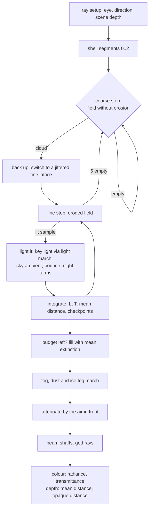

# The cloud march

`shaders/cloud_v2_march.comp` ray-marches the [cloud field](field.md) at half the render resolution and
lights every sample: the Sun or Moon through a short light march, sky light through the cloud above, light
bounced from the ground, city light and Reflect-beam light at night, and the halos and rainbows of ice and
rain. It also marches fog and dust, and integrates the Reflect beams' shafts through clear air. This page
covers one ray. Which pixels are marched each frame, and how the results are accumulated, is in
[Temporal resolve and the far layer](temporal.md).

## Overview



The march outputs radiance **already attenuated** by the air between the eye and the cloud, but adds no air
light of its own: the sky pass integrates the air in front of each cloud and composites it, so a cloud and the
clear sky beside it share one atmosphere (see [Atmosphere and sky](../atmosphere-and-sky.md)).

## Ray setup

- **Eye and frame.** The eye is 2 m above the detailed ground under the observer (`terrainFrame.x`, written by
  `scene_depth.comp`), in the observer's local east-north-up (ENU) frame centred on the Earth.
- **Direction.** Each visit of a pixel moves the ray within its texel (see [Jitter](#jitter)).
- **Scene depth.** `tScene` is read 1:1 from the half-resolution shared depth (terrain, sea, meshes).
- **Resolution.** The march targets, the scene depth and every clouds v2 screen image are half of the
  *scaled* window (`computeHalfExtent()`), so at a render scale of 50 percent the march covers a quarter of the
  pixels of 100 percent. "Clouds follow render scale" (`display.clouds_follow_render_scale`, on by default)
  turns this off and keeps them at half the window. The noise level of detail stays at the 100 percent pixel:
  `cv2.motion.w`, the ratio of the current half-res height to the 100 percent one, scales the footprint back.
  The clouds therefore keep their texture, only softer; read at the coarser pixel, the storm cumulus texture
  would filter away. A change
  of scale recreates the images (`recreateComputeScaledTargets()`, checked at the start of
  `recordCompute()` before anything is recorded) and blits the temporal history across, so the clouds do not
  restart.
- **Shell segments.** `cv2ShellSegments()` intersects the ray with the shell between the lowest cloud base and
  the highest top and removes what lies inside the inner sphere, giving 0 to 2 segments. No special cases are
  needed for an eye below, inside or above the shell.
- **End of the march.** Each segment ends at `min(segment end, tScene, tLimit)`, where `tLimit` is "Max
  distance" (600 km) measured from the **shell entry**, not the eye: from orbit the Earth is farther away than
  the limit.
- **Soft ground contact.** Extinction fades out over the last `clamp(3 × footprint, 40 m, 600 m)` before the
  scene depth. Dense cloud meeting a slope otherwise ends on a hard line that the half-resolution grid
  stair-steps; real cloud also thins against the ground.

## Stepping

With \( t_r \) the distance past the shell entry, a step is

\[
\Delta t = \min\!\big(b + g\,t_r,\ \max(c,\ 0.012\,t_r)\big), \qquad
\Delta t \le \frac{200\ \text{m}}{\max(|\hat d \cdot \hat u|, 0.01)}
\]

with \(b\) "Step at eye" (60 m), \(g\) "Step growth" (0.01), \(c\) "Step max" (1500 m), and \( \hat u \) the
vertical **at the sample**. Steps grow with distance because the noise is read at the pixel footprint there
anyway; the vertical cap keeps any step from crossing more than 200 m of altitude, so a thin deck seen from
orbit is not stepped over.

**Coarse mode.** Each segment starts coarse, after an offset of \( 2\Delta t \times \text{jitter} \): a whole
coarse interval, so across visits the coarse lattice takes every phase and a thin deck is found at all of them.
Coarse samples read the field with no erosion, an upper bound of the eroded density, and an empty one advances
\( 2\Delta t \).

**Switch to fine.** At the first coarse sample with density the march backs up by \( (2 - j_f)\Delta t \) and
switches to fine steps, so the fine lattice is jittered too (\( j_f \) is derived from the start jitter). If
the back-up passes the segment start, the march restarts at the start plus a jittered offset; clamping to the
start itself would put every ray from inside a cloud or rain on one lattice aligned to the eye, which draws
contour rings. Fine samples read the eroded field with `detailAmt = 1 − smoothstep(D, 4D, t)`, D being "Detail
fade start" (13 km). After more than 5 consecutive empty fine samples the march returns to coarse mode.

**Cheap samples.** A coarse sample that is almost all high-layer ice (`thin > 0.9`) or rain shaft
(`rain > 0.9`) is shaded on the spot and never enters fine mode; ice and rain are nearly uniform media with
weak structure. An ice sample stands for two steps where the pixel spans more than 60 m; closer, it is one step,
because two-step samples near the eye catch the fibres on some frames and miss them on others. A rain-only
sample stands for **four** steps: each runs a light march whose steps evaluate the whole field, towers included,
so under a storm the shafts would otherwise dominate the march. A shaft's edge reads slightly brighter, because
a step carries its density a little past the edge.

**Termination and budget.** The loop ends when transmittance falls below 0.01, at the end of the segments, or
when the iteration budget (`misc.x`, "March budget") runs out. The unmarched remainder, including whole
segments never reached, is **filled** with the path's mean extinction,
\( T_\text{rem} = e^{-(\tau_\text{path}/\ell_\text{path})\,\ell_\text{rem}} \), lit with the mean colour so
far, at a depth halfway into the remainder. Leaving it transparent would let the horizon show through clouds.

### Jitter

Every jitter sequence advances per **visit** of a pixel, not per frame: a sparse pixel is marched every fourth
frame, and a sequence stepped per frame would leave each pixel of a 2 × 2 block in its own cluster of offsets,
which shows as 2 × 2 squares in far cloud.

| What | Source | Advances |
|---|---|---|
| Sub-texel ray position | R2 sequence, `fract(ign(pix) + visit · (0.7549, 0.5698))`; the texel centre while the eye moves more than 1 m a frame | per visit |
| March start | 64 × 64 void-and-cluster blue-noise tile (an SSBO) + a golden-ratio step | per visit; per frame while the eye moves |
| Fine-lattice restart | `fract(1.618 · jitter + 0.5)`, derived from the start jitter | — |
| Light march | another cell of the blue-noise tile, its own step (0.7549) | per visit; per frame while moving |

The sub-texel motion lets the history integrate the whole texel footprint, so thin far cloud does not draw as
hard stairs. The light march has its own jitter because a shared one moves a sample's depth inside a flat cloud
top together with its light-step positions; their product never averages out and draws contour rings.

## Lighting a sample

The radiance a sample scatters toward the eye is

\[
S = S_\text{key} + S_\text{amb} + S_\text{bounce} + S_\text{night}
\]

Phase functions are Henyey-Greenstein normalised so that isotropic scattering is 1 (no \(1/4\pi\)), the
codebase's convention; `SUN_INTENSITY` is 1.

### Phase functions

Computed once per ray:

| Medium | Phase |
|---|---|
| cloud, single scattering | \( 0.6\,\text{HG}(0.57) + 0.4\,\text{HG}(-0.25) \) ("Forward scatter g", 0.57) |
| cloud, multiple scattering | \( 0.85\,\text{HG}(0.2) + 0.15\,\text{HG}(-0.4) \) |
| ice (`thin`) | \( \text{HG}(0.3) \) + ice optics / 0.55 |
| rain | \( 0.3\,\text{HG}(0.97) + 0.55\,\text{HG}(0.35) \) + 0.5 × rain optics |
| snow shafts | the rain phase blended toward faint ice optics and a pillar where the shafts are below freezing |

**Ice is delta-scaled.** About 45 percent of an ice crystal's scattering is a narrow forward peak that carries
on almost undeviated. It is removed from the extinction, \( \sigma \leftarrow \sigma(1 - 0.45\,\text{thin}) \),
and the phase keeps only the broad lobe (renormalised by 0.55). Counting the peak as extinction would dim
everything behind cirrus as if that light were lost. In the light march the factor is \( 1 - 0.8\,\text{thin} \),
because what reaches cloud *below* a cirrus veil includes light the ice scatters within a few degrees (an
effective g near 0.8): real cirrus barely dims the cloud under it.

**Rain** has a diffraction spike well under a degree wide plus a broad refracted lobe; a single wide lobe would
light shafts toward the Sun as white walls.

### Key light

The key light is the Sun, or, when the Sun is below the sample's horizon at night, the Moon through the same
light march (`moonGain` × "Moon gain", 1.0).

- **Sun colour at the sample** (`sunColorAt()`): the Rayleigh and Mie columns toward the Sun by the Chapman
  function (`include/atmosphere.glsl`), which handles a grazing path's tangent point exactly, plus an ozone
  shell at 25 km crossed at its secant (the Chappuis band turns twilight cloud pink rather than orange). The
  clouds' Rayleigh has its own gain, "Cloud sunlight Rayleigh" (0.61 × physical), separate from the sky's.
- **Cache.** The Sun colour and the zenith sky radiance (`skyZenithAt()`, a 6-step single-scattering
  integral) are cached at **fixed 800 m altitude levels** and interpolated between the two around the sample,
  refreshed after 25 km of ray. Fixed levels matter: refreshing by distance from the last refresh steps the
  colour at a different depth on every ray, which draws rings looking down.
- **Earth's shadow.** `smoothstep(horizon ± 0.004, sun elevation)` at the sample itself.
- **Solar eclipse.** × `eclipseSunVis()`, the share of the Sun's disc visible from the sample (see
  [Moon and eclipses](../moon-and-eclipses.md)).
- **Sun-path profile.** The light march reaches a few km, so it cannot see a storm between a low Sun and a
  cloud near the eye's line to the Sun. The lightning pass marches 400 km from the eye toward the Sun and
  stores the optical depth at 17 distances (`cv2SunProf`, see
  [Weather](weather.md#the-sun-behind-clouds)). A sample within about 2 km of the eye's Sun ray multiplies its
  key light by \( e^{-(\tau_\text{total} - \tau(\text{sample}))} \), the cloud between it and the Sun beyond
  it. Clouds beyond the blocker keep their light, which keeps silver linings. Behind the eye the distance used
  is the distance to the eye, which keeps the term continuous at 90 deg from the Sun.
- **Rain near the eye** additionally takes `mix(1, sunCloudT, e^(−t/100 km))`, the eye's Sun transmittance
  through cloud, so a shaft's sharp forward lobe does not draw the Sun's disc under a storm that hides it.

### The light march

`lightAmbOD()` holds the shader's **only** lighting call of `cv2Field()` and does four jobs in one loop
(each extra call site inlines another copy of the whole field, roughly 60 KB of GPU code):

| Index | Sample | Accumulates |
|---|---|---|
| 0 … nL−1 | geometric steps (ratio 1.6) toward the light, summing to "Light march" (2500 m), each jittered over its whole segment; the first two read eroded detail (self-shadowed lumps), the rest mean erosion | optical depth, ice scaled by \(1 - 0.8\,\text{thin}\) |
| nL | one far sample at 1.6 × the march length, the far side of a tall tower | \( \sigma \times 0.8\,L \) |
| nL + 1 | a probe 250 m straight up | `sigUp`, for the sky ambient |
| nL + 2 … nL + 4 | three steps (at 75, 375 and 1275 m) along the mean Reflect-beam direction, night only | beam optical depth |

nL is "Light steps" (6). **Light LOD:** where the ray's transmittance is already below 0.5, the pixel
footprint exceeds "Light LOD footprint" (40 m), or the sample is rain, the middle steps collapse into one: two
steps over the same length, the first kept (dropping the first flattens a tower's self-shadow). **Ice samples**
skip the light march entirely and use \( \tau = \sigma \times 400 \) m.

**Decks at grazing light.** A deck lit at a low angle is shadowed by the rest of the deck, tens of km away, far
beyond the light march. The optical depth is raised to at least
\( 0.5\,\text{deck}\,\sigma\,(h_\text{top} - h) / \max(\hat u \cdot \hat l, 0.03) \); without it the band along
the terminator glows red from orbit.

### Scattering the key light

\[
S_\text{key} = C_\text{key}\;P\;\big(p_{SS}\,e^{-\tau} + p_{MS}\,\text{ms}(\tau)\,b_\text{ms}\big),\qquad
\text{ms}(\tau) = \sum_{k=1}^{2} b^k e^{-a^k \tau}
\]

The multiple-scattering term follows Wrenninge's octaves: each octave sees a fraction \(a\) ("Multi-scatter
reach", 0.12) of the optical depth and contributes a fraction \(b\) ("Multi-scatter strength", 0.43).
\( b_\text{ms} \) is the type's brightness. The "powder" term
\( P = 1 - 0.29\,e^{-300\sigma}(0.5 - 0.5\cos\theta) \) ("Powder", 0.29) darkens thin edges seen away from the
light. \( p_{SS} \) is blended toward the ice phase by `thin` and toward the rain phase by `rain`.

### Sky light

The ambient is the **diffuse** transmission of the cloud above the sample (two-stream, conservative
scattering, g about 0.85), plus light from below (the ground and the horizon sky, which the cloud above does
not shade):

```text
τ_up   = max(σ_up · 250 m, 0.6 σ (topH − h))
ambVis = mix(0.7, 1, hf) / (1 + 0.11 τ_up) · mix(1, e^(−150σ), 0.3) + 0.35 (1 − hf)
```

A straight-line Beer's law, \( e^{-\sigma_\text{up} \cdot 250\,\text{m}} \), is near 0 inside cumulus and would
turn every large cloud's lower part a flat dark grey. The incoming sky radiance is

\[
L_\text{sky} = L_\text{zenith}\;D\;\text{(Sky ambient)}\;(1 + \text{(Twilight sky light)}\cdot w_\text{twi})
 + \text{moonlit sky} + \text{moonless night sky}
\]

- "Sky ambient" is 2.0; "Twilight sky light" (0) boosts the sky light from about 7 deg below the sample's
  horizon to 14 deg above it, where the zenith alone under-counts the bright dome toward the Sun.
- \(D\) fades the sky light over the Sun's first ~5 deg below the sample's horizon: the six-sample zenith
  integral over-counts the lit air past the terminator, and a cloud must not be brighter than the sky beside it.
- The moonless night sky (starlight and airglow) is the terrain's "Night sky light" on the moonlit-sky scale,
  ungated, so night clouds are never black against the airglow.
- A solar eclipse multiplies the zenith radiance by `eclipseSkyLight()`.

Ice samples skip the transmission term (`ambVis = 1`).

### Ground bounce and light from below

`S_bounce = C_key · max(û·l̂, 0) · 0.15 · "Ground bounce" · (1 − hf)²` ("Ground bounce", 2.2). High ice
also receives the light reflected by the cloud under it, scaled by the coverage there (mip 2): cirrus over
white cloud is lit from below. The coverage is read along the flowed direction the field sample has already
computed (`gCv2FlowD`), so it costs one texture read rather than another evaluation of the eight-wave flow.

### Night: city light and Reflect beams

When the sample is on the night side (`dayness < 0.9`):

- **City up-light** on the lower part of a cloud: the night map at mip 3 under the sample, through the same
  response curve the sky uses, × `cloud.ambientGain`.
- **Reflect-beam light.** A beam is a column of sunlight reflected down from a mirror (see
  [Reflectors and beams](../../simulation/reflectors.md)). For each beam in the tile's culled list,
  `beamGather()` computes its irradiance at the sample: the Sun's disc seen in the mirror, a soft dome
  `1 − smoothstep(0.25R, 1.15R, d)` normalised to the same energy as a flat disc of radius R (the footprint),
  times the beam's mean irradiance in Suns, \( A_\text{mirror} / (\pi R^2) \), cut where the beam is blocked
  above. The lights are summed first; occlusion is then marched **once**, along their mean direction (the
  three beam steps of the light march), because beams converging on one site come from within a few degrees of
  each other. `beamFinish()` lights the sum like the Moon: cloud, ice and rain phases, multiple-scattering
  octaves. "Beam light on cloud" (32) scales the physical irradiance up to sit beside the night view's Moon.

## Atmospheric optics

The halos and bows are added to the single-scattering phase per ray, for the Sun or the Moon (so moon halos and
moonbows appear too). Every **position** is Snell's law per colour channel (650, 550 and 450 nm), so colour
order and the dependence on the light's elevation are exact; the intensity profiles are analytic.

| Optic | Model (`cv2IceOptics()`, `cv2RainOptics()`) |
|---|---|
| 22 deg and 46 deg halos | minimum deviation of 60 deg and 90 deg ice prisms, sharp inner edge, outward tail |
| sundogs | plates falling flat, effective index \( n' = \sqrt{n^2 - \sin^2 e}/\cos e \): 22 deg out at the horizon, 36 deg at 40 deg of Sun, none above about 61 deg |
| parhelic circle | a band at the light's elevation |
| circumzenithal arc | plates, only below 32 deg of light elevation |
| primary and secondary rainbow | one and two internal reflections; the bright sky inside the primary and Alexander's dark band |
| sun pillar | plates drifting almost level near the ground (ice fog only, see [Weather](weather.md#ice-fog-and-diamond-dust)) |

Ice optics are gated per **region** by crystal habit (`cv2IceHabit()`, evaluated once per ray at its first ice
sample from cluster noise): a 22 deg halo appears in about a third of cirrus, sundogs less often, the
circumzenithal arc and parhelic circle rarely, the 46 deg halo very rarely. Rain shafts below freezing show no
bow: where the shafts' air (500 m above the ground under the eye, at the eye's temperature lapsed by
6.5 C/km) is below about −1 C, the rain phase gives way to faint ice optics and a pillar. No glory is modelled.
"Optics (halos, rainbows)" (1.0) scales all of these.

## Integration and outputs

Each lit sample is taken as constant over its step, with single-scattering albedo 1:

```text
T_step = exp(−σ · stepW);   w = T · (1 − T_step)
L += w · S;   wAcc += w;   dAcc += w · t;   T *= T_step
```

The march records `tHalf`, where \(T\) first falls below 0.5, and checkpoints `tq` where it falls below 0.8,
0.5, 0.2 and 0.05; `cv2TAt()` interpolates the ray's cloud transmittance at any distance from them for the beam
shafts and god rays.

**Fog and dust** are then marched separately and composited by distance around the clouds' mean depth (see
[Weather](weather.md#fog-dust-and-ice-fog)). From above their band, a ray whose cloud transmittance has fallen
below 0.01 skips that march: nothing beneath an opaque cloud shows, and dust above it is faint seen from above.

**Air in front.** The result is multiplied by the Rayleigh and Mie transmittance from the atmosphere entry to
the cloud's mean distance \( d_\text{acc}/w_\text{acc} \) (a 12-step integral starting at the atmosphere's edge,
so from orbit no steps are spent in vacuum). The march adds no air light: the sky pass adds the air in front
and composites it outside the cloud's attenuation. A separate coarse air light here reads far darker than the
sky's at a grazing Sun, and any split between two air models disagrees at cloud edges.

| Image | Format | Contents |
|---|---|---|
| colour | RGBA16F | rgb: attenuated cloud radiance + beam shafts; a: transmittance \(T\) (× the god-ray factor) |
| depth | RG32F | x: transmittance-weighted mean distance (0 = no cloud; the shafts' distance on a ray with only a shaft); y: `tHalf` if \(T < 0.1\), else −1 |

At sparse rate the march writes the quarter-size top-left of these images; at full rate, every half-res pixel.
The signed-kilometre occlusion alpha the rest of the frame reads is made later by `cloud_march.comp`
([Temporal](temporal.md#the-post-pass-cloud_marchcomp)).

## Beam shafts

A Reflect beam is visible in clear air only by what scatters it: a little by air, far more by aerosol, so a shaft
glows low down and in hazy air and fades above about 15 km. `beamShafts()` integrates each culled beam per ray,
in closed form, after the march loop:

- The ray's interval **inside** the beam's column is found by a ray-cylinder intersection, clipped to the eye,
  the scene depth, the beam's ground point and about 60 km of altitude. (Evaluating only at the closest point
  of the view ray to the axis would make a shaft turn with the camera like a billboard when standing inside it.)
- The column's edge widens to at least 1.5 pixel footprints, with energy kept by \( (R/R_o)^2 \), so a beam
  narrower than a pixel is not a jagged line.
- Air and aerosol scattering along the interval use exact exponential columns, at the phase angle to the beam;
  aerosol is × "Beam haze / dust" (1.6).
- The result is attenuated by the air to the shaft and by the ray's own cloud transmittance there (`cv2TAt()`),
  and added to the colour. On a cloudless ray the shaft's weighted distance becomes the pixel's depth, so the
  temporal resolve reprojects it at the right parallax.

"Beam shafts" (1.0) scales them; at 0 the beams are drawn instead as the per-pixel pointing-ray lines in
`cloud_march.comp`. With shafts on, those lines remain as each beam's faint companion streak ("Beam lines (per
beam)", 0.25), because the cloud-light list clusters converged beams. The cloud-light list is culled per 16 × 16
workgroup tile against the tile's view cone (`cullCloudLightsForTile()`, up to 128 lights; on overflow every
sample walks the whole list of up to 512).

## Design constraints

!!! warning "Invariant: the register cliff"
    On NVIDIA this shader compiles either to 128 registers (with a small spill) or to about 224 (none), and the
    second is 20 to 60 percent **slower**. Trivial edits flip it: a second blue-noise read live across the loop,
    the adaptive-tile vote inside the march, a one-line debug-view exemption, any new `CV2Field` member, a
    second weather read for the far fraction. Check the register count (harness `shaders reload`, see
    [Automation harness](../../development/harness.md)) before timing a variant, and A/B variants in one running
    app; run-to-run noise is 5 to 10 percent.

!!! warning "Invariant: code size"
    `cv2Field()` is inlined at every call site. There are exactly two: the view sample (coarse and fine share
    it) and `lightAmbOD()`. The small fixed loops carry `[[dont_unroll]]`, and the Sun-colour cache's two levels
    are one loop, so one copy is inlined. A smaller workgroup that forces fewer registers spills and is slower.

- **Workgroup size** is a specialisation constant (default 16 × 16) because it bounds the registers a thread may
  have. The adaptive rate and the tile light cull assume 16 × 16.
- The rate, eye height and all lighting caches are per ray, so the march has no cross-pixel state except the
  tile's light list.

## Debug views

`clouds_v2.debug_view` (the march's views):

| View | Shows |
|---|---|
| 1 | iterations / budget (blue to red) |
| 2 | opacity \(1 - T\) |
| 3 | mean distance, banded every 50 km |
| 5 | rain optical depth |
| 7 | optical depth per layer (see [the field](field.md#debug-views)) |
| 8 | beam shafts: red the tile's light count, green the beams this ray's interval found, blue the shaft radiance (log) |
| 10 | the god rays' shadowed share of the air light |

## Settings

Clouds tab, "Lighting" (keys under `clouds_v2`):

| Label | Key | Default |
|---|---|---|
| Cloud sunlight Rayleigh | `cloud_sun_rayleigh` | 0.61 |
| Twilight sky light | `twilight_sky` | 0 |
| Sun gain | `sun_gain` | 1.0 |
| Moon gain | `moon_gain` | 1.0 |
| Sky ambient | `ambient_gain` | 2.0 |
| Ground bounce | `bounce_gain` | 2.2 |
| Powder | `powder` | 0.29 |
| Multi-scatter reach | `ms_extinction` | 0.12 |
| Multi-scatter strength | `ms_strength` | 0.43 |
| Optics (halos, rainbows) | `optics_gain` | 1.0 |
| Forward scatter g | `phase_g` | 0.57 |
| Light march (m) | `light_len_m` | 2500 |
| Light steps | `light_steps` | 6 |
| Light LOD footprint (m) | `light_lod_footprint_m` | 40 |

The same section also holds the scene-wide tonemap controls (Exposure, Highlight roll-off, Auto exposure, White
balance), described in [Atmosphere and sky](../atmosphere-and-sky.md).

Clouds tab, "Quality / performance" (the march's rows; the rate rows are on the [temporal page](temporal.md#settings)):

| Label | Key | Default |
|---|---|---|
| Step at eye (m) | `step_base_m` | 60 |
| Step growth | `step_growth` | 0.01 |
| Step max (m) | `step_max_m` | 1500 |
| March budget | `max_iters` | 400 |
| Max distance (km) | `max_dist_km` | 600 |
| Detail fade start (m) | `detail_lod_start_m` | 13000 |

Graphics presets set three of these: March budget / Light steps / Step growth are 300 / 6 / 0.015 at Low and
Medium (which differ in render scale, 50 and 67 percent), 400 / 6 / 0.01 at High and 640 / 8 / 0.008 at Ultra.

Beams tab (keys under `clouds_v2`): "Beam shafts (0 = drawn line)" `beam_shafts` 1.0, "Beam haze / dust"
`beam_haze` 1.6, "Beam light on cloud" `beam_light` 32, "Beam lines (per beam)" `beam_lines` 0.25.

Knockout bit 32768 skips the volumetric cloud march (fog and dust still run); bit 128 removes the beams' light and
shafts. See [Profiling](../../development/profiling.md).

## Where in the code

- `shaders/cloud_v2_march.comp`: `main()` (setup, stepping, lighting, fog march, outputs), `lightAmbOD()`,
  `sunTransmit()`, `sunColorAt()`, `skyZenithAt()`, `msOctaves()`, `beamGather()`, `beamFinish()`,
  `beamShafts()`, `cv2TAt()`.
- `shaders/include/clouds_v2.glsl`: `cv2ShellSegments()`, `cv2HG()`, `cv2IceHabit()`, `cv2IceOptics()`,
  `cv2RainOptics()`, `cv2PillarOptics()`.
- `shaders/include/beam_cloud_lights.glsl`: the beam light list and `cullCloudLightsForTile()`.
- `shaders/include/atmosphere.glsl`: the Chapman columns.
- `src/simulations/SatelliteSimCloudsV2.cpp`: `fillCloudsV2Params()`, `recordCloudsV2()`, the blue-noise tile
  (`makeBlueNoise64()`).
