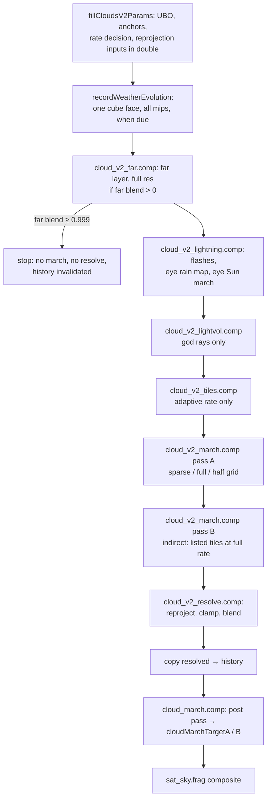
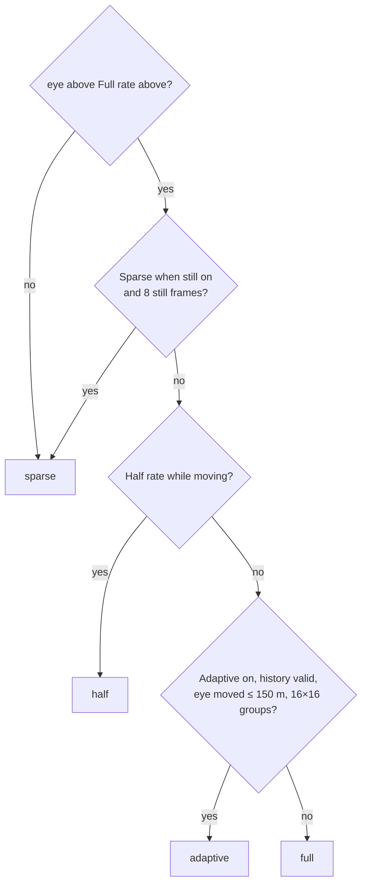

# Temporal resolve and the far layer

Marching every half-resolution pixel every frame is too expensive in most views, and a single march is noisy
(jittered starts, sub-texel ray positions, short light marches). The cloud pipeline therefore marches a subset
of pixels each frame and accumulates them in a reprojected history. This page covers how the rate is chosen,
the resolve, `cloud_march.comp`'s post pass (which produces what the rest of the frame reads), the clouds'
shadow on the ground, how clouds hide stars and satellites, and the **far cloud layer** that replaces the march
from far orbit. The march itself is in [The cloud march](march.md).

## Pass order

All of this runs inside the `cloud_march` GPU timestamp bucket, orchestrated by `recordCloudsV2()` and
`fillCloudsV2Params()` in `src/simulations/SatelliteSimCloudsV2.cpp`.

| Image | Format | Size |
|---|---|---|
| new samples (+ depth) | RGBA16F + RG32F | half res; the sparse rate uses its quarter-size top-left |
| full-rate tiles (pass B) | RGBA16F + RG32F | half res |
| resolved (+ depth, read back as depth history) | RGBA16F + RG32F | half res |
| history | RGBA16F | half res |
| far layer | RGBA16F | full res |
| light volume | R16F 128 × 128 × 32 | — |
| weather cube | RGBA8, 1024² × 6, 8 mips | — |

All clouds screen images live in `VK_IMAGE_LAYOUT_GENERAL`; passes are separated by memory barriers only. The
two post-pass targets `cloudMarchTargetA/B` are the exception: they move between general and shader-read layouts
each frame for `sat_sky.frag`.

## Rate modes

| Mode (`misc.z`) | Pixels marched per frame | When |
|---|---|---|
| **sparse** (0) | one pixel per 2 × 2 half-res block, cycling (0,0), (1,1), (1,0), (0,1) over four frames | the default at and near the ground, and from altitude in a still view |
| **full** (1) | every half-res pixel | eye above "Full rate above" (30 km) while the view moves |
| **half** (2) | a checkerboard, alternating each frame | where full rate would run, with "Half rate while moving" on (off by default) |
| **adaptive** (3) | sparse, plus full rate in 32 × 32 tiles that need it (pass B) | where full rate would run, with "Adaptive rate while moving" on (the default) |

The decision, per frame, on the CPU:

**Why full rate from altitude.** From orbit a moving camera keeps invalidating the history, and a sparse grid
without history is visibly blocky. A ray from altitude crosses only a thin shell, so marching all of them is
affordable. **Why sparse again when still:** a still view's sparse march converges on the same image through the
history at about a third of the cost.

**History validity.** The history is valid when it was valid last frame, the hash of every cloud setting that
changes what a pixel shows is unchanged, the eye moved less than 20 km, and sim time moved less than 600 s.
Cinematic cuts, shader reloads, target recreation and the far layer taking over invalidate it.

**A still view** has no camera rotation beyond 0.3 of a half-res pixel, no eye motion beyond 1 m, a sim time
step of at most 0.5 s, no zoom change, and valid history.

**Fast-flight LOD** ("Fast-flight cloud LOD", 1): with valid history, while boost is held and the eye moves more
than 2 m a frame, or whenever it moves more than 150 m a frame, the march takes at most 2 light steps, a 1.5 ×
base step and 60 percent of the iteration budget. At 2, it applies whenever the eye moves more than 2 m a frame.
Above 150 m a frame the history is of little use anyway, and the march switches its jitter per frame (see
[Jitter](march.md#jitter)).

**HQ photos and cinematic HQ exports** set "Full rate above" to 0 and "Sparse when still" off for their
duration, with time paused, and settle for many frames so the history converges.

## Adaptive tiles

`cloud_v2_tiles.comp` runs one 16 × 16 workgroup per 32 × 32 half-res tile (each thread owns one 2 × 2 block's
sparse pixel). A tile votes for full rate when, for any of its pixels:

- **parallax** exceeds "Adaptive parallax" (1 px): \( (|\Delta\text{eye}| + \text{volume slide}) /
  (d_\text{prev} \cdot \text{pixel angle}) \), with \(d_\text{prev}\) last frame's resolved cloud distance; or
- **its history is off screen**: the rotation-only reprojection falls outside the previous frame. This test has
  no margin, because a pan uncovers only about 2 px a frame and any margin would mean no edge tile ever votes.

Voting tiles are appended to `TileBuf` with indirect arguments (4 workgroups each) and flagged. Pass A returns
early on a flagged workgroup; pass B (the same shader with specialisation constant 2 = 1, dispatched indirectly)
marches the listed tiles into the full-rate images and also writes their sparse-grid samples, so the quarter grid
stays complete for the resolve.

**Why two passes:** inside one full-rate dispatch, skipping pixels saves nothing, because a warp costs as much as
its slowest lane. **Why the vote is its own pass:** inside the march it pushes the shader past the 128-register
allocation ([design constraints](march.md#design-constraints)).

In a still view nothing votes and the cost is the sparse grid; flying through a storm, only tiles with near cloud
pay full rate. "Foveated full rate (radius)" (0, experimental) additionally makes tiles within that radius of the
screen centre vote.

## The resolve

`cloud_v2_resolve.comp` runs one thread per half-res pixel and writes the resolved colour and depth.

### Fresh samples and the spatial estimate

A pixel is **fresh** if it was marched this frame: every pixel at full rate, this frame's parity at half rate,
the block's one pixel at sparse rate, every pixel of a listed adaptive tile (read from the full-rate images).

Over the 3 × 3 of this frame's new samples the resolve gathers: min, max, mean and standard deviation in
**mean-colour space**, \( (\text{rgb} / \max(1 - T, 0.02),\ T) \); min and max in plain radiance; the nearest
cloud distance; the opacity-weighted mean distance; and the sum of the four axial neighbours. Pixels with no
fresh sample take a spatial estimate:

| Rate | Fresh pixel | Other pixels |
|---|---|---|
| sparse | half its own sample, half the axial mean | bilinear read of the quarter grid |
| half | \( 0.5 \times \) own + \( 0.125 \times \) each diagonal | mean of the four (fresh) axial neighbours |
| full, adaptive tile | own; plus a 3 × 3 tent `blur` used in fast motion | — |

### Reprojection

All reprojection inputs are computed on the CPU in double precision: the previous view rotation, the previous
eye, the eye's ECEF displacement, and the change in the map's drift angle.

1. Take the pixel's view direction in ECEF.
2. Choose a depth: its own resolved distance; else the nearest cloud distance among its 3 × 3 new samples (a
   cloudless pixel reprojected at infinity would drag small clouds into streaks in motion); else infinity.
3. The world point is turned by the drift change (the clouds move with the map), offset by the eye's
   displacement plus the shape wind's shift (0.9 of "Wind"), and projected into the previous view.

This is exact for any rotation about a known eye. The history is sampled with a 9-tap Catmull-Rom filter.

### Motion, clamping and blending

**Motion is parallax, not pixel motion.** `motionPx` is the distance between the reprojection at the cloud's
depth and the same ray reprojected at infinity, in half-res pixels, with two floors: the noise volumes' own
relative slide (the part reprojection cannot follow), and the eye's sideways motion at the pixel's depth
(capped at 50 km). A pure rotation reprojects exactly and is not motion. Raising the blend weight during a pan
would swap the accumulated image for the quarter grid's noisy samples.

**Weights.**

\[
w_\text{new} = \text{mix}\big(w_\text{still},\ \max(w_\text{still}, w_\text{moving}),\ \text{smoothstep}(0.05, 1, \text{motionPx})\big)
\]

- \( w_\text{still} \) is "History weight" (0.05, capped at 0.15 on load: higher values make a woven checker
  as each pixel alternates between its own ray and its neighbours' estimate). It falls to 40 percent of that
  between 300 and 3000 km of eye altitude, against flicker of small clouds seen from medium orbit.
- \( w_\text{moving} \) is "History weight moving" (0.4, capped at 0.5).

**Clamp box.** In a still view the box is the neighbourhood's min and max **widened** by its range (a tight box
against quarter-grid neighbours makes blocky 2 × 2 squares in far cloud). As motion rises (0.1 to 1.5 px) it
tightens toward mean ± 1.25 standard deviations (variance clipping). History is clamped first in mean-colour
space, then in plain radiance: mean-colour space divides by opacity, which inflates near-transparent pixels
(the clear air inside beam shafts) by up to 50 times, and clamped only there, history at cloud edges blows up
into bright blocks.

**Block convergence.** As motion or the new-sample weight rises, a fresh pixel leans toward its spatial estimate
and the other three pixels of a sparse block take a matching weight, so all four update nearly alike. In fast
parallax (6 to 24 px) the fresh samples blend toward this frame's 3 × 3 tent and the weight toward 0.7. Without
valid history the output is this frame's spatial reconstruction.

### The resolved depth

The resolved distance is the 3 × 3 new samples' **opacity-weighted mean** distance rather than one ray's noisy
estimate. In a still view (parallax under 0.5 px **and** total texel shift under 0.5 px, rotation included) it
also blends at 0.1 with the previous frame's value, read back in place. The sky pass splits the air in front of
clouds at this distance ([Atmosphere and sky](../atmosphere-and-sky.md)), so a depth that jumped with the
sparse four-frame cycle would flicker that air. The gate includes rotation because a pitching camera would
otherwise blend the depth of a different direction into each texel, drawing streaks along the horizon.

## The post pass: cloud_march.comp

`cloud_march.comp` is a half-resolution compute pass (16 × 16) that turns the resolved clouds into the two
targets every later consumer reads. Despite its name it does not march the volumetric clouds; it composites
them with everything else that lives at half resolution. In order:

1. **Ray, eye ground, tile cull** of the beam pointing rays (before the bounds check, so its barriers stay in
   uniform control flow).
2. **Legacy cirrus** (`cirrusMarchCS`), active only when the volumetric march is knocked out.
3. **Read** the resolved radiance, transmittance and depth.
4. **Despeckle.** A cloud texel with at most one neighbour of comparable opacity is replaced by its 3 × 3 tent,
   and an edge texel (opacity falling sharply across it) leans 60 percent on the tent: isolated sub-pixel wisps
   caught on some frames flicker otherwise.
5. **Depth fill.** A cloudy texel with no distance takes its neighbours' opacity-weighted distance.
6. **Far-layer fade.** Radiance × (1 − far blend), transmittance toward 1.
7. **Lightning** (glow, bolts, red sprites) and **rain, snow and diamond dust at the eye**, drawn here, after the
   resolve, because a flash lasts a few frames and the history would swallow it. See [Weather](weather.md).
8. **Aurora and red airglow**, added to the radiance (see [Aurora and airglow](../aurora-airglow.md)).
9. **Beam pointing rays**: each beam's drawn line, cut by the scene depth, the beam's own cloud block altitude
   and the view ray's opaque cloud.
10. **Ground shadow** (below).
11. **Write the targets.**

| Target | rgb | a |
|---|---|---|
| `cloudMarchTargetA` | radiance: clouds, cirrus, aurora, red airglow, lightning, drops, beam lines and shafts | signed occlusion distance in **km** |
| `cloudMarchTargetB` | transmittance, per channel | ground shadow: Sun transmittance from the surface point |

The alpha of target A encodes occlusion: \( \ge 0 \) is an opaque cloud (the ray's transmittance fell below
0.1) at its mean distance (or the half-opacity point if no mean exists); \( < 0 \) is minus the mean distance of
translucent cloud; −60000 means no cloud. It is in kilometres because the target is RGBA16F, whose largest value
is 65504: in metres every cloud beyond 65.5 km would be infinite.

!!! note "Naming trap"
    Inside `cloud_march.comp` the transmittance accumulator is named `A_*` and is stored in target **B**; the
    radiance `B_*` is stored in target **A**. The names follow the composite `colour × A + B`.

## Hiding point sources

Stars, planets, satellite points, flare sources and glare sprites are hidden by cloud through
`cloudPointVisibility()` (`shaders/include/cloud_occlusion.glsl`): an opaque texel nearer than the source hides it
completely; translucent cloud in front dims it by \( T^\text{power} \), ramped in across the cloud's distance
(±1 percent + 300 m) so sources behind thin cloud dim and sources in front do not.
`cloudPointVisibilityAt()` evaluates this per **texel** for the four texels around the source (gathered) and
blends the four results bilinearly. Filtering the alpha instead would mix a real cloud distance with the no-cloud
marker into something near 0 km, which reads as an opaque cloud in front of everything along every cloud outline.
See [Points, bloom and glare](../points-bloom-glare.md).

## The cloud shadow on the ground

`cloudGroundShadowV2()` runs for surface pixels only (the scene depth hit something), fading out between 180 and
300 km from the eye. It marches the field (mean erosion) from the surface point toward the Sun:

- **Start** 10 m above the surface: a point exactly on the 0 m shell floor flips in and out of the shell in float
  rounding.
- **Past the terminator** the Sun ray is lifted to graze the horizon, so the shadow continues across the
  terminator instead of ending on a straight line.
- **Low stretch:** up to 3.5 km above the ground, measured along the **curved** ray
  (\( h(t) = t\mu + t^2/2R \)), in 20 to 60 steps of at most 2.5 km. A low Sun's path through a deck's height
  band can be 200 km long; with fewer, longer steps one small cumulus casts a chain of separate disc shadows.
- **Upper stretch:** 12 steps through the rest of the shell.
- **Footprint:** each step reads the field at about its own length (60 m to 3 km), so a long path averages the
  cells into their coverage instead of aliasing. As the Sun drops the weather cube is read up to 3 mips coarser
  (`gCv2WxLod`), because a grazing shadow has a penumbra tens of km wide, and the 5 km map's JPEG blocks would
  otherwise appear as stair-stepped shadows. The field's far-field substitution is disabled for the shadow
  (`gCv2NoFar`).
- **Rain** curtains count at 15 percent: at this footprint they are their regional mean.
- **Jitter** is a 2 × 2 ordered offset that the sky pass's [1 2 1] blur averages out exactly; white noise would
  leave a grain of hit-or-miss cells.

The result rides in target B's alpha and multiplies the direct sunlight on terrain and sea. Knockout bit 256
disables it. Its cost rises near sunset (more low-stretch steps), up to a few ms.

## The far cloud layer

From far orbit a half-res pixel spans kilometres, and the march's sub-texel sampling flickers on small clouds. The
**far layer** (`cloud_v2_far.comp`) replaces the march there with a 2D evaluation of the same placement, per
full-resolution pixel.

**When.** The far blend is a smoothstep of the eye's altitude between "Far cloud layer from" (600 km) and "Far
cloud layer full at" (8900 km) (`SatelliteSim::cloudFarBlend()`). Above 0.999 the march, resolve and lightning
passes are not dispatched at all, and the history restarts on the way back down. The layer needs the eye above
16 km.

**Per pixel.**

- The ray meets a sphere 1.5 km above sea level. `cv2FarColumn()`, the hand-kept 2D copy of the low layer's
  placement ([field](field.md#one-field-for-every-consumer)), gives the strength `e`, the cover fraction, the
  type's extinction, base and top. The footprint is stretched by \(1/\max(\mu, 0.15)\) along grazing views.
- **Optical depth:** \( \tau = \sigma_\text{type} \cdot \text{thickness}(e) \cdot 0.6 \cdot \) "density"
  (1.2). The coverage threshold is biased by "coverage bias" (0.12, field units), which matches the march: its
  3D lobes put cloud slightly outside the 2D field's edge.
- **Slant coverage:** at a zenith angle z, the apparent cover is \( 1 - (1 - f)^{1 + k \tan z} \) (k "slant
  coverage", 0.91, capped at 12), because seen obliquely clouds hide the gaps between them.
- **Relief:** two more columns a footprint away give e's gradient, which tilts the shading.

**Lighting** treats the cloud as a conservative two-stream slab with g = 0.85:

\[
R(\tau) = \frac{a\tau}{1 + a\tau}, \quad a = 0.75(1 - g)
\]

The key light uses the slab's direct-beam reflectance at the Sun's incidence (`slabRmu()`), times
\( \mu_0^{1/(1 + k_\text{low})} \) with \(k_\text{low}\) "low-Sun light" (0.38): a flat slab's \( \mu_0 \) would go
dark well before the terminator, where the march's 3D tops stay lit. It is scaled by "sunlight" (4.1). Sky light
is \( R \times \) the zenith sky × "sky light" (0.6), plus the moonless night sky; the Moon replaces the Sun at
night, city light reaches the base, and an eclipse dims both terms.

**Mid and high layers** are sampled at three heights inside each lens (from the same cluster reads as the march),
lit as slabs, and placed over the low layer by the **adding method**:

\[
L = L_U + L_\text{low}\,\frac{(1 - R_U)^2}{1 - R_U R_\text{low}}
\]

A plain attenuator over the decks draws a grey camouflage pattern.

**Composite.** `cloud_march.comp` fades the march's clouds out by the far blend, and `sat_sky.frag` puts the far
layer **behind** the half-res composite: \( c' = (c\,T_f + L_f)\,T + L \), so aurora, airglow and beam light stay in
front. The far layer has no scene-depth test (a half-res depth read per full-res pixel draws a dot grid), no Cb
towers, no rain and no ground shadow.

## Debug views

| View | Shows |
|---|---|
| 6 | rain at the eye: red the rate, green the drop mask, blue the snow share (drawn by `cloud_march.comp`) |
| 11 | adaptive full-rate tiles tinted red (drawn by the resolve; the march then sees view 0) |

Harness `state` reports the current rate under `clouds_v2.rate` (sparse, full, half or adaptive) and
`clouds_v2.fast_lod`; `tools/harness/tstab.py` measures temporal stability against settled references (see
[Automation harness](../../development/harness.md)).

## Settings

Clouds tab, "Quality / performance" (keys under `clouds_v2`):

| Label | Key | Default |
|---|---|---|
| History weight | `history_weight` | 0.05 (max 0.15) |
| History weight moving | `history_weight_moving` | 0.4 (max 0.5) |
| Full rate above (km) | `full_rate_above_km` | 30 |
| Sparse when still (0/1) | `sparse_when_still` | 1 |
| Half rate while moving (0/1) | `half_rate_moving` | 0 |
| Fast-flight cloud LOD (0/1/2) | `fast_flight_lod` | 1 |
| Foveated full rate (radius) | `fovea_radius` | 0 |
| Adaptive rate while moving (0/1) | `adaptive_rate` | 1 |
| Adaptive parallax (px) | `adaptive_parallax_px` | 1.0 |

Clouds tab, "Noise scales" (the far layer rows):

| Label | Key | Default |
|---|---|---|
| Far cloud layer from (km) | `far_layer_from_km` | 600 |
| Far cloud layer full at (km) | `far_layer_full_km` | 8900 |
| Far cloud layer sunlight | `far_layer_sun_gain` | 4.1 |
| Far cloud layer sky light | `far_layer_sky_gain` | 0.6 |
| Far cloud layer slant coverage | `far_layer_slant` | 0.91 |
| Far cloud layer coverage bias | `far_layer_cover_bias` | 0.12 |
| Far cloud layer density | `far_layer_density` | 1.2 |
| Far cloud layer edge softness | `far_layer_softness` | 1.0 |
| Far cloud layer low-Sun light | `far_layer_low_sun` | 0.38 |

## Where in the code

- `src/simulations/SatelliteSimCloudsV2.cpp`: `fillCloudsV2Params()` (rate decision, history validity,
  reprojection inputs), `recordCloudsV2()` (pass order and barriers), `createCloudsV2Targets()`.
- `src/simulations/SatelliteSim.h`: `cloudFarBlend()`.
- `shaders/cloud_v2_tiles.comp`: the adaptive tile vote.
- `shaders/cloud_v2_resolve.comp`: reprojection, clamping, blending, depth history.
- `shaders/cloud_march.comp`: the post pass, `cloudGroundShadowV2()`.
- `shaders/cloud_v2_far.comp`: the far layer; `cv2FarColumn()` in `shaders/include/clouds_v2.glsl`.
- `shaders/include/cloud_occlusion.glsl`: `cloudPointVisibility()`, `cloudPointVisibilityAt()`.
- `shaders/sat_sky.frag`: the composite of both targets and the far layer.
