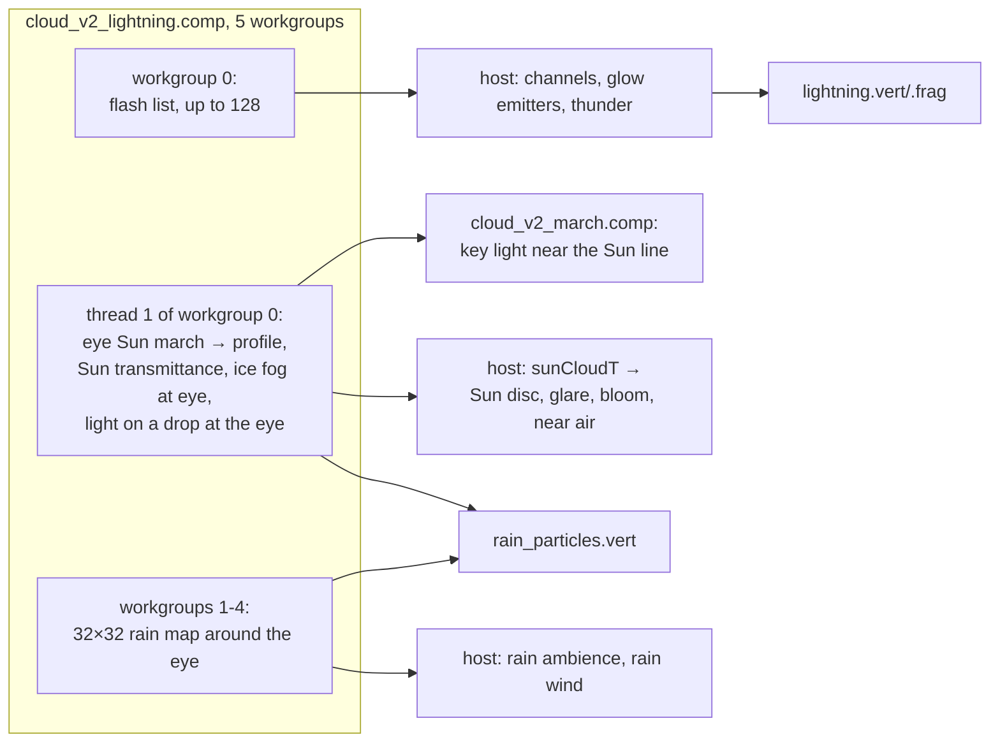
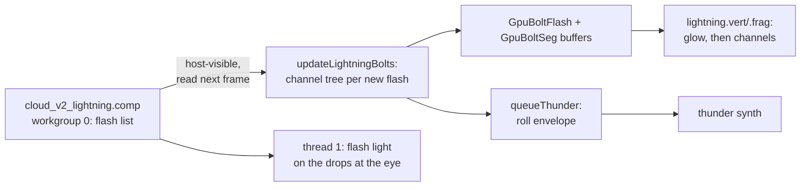

# Weather, rain, lightning, fog

This page covers the weather effects built on the [cloud field](field.md): rain shafts and the precipitation an
observer stands in (rain, sleet, snow and diamond dust as particles in the world), lightning and its hand-off to
thunder, fog, dust and ice fog, the Sun hidden behind clouds, and the experimental god rays. The weather map
itself (coverage, cloud types, precipitation, evolution over time) is described in
[The cloud field](field.md#the-weather-cube).

Most of these effects are fed by one small compute pass, `cloud_v2_lightning.comp`, which runs before the march
each frame and writes a host-visible buffer (`CV2FlashBuf`, `shaders/include/cloud_lightning.glsl`):

Lightning and the drops at the eye are drawn in the main render pass after the sky's temporal AA, at full
resolution, so neither the cloud history nor the sky's history smears them.

## Rain shafts

Rain shafts are part of the field: below a cloud's base, where the weather map precipitates, the low layer
returns rain curtains instead of cloud ([field: rain shafts](field.md#rain-shafts)). Heavy rain falls in a core
under each dominant storm tower, stretched 2.5 times downwind under the anvil; lighter, intermittent rain falls
wherever the map's precipitation says.

In the march a rain sample is cheap (no fine steps, one sample standing for four coarse steps, a two-step light march) and uses the rain phase: a
sub-degree diffraction spike plus a broad refracted lobe, with the primary and secondary rainbows
([The cloud march: atmospheric optics](march.md#atmospheric-optics)). Lit through the cloud above, a shaft is dark
under a Cb and bright at its sunlit edge, which is where rainbows show: at storms near the terminator, with a low
Sun behind the observer. A clear bow needs dense shafts: at the default "Rain" (0.71) it barely shows, and it
reads well from about 1.5 up. Where the shafts' air is below freezing they are snow, which shows faint ice optics
and no bow.

## Precipitation at the eye

Near the observer, rain, sleet, snow and diamond dust are drawn as **particles**: individual drops in the world,
not streaks attached to the camera, so walking moves through the rain. They are one instanced draw
(`rain_particles.vert/.frag`, recorded by `recordRainParticles()`) in the main render pass after everything
else, that is after the sky's temporal AA has resolved the frame. A drop is far smaller than a half-res cloud
texel and moves several pixels a frame; drawn into the cloud composite it would be fattened and smeared by both
histories. The particles are the near part of the rain volume, drawn one drop at a time: beyond their reach the
march's rain shafts carry the rain.

Nothing is stored per drop. Every drop is built in the vertex shader from its instance index and a hash, so the
draw needs no buffers beyond the flash buffer's rain map and lighting terms.

### Temperature: rain, sleet or snow

The air temperature at the eye (`SatelliteSim::cv2EyeTempC`, computed in `fillCloudsV2Params()`) is a simple
climate model:

\[
T = -18 + 45\cos^{1.5}(\text{lat}) + \min(0.25\,|\text{lat}|,\ 15)\cdot s - 6.5\,h_\text{km}
\]

in degrees C, where \(s\) is the season (+1 at local midsummer, from the Sun's declination in that hemisphere)
and \(h\) the eye's altitude. That gives about 27 C at the equator, 9 C at 45 deg and −12 C at 75 deg at sea
level. The **liquid share** is `smoothstep(−1, 2.5, T)`: all snow below −1 C, all rain above 2.5 C, and in
between each particle is a drop or a flake by its own hash (**sleet**). The distant rain curtains stay rain; only
the eye's precipitation changes type.

### The rain map

Workgroups 1 to 4 of the lightning pass fill a 32 × 32 map of 40 m cells (±640 m) around the eye, at the eye's
height: each cell evaluates `cv2Field()` (no erosion) and stores the rain rate,
\( \text{rain} \times \operatorname{clamp}(\sigma / 0.0012, 0, 1) \), from 0 (none) to 1 (a Cb core). Each
workgroup also stores its maximum. On the host, the previous frame's maxima decide whether to draw at all (rain
near the eye, or else diamond dust in sunshine). In the shader every drop reads the map at its own position
(`cv2RainMapAt()`, bilinear), so walking toward a shaft its drops appear in the far boxes before the observer is
inside it. A ~6 s value noise in sim time (`cv2RainBurst()`, 0.35 to 1) makes showers come in bursts.

### Nested world-fixed boxes

The drops live in a local frame fixed to the nearest 0.25 deg point on the ground (`cv2.rainE/N/U`); the eye's
position in it is computed in double and wrapped to 1024 m, which every box size divides. Level k is a box of
side \( L = 4\ \text{m} \times 2^k \) holding \( N_0 \times 2^k \) drops, where \(N_0\) is "Drop particles
(x1000, nearest box)" (16 000). Each drop wraps within its box as it falls and drifts, so the box always
surrounds the eye. Level k is drawn over distances \([L/4, L/2]\) from the eye (level 0 from the eye itself,
fading in from 8 to 25 cm), cross-faded with the next level over \([0.4, 0.5]\,L\). "Drop reach (m)" (33, at
most 64) sets the number of levels, the last one ending at the reach: 5 levels and 496 000 instances at the
defaults, most of them culled in the vertex shader where there is no rain.

Each level holds twice the drops in eight times the volume, so particles thin out with distance by design; each
far particle stands for more real drops (below).

### Sizes and fall speeds

| Particle | Size | Fall speed |
|---|---|---|
| raindrop | Marshall-Palmer above 0.5 mm (\( \Lambda = 2.9\ \text{mm}^{-1} \)), 0.5 to 5 mm, fixed per drop | terminal velocity \( v = 9.65 - 10.3\,e^{-0.6 D} \) m/s (Atlas): 2.3 m/s at 0.5 mm, 8.8 at 4 mm |
| snowflake | an aggregate of 2 to 8 mm | 0.8 to 1.4 m/s, fluttering ±3 to 9 cm |
| diamond dust | a 0.15 mm ice plate, tumbling | 0.25 to 0.45 m/s |

### Motion

The fall and the wind are **integrated over sim time on the CPU** (`updateRainMotion()`, in double) and handed
to the shader as phases wrapped to 1024 m (`cv2.rainMotion`, `cv2.rainWind`). A drop's fall offset is its
terminal speed, quantised to 1/64 m/s, times the shared fall phase, so the shader can take the phase modulo its
box exactly. Integrating rather than evaluating \( v\,t \) is what lets the speed and the wind change smoothly:
with \( v\,t \) every change of v or of the wind would move every drop at once. Pausing stops the rain;
reversing time runs it backwards.

- **Fall.** "Rain fall speed (x)" (3.0) × each drop's terminal velocity, × up to 1.35 in heavy rain (rate 0.6
  and up).
- **Wind.** "Rain wind (x ground wind)" (0.4) × 0.4 × the wind aloft ("Wind"), toward the east, plus a
  shower's **outflow**: "Storm wind (m/s)" (11) at rain rate 0.6 and above, blowing away from the rain map's
  rain-weighted centre (the shower's core; when the core is within about 40 m of the eye the outflow takes the
  ambient wind's direction).
- **Gusts.** "Wind gusts" (1.38) modulates the wind by a smooth noise over about 4 s and 1.5 s of sim time:
  ±20 percent in light rain to ±60 percent in heavy rain, turning it by up to ±15 deg. The wind and the rate are
  eased over about 0.6 s.
- **Snow** drifts with the same wind × "Snow wind (blizzard)" (1.0), integrated separately; flakes flutter on
  two slow oscillations of their own.

### Coverage is conserved

A drop is drawn as the **streak** it sweeps over the shutter time "Drop shutter (ms)" (33): its own fall and
drift relative to the eye, including the eye's own velocity (capped at 30 m/s; a jump of more than 2 km/s, such
as a Go to, counts as no motion). The streak's pixels together cover the drop's real cross-section, so each
pixel's alpha is the share of the exposure the drop spent on it, and its drawn width is its real width or one
pixel, whichever is larger.

Each particle carries the rain's real geometric cross-section per m³ divided by the particle density at its
level. For rain the cross-section is Marshall-Palmer's (\( N_0 = 8000\ \text{m}^{-3}\text{mm}^{-1} \),
\( \Lambda = 4.1 R^{-0.21} \)) at a rain rate \( R = 60\,r^{1.5} \) mm/h (a light shower, r = 0.2, is about
5 mm/h; a Cb core, r = 1, 60 mm/h); snow carries four times that; diamond dust half the ice fog's extinction.
Summed along a ray, the particles' coverage is the rain's optical depth. The share of particles drawn is
\( \sqrt{r/0.5} \), each fading in and out over its own hash band as the rate changes, so nothing pops.

Where one particle would carry so much coverage that it draws as a bright dot (far away, heavy rain: alpha 0.12
to 0.35) it fades out, and the rain volume carries that distance alone; real rain there is a haze, not grains. A
streak that would need more than 0.8 coverage widens instead of becoming opaque. "Drops at the eye
(visibility)" (2.63, up to 10) multiplies the alpha: 1 is physical.

### Light

A drop is lit the way the cloud march lights a rain sample at the eye, so the drops and the rain volume beyond
them agree. Thread 1 of the lightning pass computes the terms once per frame:

- `cv2RainKey`: the Sun through the clouds toward it (the 400 km Sun march, below) and the Earth's shadow, or at
  night the Moon dimmed by the column above at its slant; an eclipse dims it.
- `cv2RainAmb`: the zenith sky through the cloud above (two-stream diffuse transmission of the column's optical
  depth, as the march's ambient), plus the ground and horizon, the key light's bounce off the ground, city light
  at night, and the light of every lightning flash at its distance, so a close strike in a downpour lights every
  drop.
- `cv2RainKeyDir`: the direction to the key light, and the liquid share.

Copies of the march's `sunTransmit`, `sunColorAt` and `skyZenithAt` live in `cloud_v2_lightning.comp` for this
and must be kept in step. The terms are divided by the frame's white balance, because the particles are drawn
after it.

Each drop scatters through the volume's own phase function (`shaders/include/cv2_optics.glsl`, shared with the
march):

- **Raindrops** take the rain phase, a diffraction spike plus a broad refracted lobe, and the rainbow optics:
  drops 42 deg from the antisolar point flash the bow's colours, drops toward the Sun glow in its diffraction
  lobe.
- **Snowflakes** take the snow phase (broad lobes, a little of the ice optics and the pillar) plus a plate glint:
  each flake is tilted up to about 12 deg from level and turns as it flutters, flashing when its face mirrors
  the key light into the eye.
- **Diamond dust** draws only the glints of plates tumbling in every orientation, with no diffuse light; it does
  not occlude.

The fragment shader applies the sky's tonemap (with its highlight roll-off) and blends **premultiplied**,
`ONE, ONE_MINUS_SRC_ALPHA`: a drop dimmer than the sky behind it darkens it, as a real one does. Drops are
depth-tested against the unified scene depth at their range, so terrain, opaque cloud and meshes in front hide
them. Below 100 percent render scale with the sky TAA off they test the half-res scene depth instead.

The draw happens only when the lightning pass ran this frame, the eye is below 6 km, and the previous frame's
map held rain (or there is diamond dust in sunshine). It costs about 0.35 ms at the defaults (RTX 3070 Ti,
1600 × 900), about 0.8 ms at a 64 m reach.

!!! note "Known overlap"
    The march's rain volume is not cut at the particles' reach, so the rain within the nearest few tens of
    metres is counted twice (an optical depth of about 0.02 to 0.05).

### Hand-off to sound

The host reads the rain map's central 6 × 6 cells (±120 m), times the liquid share of precipitation from the
eye temperature, eased over 2 s, as the `rain` ambience driver. See [Ambience](../../sound/ambience.md).

## Lightning

Lightning is split between the GPU and the host. The GPU decides **which** flashes happen, from the clouds it
draws; the host builds what each flash **looks** and **sounds** like from its record; a full-resolution draw
after the sky TAA puts it on screen.

### Where flashes come from

Workgroup 0 of the lightning pass (256 threads) walks two lattices around the observer, out to the horizon of
12 km cloud tops:

- **Cb towers.** The same lattice, roles and fill as the field's towers (`cv2CbRole()`); only **dominant**,
  anvil-reaching towers flash. Their rate is "Lightning rate: Cb towers (/min each)" (0.4) × the tower's
  activity (its strength from 0.35 to 0.75), with up to three flashes per tower per slot.
- **Storm regions.** A fixed equal-angle lattice of 64 × 64 regions on each of the six cube faces of the drifted
  sphere, about 156 km across, the same at any eye altitude (only how far out it is walked changes, so climbing
  or descending never reshuffles the flashes). Each region draws candidate flashes at the most active rate,
  "Lightning rate: storms (/min per 20 km)" (0.31 flashes a minute per 20 × 20 km of full-strength storm, scaled by
  the region's true area), at random points inside it. Each candidate reads the weather cube at its point (mip
  2: the deep-convective type, the coverage and the rain) and is kept with probability equal to the storm's
  activity there. This thinning makes the rate per area follow the weather while only the few candidates alive
  this frame read it. Whole storms therefore flash, including map-typed storms without anvil towers.

The schedule is hashed from the source's cell and a 2 s slot of **sim time**; the current and the previous
slot are evaluated. It is deterministic and reversible: replaying or reversing time shows the same flashes, and
with time paused a flash stays frozen (harness `time add 0.25` steps through one).

**The column probe.** Each live flash samples `cv2Field()` at 16 heights from 150 m above the ground to above the
tropopause (the Cb type's top + 1.5 km) and takes the lowest and highest heights holding cloud (density without
rain or thin ice above 4e-4 /m) as the base and top of the cloud **actually drawn** there. With no cloud, or less
than 1.5 km of it, there is no flash; the weather type's nominal heights would put flashes in clear air above
the capped cumulus away from the towers.

**Kinds.**

| Kind | Share | Where |
|---|---|---|
| cloud-to-ground (1) | up to 30 percent, where the storm is strong | origin at 25 to 45 percent of the cloud's depth; ground point 1.5 to 9 km aside |
| spider lightning (3) | about 40 percent | 150 m under the cloud base, spreading near-level |
| in cloud (0) | the remainder | 30 to 75 percent of the cloud's depth |
| red sprite (2) | "Lightning sprites (chance)" (0.01) per ground stroke | about 75 km up, within about 15 km of the stroke |

**Timing** (`cv2FlashIntensity()`, `include/cloud_lightning.glsl`): a 50 ms stepped leader with no brightness of
its own, then for a ground stroke 1 to 4 return strokes (sharp pulses decaying over 35 ms) over a fading
continuing current, lasting 0.25 to 0.85 s in all; an in-cloud flash flickers through 2 to 6 softer pulses
(60 ms) over 0.35 to 1.15 s. A sprite starts 4 ms after the return stroke, rises over 12 ms and decays over
about 70 ms. Up to 128 flashes are listed (`kCv2FlashMax`), each a 64 B record: origin, ground point, kind, id,
shape seed, age, distance, the cloud's base and top, strength, duration.

### The channel

`updateLightningBolts()` reads the previous frame's list, only if the lightning pass wrote it last frame (a stale
list would hang on screen), together with the observer direction it was written in. For each new flash
`buildBoltTree()` builds the channel **once** as geometry, a fractal tree grown from the flash's seed by midpoint
displacement down to pieces about 3 pixels long at the flash's distance (4 m to 2.5 km), and caches it by id until
the flash has ended. "Lightning tendrils" (1.23) scales the branch and tendril counts.

- **Cloud-to-ground.** The main channel wanders inside the cloud from the charge region, leaves the cloud's flank
  or base, and comes down **slanted** to the ground point, covering most of the sideways distance on the way.
  Branches leave the channel about every 260 m, always down and outward and shorter the lower they start; they
  carry twigs, and the twigs many dim tendrils (fewer far away, where they would be sub-pixel). Two to five
  short upward streamers rise from the ground near the strike.
- **In cloud and spider.** Three to six arms spread nearly level for 6 to 30 km (longer in strong storms),
  branching into a web of twigs and drooping tendrils.
- **Sprite.** A head with 20 to 45 tendrils hanging 12 to 35 km, forking and splaying as they fall, and a few
  streamers rising from the head.

Each frame the host uploads the live flashes (`GpuBoltFlash`: frame, intensity, age, state, four glow emitters)
and their segments (`GpuBoltSeg`, 32 B; up to 131 072) in this frame's eye-centred frame. The state animates the
tree: during the leader the revealed part works down the channel (faint, its tips brighter); a ground stroke's
branches light with the first return stroke and fade within about 0.1 s while the main channel carries the later
strokes; a spider spreads through its web at 150 km/s, its front brightest.

### Drawing

`recordLightning()` draws in the main pass after the scene and before the rain particles, at full resolution and
after the sky TAA, so a flash lasting a few frames is neither averaged away nor smeared.

**Blending.** Both draws are **screen**-blended, \( \text{out} = s + d(1 - s) \), after applying the sky's
tonemap. For the tonemap \( 1 - e^{-x} \) this is exactly the tonemap of the summed light,
\( T(a + b) = T(a) + T(b)(1 - T(a)) \), so any number of overlapping strokes saturate instead of clipping.

**Glow.** One full-screen triangle loops over the flashes' emitters (the origin; a ground stroke's exit from the
cloud; the advancing fronts of three spider arms). At each pixel it reads the four half-res cloud-composite
texels around it, each with its own distance and opacity (one filtered distance would mix a cloud's with the
no-cloud marker), and lights the cloud there by `boltGlow()`: a diffusion core about 4 km wide whose distance is
floored at about 3.5 km (the light has crossed at least that much cloud wherever it leaves it, so no cloud surface
shows a point-like lamp), and a faint tail with a 15 km scale, windowed to zero by 45 km. From orbit a flash is a
soft patch 10 to 20 km across. × "Lightning glow" (0.088). A sprite's head is instead a flattened red glow about
15 km across, seen through the air.

**Channels.** One antialiased quad per segment, at the channel's **true luminous width**: 3 m for a return
stroke's main channel, 1.2 m for branches, 0.6 m for twigs, 0.35 m for tendrils; 380 m tapering to 120 m for a
sprite's tendrils (red, the tips leaning violet). A channel thinner than a pixel is drawn one pixel wide with its
energy scaled by its true width, so a far stroke is a fine dim line and never fatter than it is. A halo of the
light scattered by rain and air (70 m about the main channel, 22 m about branches, 1.5 to 22 px) widens it.
Terrain hides a channel through the depth test, and the cloud and rain in front of it through
`cloudPointVisibilityAt()`; inside a cloud only its glow shows. × "Lightning bolts" (1.25).

**Air.** Channels and glow are dimmed by the air **column** between the eye and the point (`boltAir()`: 8 km scale
height, an optical depth of about 0.15 per scale height), so a flash seen from orbit crosses only the air below
the eye rather than a fixed haze length.

The lightning draw costs about 0.3 ms.

### Thunder

The same geometry schedules the thunder: for a flash within 35 km, `queueThunder()` builds the roll's envelope
from each segment's arrival at its distance / 343 m/s. See
[Ambience: rain and thunder](../../sound/ambience.md#rain-and-thunder).

### Harness

`lightning` lists the flashes in progress, their built trees and drawn segments, and the thunder queue;
`lightning spawn kind=cg|ic|spider|sprite dist_km= az= ...` places a flash by hand, which runs through the same
channel, glow and thunder code (see [Automation harness](../../development/harness.md)).

## Fog, dust and ice fog

`cv2FogDust()` returns three extinctions driven by the weather cube. It is **not** part of `cv2Field()`: any
addition to the march's main loop costs registers (see
[design constraints](march.md#design-constraints)), so fog and dust get their own short march after the clouds'.
Heights are measured above the **smoothed** ground (`cv2Ground()`, tens of km), so valleys fill deeper and ridges
stand out.

### Fog

| Kind | Forms where |
|---|---|
| radiation fog | clear or broken nights (burning off as the Sun passes about 12 deg), in valleys below the ~80 km mean ground and on low ground by the sea |
| advection (sea) fog | the coast and the sea, under a stratiform regime, day or night |
| mist | in rain |

Fog is patchy on the cluster field. Its top lies at "Fog depth" (200 m) × (0.5 + presence), undulating with the
low shape noise (a flat sheet reads as a painted plane), and its extinction is "Fog density" (0.0013 /m, about
2.3 km visibility) × presence. "Fog amount" (0.26) sets how readily it forms.

### Dust

Over dry land: the map clear over about 100 km, not sea, not rain. Dust varies gently by region (a value noise on
the direction at roughly 400 to 1300 km) and in plumes on the coarse cluster field, and falls off exponentially
with height (scale "Dust height", 1500 m). Its ground extinction in a full plume is "Dust density"
(0.00025 /m, about 15 km visibility) × "Dust amount" (0.5). Dust is mostly a terrestrial effect, so seen from
above it fades to a quarter between 15 and 80 km of eye altitude.

### Ice fog and diamond dust

Over the ice sheets under a clear sky: Antarctica (everything south of about 72 to 80 deg S, the ice shelves
included, and Antarctic land north of that), Greenland's interior above 800 to 1600 m, and the high Arctic's
land. A thin haze of ice crystals with a 250 m scale height, patchy, with ground extinction "Ice fog density"
(0.0002 /m) × "Ice fog amount" (1.0). It is lit with halo-rich ice optics (22 and 46 deg halos, sundogs,
parhelic circle, circumzenithal arc) and a **sun pillar**, for the Sun or the Moon; at the eye it sparkles as
diamond dust ([particles](#precipitation-at-the-eye)) at a rate of the ice fog's density / 5e-5 per metre.

### The fog march

After the cloud loop, `cloud_v2_march.comp` marches the ray's stretch inside a band of
`max(1.6 × fog depth, 4 × dust height, 6 × 250 m) + 5 km` above sea level, cut at the scene depth (or the
sea-level sphere when there is no surface) and capped at 150 km. When the eye is inside the band the far end is
dropped; from above, the near end, keeping the dense part.

- **20 steps**, jittered, with \(u^2\) spacing crowding toward the dense end: near the eye from inside the band,
  near the ground from above (coarse steps in the dense air draw concentric bands).
- **Exact height integration.** Dust and ice fog are exponential in height, and each step integrates the profile
  exactly, \( H\,|e^{-a_0/H} - e^{-a_1/H}| / |a_1 - a_0| \); one height per step draws the step pattern as rings on
  the ground seen from altitude. Samples below the ground carry no dust or ice fog.
- **Lighting**, once per ray at the band's middle: the Sun colour gated by the horizon, times the map's cover
  overhead and the path to the fog's top; the zenith sky; the Moon; and at night city light (in proportion to
  the lights) and the moonless sky. Phases: fog takes the cloud phase, dust a forward lobe with a tan albedo and a
  diffuse multiple-scattering term (single scattering alone makes a dusty sky a grey veil), ice fog the ice
  optics. An eclipse dims the Sun and sky terms.
- **Compositing.** Samples nearer than the clouds' mean depth go in front of them, the rest behind:
  \( L = L_\text{near} + T_\text{near}(L_\text{cloud} + T_\text{cloud} L_\text{far}) \).
- **Skipped under opaque cloud.** When the eye is above the band and the ray's cloud transmittance has fallen
  below 0.01, the fog march does not run: everything beneath an opaque cloud is hidden, and the dust above it is
  faint (a quarter seen from above). In an orbit view of a storm this saves a few ms.

Knockout bit 2048 switches all three off; the Planetarium and Potato presets set it.

## The Sun behind clouds

Thread 1 of the lightning pass marches from the eye toward the Sun, when the Sun is above −5.7 deg (sine −0.1)
and the eye is below the cloud shell's top: 32 quadratically spaced steps over
\( L = \min((h_\text{top} - h_\text{eye}) / \max(\sin e, 0.03),\ 400\ \text{km}) \), stopping early at optical
depth 8. It writes:

- the **profile** `cv2SunProf`: L and the optical depth from the eye at \( L(k/16)^2 \), k = 0 … 16, which the
  march uses to shadow clouds near the eye's line to the Sun
  ([key light](march.md#key-light));
- the Sun disc's cloud transmittance \( e^{-\tau} \), read back by the host and eased over 0.15 s into
  `CloudParams.sunCloudT` (1 when the march is not running);
- the Sun's transmittance at the eye including the horizon and the ice fog density at the eye (whether diamond
  dust can sparkle), and the key light and ambient on a drop at the eye
  ([particles](#light)).

`sunCloudT` multiplies the Sun disc, its corona, glare and lens flare (the minimum with the pixel's own cloud
transmittance), the Sun's bloom seed, the key light of rain samples near the eye, and the direct in-scatter of
air within about 3 km of the eye's line to the Sun, within 50 km and below 8 to 14 km. Without it a storm that
hides a low Sun still shows a Sun-shaped glow from the forward scattering of the haze and rain in front of it.
Applied to the whole sky, one small cumulus over the Sun would darken everything, hence the narrow region.

## God rays and the light volume

!!! note "Experimental"
    God rays are off by default ("God rays" 0) and their effect is subtle: a low Sun's air light comes mostly
    from beyond the volume's reach.

`cloud_v2_lightvol.comp` bakes a camera-centred 128 × 128 × 32 R16F volume of Sun transmittance: gnomonic
columns over ±"God ray range" (400 km) about the eye, from sea level to 16 km, 4 of its 32 levels per frame. Each
voxel marches 16 steps toward the Sun, from 150 m growing by 1.45 (about 127 km in all), stopping above the shell
or at optical depth 6.

For **sky pixels only**, with the Sun above about −11.5 deg and the eye below 60 km, the march estimates the share
of the ray's single-scattered air light that lies in cloud shadow (16 samples to 250 km plus a 4-sample tail to
the atmosphere's exit) and scales the output transmittance by
\( 1 - \min(0.9,\ k \cdot \text{shadowed}/\text{total}) \), so the composite takes that share of the sky behind away.
Subtracting a radiance instead would use the march's own air model, which does not match the sky pass's.
Surfaces are excluded because terrain and sea already carry their own cloud shadow.

## With the volumetric clouds off

Everything on this page is driven by the volumetric clouds, so it all stops when their march is knocked out
(bit 32768, set by the Planetarium and Potato presets). `recordCloudsV2()` then records nothing of the clouds
except the weather cube's evolution, which the flat stand-in cloud layers still read: no march, resolve or far
layer, and no lightning pass. Without the lightning pass there are no flashes, no rain particles, no thunder and
no rain sound, since all of them key on that pass having run this frame. Fog, dust and ice fog are part of the
march and go with it.

## Settings

Weather tab (keys under `clouds_v2`):

**Lightning**

| Label | Key | Default |
|---|---|---|
| Lightning rate: storms (/min per 20 km) | `lightning_storm_rate_per_area` | 0.31 (0 = off) |
| Lightning rate: Cb towers (/min each) | `lightning_rate` | 0.4 (0 = off) |
| Lightning glow | `lightning_glow` | 0.088 |
| Lightning bolts | `lightning_bolt` | 1.25 |
| Lightning tendrils | `lightning_tendrils` | 1.23 |
| Lightning sprites (chance) | `lightning_sprites` | 0.01 |

**Rain & snow**

| Label | Key | Default |
|---|---|---|
| Rain | `rain_amount` | 0.71 (0 = no shafts, no drops) |
| Drops at the eye (visibility) | `rain_streaks` | 2.63 (1 = physical, up to 10) |
| Drop reach (m) | `drop_reach_m` | 33 (4 to 64) |
| Drop particles (x1000, nearest box) | `rain_particles_k` | 16 |
| Drop shutter (ms) | `rain_shutter_ms` | 33 |
| Rain fall speed (x) | `rain_fall_speed` | 3.0 |
| Rain wind (x ground wind) | `rain_wind_gain` | 0.4 |
| Storm wind (m/s) | `rain_storm_wind_mps` | 11 |
| Wind gusts | `rain_gusts` | 1.38 |
| Snow wind (blizzard) | `snow_wind` | 1.0 |

**Fog, dust & ice fog**

| Label | Key | Default |
|---|---|---|
| Fog amount | `fog_amount` | 0.26 |
| Fog depth (m) | `fog_depth_m` | 200 |
| Fog density (1/m) | `fog_density` | 0.0013 |
| Dust amount | `dust_amount` | 0.5 |
| Dust height (m) | `dust_height_m` | 1500 |
| Dust density (1/m) | `dust_density` | 0.00025 |
| Ice fog amount | `ice_fog_amount` | 1.0 |
| Ice fog density (1/m) | `ice_fog_density` | 0.0002 |

**God rays (experimental)**

| Label | Key | Default |
|---|---|---|
| God rays | `godrays` | 0 |
| God ray range (km) | `godray_range_km` | 400 |

The storm and weather-evolution sliders are listed on [the field page](field.md#settings). "Optics (halos,
rainbows)" is on the Clouds tab ([march](march.md#settings)).

## Where in the code

- `shaders/cloud_v2_lightning.comp`: the flash schedule and column probe, the eye rain map, the eye Sun march,
  the light on a drop at the eye.
- `shaders/include/cloud_lightning.glsl`: `CV2FlashBuf` layout, `cv2FlashIntensity()`, `cv2RainMapAt()`,
  `cv2RainBurst()`; mirrored on the host by `kCv2FlashMax`, `kCv2RainMapOffset` and `kCv2FlashBufBytes` in
  `src/simulations/SatelliteSim.h`.
- `shaders/rain_particles.vert/.frag`, `shaders/include/rain_particles.glsl`: the drops;
  `src/simulations/SatelliteSimRain.cpp`: `recordRainParticles()`, `updateRainMotion()`.
- `shaders/include/cv2_optics.glsl`: the rain, ice and pillar optics shared by the march and the drops.
- `src/simulations/SatelliteSimLightning.cpp`: `updateLightningBolts()`, `buildBoltTree()`, `recordLightning()`,
  `queueThunder()`; `shaders/lightning.vert/.frag`, `shaders/include/lightning_draw.glsl` (`boltGlow()`,
  `boltAir()`).
- `shaders/include/clouds_v2.glsl`: `cv2FogDust()`, `cv2DirNoise()`, `cv2PillarOptics()`, the rain branch of
  `cv2FieldLow()`, the rain core in `cv2ColumnSigma()`.
- `shaders/cloud_v2_march.comp`: the fog march and the god-ray estimate.
- `shaders/cloud_v2_lightvol.comp`: the light volume.
- `src/simulations/SatelliteSimCloudsV2.cpp`: `fillCloudsV2Params()` (eye temperature, rain frame, fog
  parameters).
- `src/simulations/SatelliteSim.cpp`: `sunCloudT` easing; `src/simulations/SatelliteSimAmbience.cpp`:
  `updateThunder()` (plays the queued rolls) and the rain driver.
