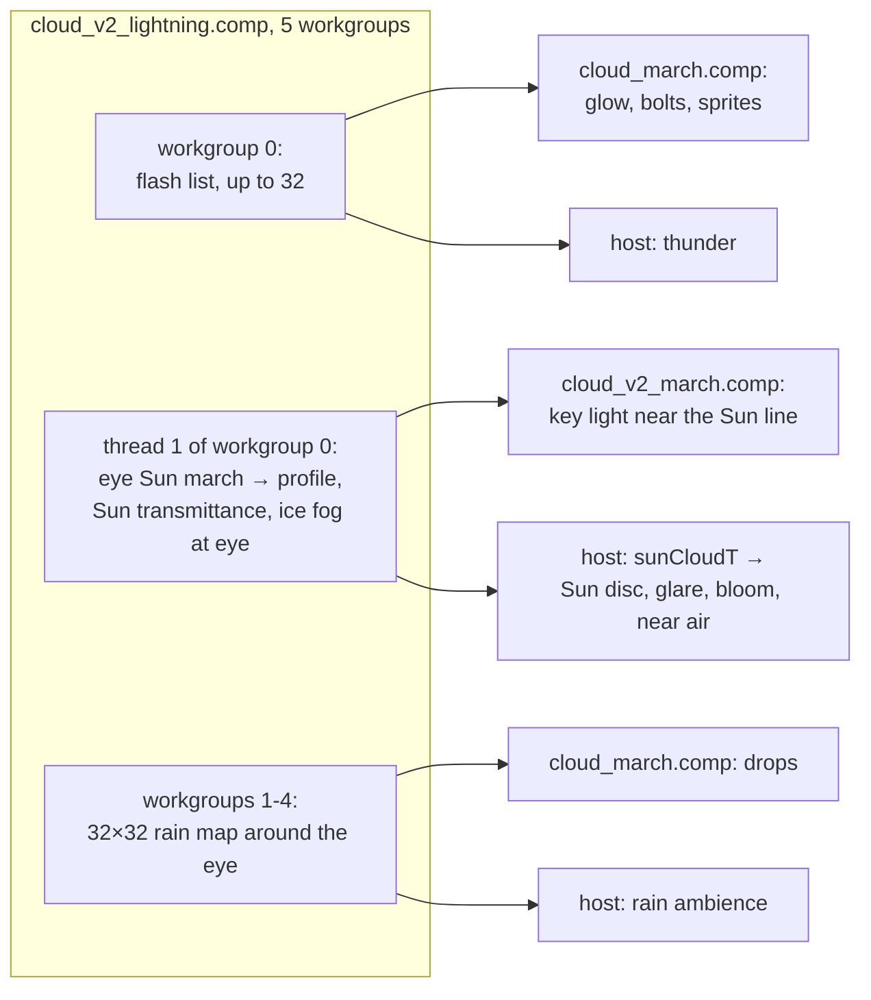

# Weather, rain, lightning, fog

This page covers the weather effects built on the [cloud field](field.md): rain shafts and the precipitation an
observer stands in (rain, sleet, snow and diamond dust as drops in the world), lightning and its hand-off to
thunder, fog, dust and ice fog, the Sun hidden behind clouds, and the experimental god rays. The weather map
itself (coverage, cloud types, precipitation, evolution over time) is described in
[The cloud field](field.md#the-weather-cube).

Most of these effects are fed by one small compute pass, `cloud_v2_lightning.comp`, which runs before the march
each frame and writes a host-visible buffer (`CV2FlashBuf`, `shaders/include/cloud_lightning.glsl`):

## Rain shafts

Rain shafts are part of the field: below a cloud's base, where the weather map precipitates, the low layer
returns rain curtains instead of cloud ([field: rain shafts](field.md#rain-shafts)). Heavy rain falls in a core
under each dominant storm tower, stretched 2.5 times downwind under the anvil; lighter, intermittent rain falls
wherever the map's precipitation says.

In the march a rain sample is cheap (no fine steps, a two-step light march) and uses the rain phase: a
sub-degree diffraction spike plus a broad refracted lobe, with the primary and secondary rainbows
([The cloud march: atmospheric optics](march.md#atmospheric-optics)). Lit through the cloud above, a shaft is dark
under a Cb and bright at its sunlit edge, which is where rainbows show: at storms near the terminator, with a low
Sun behind the observer. Where the shafts' air is below freezing they are snow, which shows faint ice optics and
no bow.

## Precipitation at the eye

When the eye is below 6 km and rain is within about 640 m, `cloud_march.comp` draws individual drops (or flakes)
over the view: **drops in the world**, not streaks attached to the camera, so walking moves through the rain.

### Temperature: rain, sleet or snow

The air temperature at the eye (`SatelliteSim::cv2EyeTempC`, computed in `fillCloudsV2Params()`) is a simple
climate model:

\[
T = -18 + 45\cos^{1.5}(\text{lat}) + \min(0.25\,|\text{lat}|,\ 15)\cdot s - 6.5\,h_\text{km}
\]

in degrees C, where \(s\) is the season (+1 at local midsummer, from the Sun's declination in that hemisphere)
and \(h\) the eye's altitude. That gives about 27 C at the equator, 9 C at 45 deg and −12 C at 75 deg at sea
level. Drops are **snow** below −1 C, **rain** above 2.5 C, and a mix of drops and flakes (**sleet**) between.
The distant rain curtains stay rain; only the eye's precipitation changes type.

### The rain map

Workgroups 1 to 4 of the lightning pass fill a 32 × 32 map of 40 m cells (±640 m) around the eye, at the eye's
height: each cell evaluates `cv2Field()` (no erosion) and stores the rain rate,
\( \text{rain} \times \operatorname{clamp}(\sigma / 0.0012, 0, 1) \), from 0 (none) to 1 (a Cb core). Each
workgroup also stores its maximum, which tells the drop pass whether any rain is near. Because every drop layer
reads the map at its own point, a shaft's drops appear in the far layers before the observer walks into it.

### Drops in a world-fixed lattice

`rainDrops()` builds up to 9 depth **layers** at 2, 4, 8, … m, out to "Drop distance" (128 m: 7 layers). Each
layer is a 3D lattice of cells 0.14 × the layer's depth, in a frame fixed to the nearest 0.25 deg point on the
ground (`cv2.rainE/N/U`); the eye's position in that frame is computed in double and wrapped to 1024 m, which
every cell size divides.

- **Probability.** A cell holds a drop with probability \( 0.85 \cdot r^{0.8} \), where \(r\) is the rate read
  from the rain map at that layer's point times a ~6 s burst factor (0.35 to 1). Light rain is a few drops, heavy
  rain many; the rate does not change a drop's brightness.
- **Motion.** The lattice falls at about 10 m/s for rain (8.4 m/s in the farthest layers) and 1.1 m/s for snow,
  and drifts with the ground wind (0.4 × "Wind"), gusting. The drift is the **integral** of the gusting wind:
  the time used is sim time modulo 600 s, and wind × t would carry a spurious speed of t × d(wind)/dt.
  Fall speed cannot follow the rain rate for the same reason: changing v moves every drop at once.
- **Shape.** A raindrop is a segment v/25 s long (motion blur); a flake is a fluttering dot that draws out into
  a short streak once the wind passes 4 m/s. The 2 × 2 × 2 cells nearest the ray's point at each layer are
  tested, so no drop is cut at a cell edge.
- **Brightness.** Each drop's energy is spread over its pixel footprint as \( (\text{size}/w)^{0.25} \): every
  layer puts about the same number of drops on screen while a real shower has about \(r^3\) more drops per deeper
  layer, so a far lattice drop stands for a clump. Drops are lit by the cloud they fall from (its resolved
  radiance).
- "Snow wind (blizzard)" (1.0) multiplies the flakes' drift and flutter.

### Glints and diamond dust

- **Ice crystals** in falling snow are plates tilted up to about 12 deg from level, fluttering; each flashes when
  its face mirrors the Sun into the eye (a narrow lobe about the half vector).
- **Raindrops** sparkle when backlit.
- **Diamond dust.** With no rain near, ice fog at the eye in sunshine draws only the glints of tiny crystals
  tumbling in every orientation (the same lattice, a wider lobe), at a rate of the ice fog's density / 5e-5 per
  metre.

Glints take the Sun's transmittance at the eye (from the lightning pass) and a capped peak, so an overexposed
glint stays a point. "Drops at the eye (rain/snow)" (1.0) scales drops and glints.

### Hand-off to sound

The host reads the rain map's central 6 × 6 cells (±120 m), times the liquid share of precipitation from the
eye temperature, eased over 2 s, as the `rain` ambience driver. See [Ambience](../../sound/ambience.md).

## Lightning

### The flash schedule

Flashes are generated on the GPU each frame by workgroup 0 of the lightning pass. It walks the Cb tower lattice
around the observer out to the horizon of 12 km tops (up to about 400 km from the ground, at most 81 × 81
cells), using the same lattice, roles and fill as the field's towers (`cv2CbRole()`); only **dominant** towers
flash. For each, a schedule is hashed from the tower's cell and a 2 s slot of **sim time**:

- the chance of a flash in a slot is "Lightning (flashes/min/tower)" / 60 × 2 s × the tower's activity
  (strength 0.35 to 0.75);
- a flash starts at a hashed moment in its slot and lasts 0.25 to 0.85 s, with 1 to 4 return strokes (each
  decaying over 35 ms) over a fading glow;
- a quarter of the flashes of strong towers are cloud-to-ground, from 400 m above the tower's base to a ground
  point within 1.2 radii; the others light the cloud at 30 to 75 percent of the tower's height.

The schedule is deterministic and reversible: replaying or reversing time shows the same flashes, and with time
paused a flash stays frozen (harness `time add 0.25` steps through one). Up to 32 flashes are listed
(`kCv2FlashMax`).

### Glow, bolts and sprites

`cloud_march.comp` draws the list after the temporal resolve, because a flash lasts only a few frames and the
history (a new-sample weight of 0.05 on a sparse grid) would swallow it.

- **Glow.** The resolved cloud is lit around each flash at its mean depth, by its opacity:
  \( I \cdot e^{-r/5\,\text{km}} / (1 + r^2 / (2.5\,\text{km})^2) \), in-cloud diffusion over a few km, then the
  inverse square, × "Lightning glow" (0.088). From orbit a storm top blinks across 10 to 20 km.
- **Bolts** (cloud-to-ground only). A fractal tree built in one sequential pass per pixel: a main channel of 14
  segments (a random walk pinned at both ends), a branch of 6 segments from more than half of its vertices
  (angling down and out, shorter lower down), and twigs of 4 segments off the branches. Each segment is a core of
  a few metres, never thinner than a pixel, whose **peak is capped** so an overexposed stroke keeps a narrow
  width, plus a faint halo. It is hidden by terrain and dimmed smoothly where it passes behind the cloud; a
  bounding test skips rays far from the tree. × "Lightning bolts" (1.0).
- **Red sprites.** A cloud-to-ground stroke sets off a sprite with probability "Lightning sprites (chance)"
  (0.05): about 75 km up, within 15 km of the tower, 4 ms after the stroke, fading over about 0.1 s. A deep-red
  head and 8 to 13 tendrils hanging toward 40 to 50 km, each forking twice as it falls, the tips leaning violet.

### Thunder

`SatelliteSim::updateThunder()` reads the flash list back on the host (one frame later). Each new flash within
30 km queues a roll of the `thunder` synth at its distance, arriving distance / 343 m/s after the flash began,
in sim time; a cloud-to-ground stroke is louder, and the pan follows its bearing. Sprites are silent. See
[Ambience](../../sound/ambience.md).

## Fog, dust and ice fog

`cv2FogDust()` returns three extinctions driven by the weather cube. It is **not** part of `cv2Field()`: any
addition to the march's main loop costs registers (see
[design constraints](march.md#design-constraints)), so fog and dust get their own short march after the clouds'.
Heights are measured above the **smoothed** ground (`cv2Ground()`, tens of km), so valleys fill deeper and ridges
stand out.

### Fog

| Kind | Forms where |
|---|---|
| radiation fog | clear or broken nights (burning off as the Sun passes about 12 deg), in valleys below the ~80 km mean ground and on low ground by the sea |
| advection (sea) fog | the coast and the sea, under a stratiform regime, day or night |
| mist | in rain |

Fog is patchy on the cluster field. Its top lies at "Fog depth" (200 m) × (0.5 + presence), undulating with the
low shape noise (a flat sheet reads as a painted plane), and its extinction is "Fog density" (0.0013 /m, about
2.3 km visibility) × presence. "Fog amount" (0.26) sets how readily it forms.

### Dust

Over dry land: the map clear over about 100 km, not sea, not rain. Dust varies gently by region (a value noise on
the direction at roughly 400 to 1300 km) and in plumes on the coarse cluster field, and falls off exponentially
with height (scale "Dust height", 1500 m). Its ground extinction in a full plume is "Dust density"
(0.00025 /m, about 15 km visibility) × "Dust amount" (0.5). Dust is mostly a terrestrial effect, so seen from
above it fades to a quarter between 15 and 80 km of eye altitude.

### Ice fog and diamond dust

Over the ice sheets under a clear sky: Antarctica (everything south of about 72 to 80 deg S, the ice shelves
included, and Antarctic land north of that), Greenland's interior above 800 to 1600 m, and the high Arctic's
land. A thin haze of ice crystals with a 250 m scale height, patchy, with ground extinction "Ice fog density"
(0.0002 /m) × "Ice fog amount" (1.0). It is lit with halo-rich ice optics (22 and 46 deg halos, sundogs,
parhelic circle, circumzenithal arc) and a **sun pillar**, for the Sun or the Moon; at the eye it sparkles as
diamond dust (above).

### The fog march

After the cloud loop, `cloud_v2_march.comp` marches the ray's stretch inside a band of
`max(1.6 × fog depth, 4 × dust height, 6 × 250 m) + 5 km` above sea level, cut at the scene depth (or the
sea-level sphere when there is no surface) and capped at 150 km. When the eye is inside the band the far end is
dropped; from above, the near end, keeping the dense part.

- **20 steps**, jittered, with \(u^2\) spacing crowding toward the dense end: near the eye from inside the band,
  near the ground from above (coarse steps in the dense air draw concentric bands).
- **Exact height integration.** Dust and ice fog are exponential in height, and each step integrates the profile
  exactly, \( H\,|e^{-a_0/H} - e^{-a_1/H}| / |a_1 - a_0| \); one height per step draws the step pattern as rings on
  the ground seen from altitude. Samples below the ground carry no dust or ice fog.
- **Lighting**, once per ray at the band's middle: the Sun colour gated by the horizon, times the map's cover
  overhead and the path to the fog's top; the zenith sky; the Moon; and at night city light (in proportion to
  the lights) and the moonless sky. Phases: fog takes the cloud phase, dust a forward lobe with a tan albedo and a
  diffuse multiple-scattering term (single scattering alone makes a dusty sky a grey veil), ice fog the ice
  optics. An eclipse dims the Sun and sky terms.
- **Compositing.** Samples nearer than the clouds' mean depth go in front of them, the rest behind:
  \( L = L_\text{near} + T_\text{near}(L_\text{cloud} + T_\text{cloud} L_\text{far}) \).

Knockout bit 2048 switches all three off; the Low, Planetarium and Potato presets set it.

## The Sun behind clouds

Thread 1 of the lightning pass marches from the eye toward the Sun, when the Sun is above −5.7 deg (sine −0.1)
and the eye is below the cloud shell's top: 32 quadratically spaced steps over
\( L = \min((h_\text{top} - h_\text{eye}) / \max(\sin e, 0.03),\ 400\ \text{km}) \), stopping early at optical
depth 8. It writes:

- the **profile** `cv2SunProf`: L and the optical depth from the eye at \( L(k/16)^2 \), k = 0 … 16, which the
  march uses to shadow clouds near the eye's line to the Sun
  ([key light](march.md#key-light));
- the Sun disc's cloud transmittance \( e^{-\tau} \), read back by the host and eased over 0.15 s into
  `CloudParams.sunCloudT` (1 when the march is not running);
- the Sun's transmittance at the eye including the horizon (for glints) and the ice fog density at the eye.

`sunCloudT` multiplies the Sun disc, its corona, glare and lens flare (the minimum with the pixel's own cloud
transmittance), the Sun's bloom seed, the key light of rain samples near the eye, and the direct in-scatter of
air within about 3 km of the eye's line to the Sun, within 50 km and below 8 to 14 km. Without it a storm that
hides a low Sun still shows a Sun-shaped glow from the forward scattering of the haze and rain in front of it.
Applied to the whole sky, one small cumulus over the Sun would darken everything, hence the narrow region.

## God rays and the light volume

!!! note "Experimental"
    God rays are off by default ("God rays" 0) and their effect is subtle: a low Sun's air light comes mostly
    from beyond the volume's reach.

`cloud_v2_lightvol.comp` bakes a camera-centred 128 × 128 × 32 R16F volume of Sun transmittance: gnomonic
columns over ±"God ray range" (400 km) about the eye, from sea level to 16 km, 4 of its 32 levels per frame. Each
voxel marches 16 steps toward the Sun, from 150 m growing by 1.45 (about 127 km in all), stopping above the shell
or at optical depth 6.

For **sky pixels only**, with the Sun above about −11.5 deg and the eye below 60 km, the march estimates the share
of the ray's single-scattered air light that lies in cloud shadow (16 samples to 250 km plus a 4-sample tail to
the atmosphere's exit) and scales the output transmittance by
\( 1 - \min(0.9,\ k \cdot \text{shadowed}/\text{total}) \), so the composite takes that share of the sky behind away.
Subtracting a radiance instead would use the march's own air model, which does not match the sky pass's.
Surfaces are excluded because terrain and sea already carry their own cloud shadow.

## Settings

Weather tab (keys under `clouds_v2`):

**Lightning**

| Label | Key | Default |
|---|---|---|
| Lightning (flashes/min/tower) | `lightning_rate` | 0.53 (0 = off) |
| Lightning glow | `lightning_glow` | 0.088 |
| Lightning bolts | `lightning_bolt` | 1.0 |
| Lightning sprites (chance) | `lightning_sprites` | 0.05 |

**Rain & snow**

| Label | Key | Default |
|---|---|---|
| Rain | `rain_amount` | 1.0 (0 = no shafts) |
| Drops at the eye (rain/snow) | `rain_streaks` | 1.0 |
| Drop distance (m) | `drop_distance_m` | 128 |
| Snow wind (blizzard) | `snow_wind` | 1.0 |

**Fog, dust & ice fog**

| Label | Key | Default |
|---|---|---|
| Fog amount | `fog_amount` | 0.26 |
| Fog depth (m) | `fog_depth_m` | 200 |
| Fog density (1/m) | `fog_density` | 0.0013 |
| Dust amount | `dust_amount` | 0.5 |
| Dust height (m) | `dust_height_m` | 1500 |
| Dust density (1/m) | `dust_density` | 0.00025 |
| Ice fog amount | `ice_fog_amount` | 1.0 |
| Ice fog density (1/m) | `ice_fog_density` | 0.0002 |

**God rays (experimental)**

| Label | Key | Default |
|---|---|---|
| God rays | `godrays` | 0 |
| God ray range (km) | `godray_range_km` | 400 |

The storm and weather-evolution sliders are listed on [the field page](field.md#settings). "Optics (halos,
rainbows)" is on the Clouds tab ([march](march.md#settings)).

## Where in the code

- `shaders/cloud_v2_lightning.comp`: the flash schedule, the eye rain map, the eye Sun march.
- `shaders/include/cloud_lightning.glsl`: `CV2FlashBuf` layout, `cv2FlashGlow()`; mirrored on the host by
  `kCv2FlashMax`, `kCv2RainMapOffset` and `kCv2FlashBufBytes` in `src/simulations/SatelliteSim.h`.
- `shaders/cloud_march.comp`: `lightningCS()`, `boltSeg()`, `spriteCS()`, `rainDrops()`, `rainMapAt()`,
  `rainBurst()`.
- `shaders/include/clouds_v2.glsl`: `cv2FogDust()`, `cv2DirNoise()`, `cv2PillarOptics()`, the rain branch of
  `cv2FieldLow()`, the rain core in `cv2ColumnSigma()`.
- `shaders/cloud_v2_march.comp`: the fog march and the god-ray estimate.
- `shaders/cloud_v2_lightvol.comp`: the light volume.
- `src/simulations/SatelliteSimCloudsV2.cpp`: `fillCloudsV2Params()` (eye temperature, rain frame, fog
  parameters).
- `src/simulations/SatelliteSim.cpp`: `sunCloudT` easing; `src/simulations/SatelliteSimAmbience.cpp`:
  `updateThunder()` and the rain driver.
