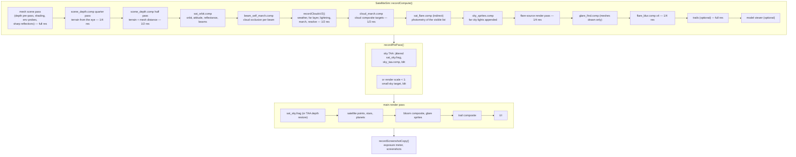

# Rendering

This section describes how SAT LIGHT SIM forms an image: what each pass computes, how passes hand data to each
other, and the conventions they share. It is written for a graphics programmer. This page is the map: the
frame graph, the resolutions, and the shared conventions (frames, depth, units, exposure). The pages below it
cover each subsystem in depth.

## The image in one paragraph

The background is drawn by one large fragment shader, `shaders/sat_sky.frag`. For each pixel it traces the
view ray against the terrain (seeded by a lower-resolution depth pass) and against the satellite meshes,
integrates single scattering through the atmosphere up to the first surface, shades that surface, and
composites the clouds over it. The clouds come from a separate half-resolution compute pipeline that
ray-marches a procedural density field and accumulates it over time. Point sources (satellites, stars,
planets, far city lights) are drawn over the background as additive sprites, depth-tested against it. A
quarter-resolution bloom and full-resolution glare sprites go on top, then the UI.

## The frame graph

There is one command buffer and one frame in flight (`App::drawFrame()` in `src/App.cpp`). The order of the
passes is fixed.

### Compute and offscreen work

| # | Pass | Writes | Resolution | Notes |
|---|---|---|---|---|
| 1 | `recordMeshScene()` → `SatMeshRenderer::recordScene()` | mesh radiance RGBA32F, true distance R32F, reflection G-buffer RGBA32UI | full | depth pre-pass, then shading with depth EQUAL; environment probe faces and sharp mirror reflections are rendered here too. See [Satellite meshes](satellite-meshes.md). |
| 2 | `scene_depth.comp`, quarter pass | `sceneDepthQImg` R32F, `terrainFrameBuf` (the eye's ground height) | ¼ | marches the terrain from the eye |
| 3 | `scene_depth.comp`, half pass | `sceneDepthImg` R32F | ½ | seeded by the quarter pass; takes the minimum with the mesh distance. See [Terrain](terrain.md). |
| 4 | `sat_orbit.comp` | compact visible list, beam list, beam glow dome | one thread per satellite | orbit, attitude, reflectance; appends visible satellites |
| 5 | `beam_self_march.comp` | per-beam cloud block altitude and opacity | one thread per beam | see [Reflectors and beams](../simulation/reflectors.md) |
| 6 | `recordCloudsV2()` | resolved clouds (½), far cloud layer (full) | ½ / full | see [Temporal resolve and the far layer](clouds/temporal.md) |
| 7 | `cloud_march.comp` | `cloudMarchTargetA/B` RGBA16F | ½ | the composite targets the sky pass reads: cloud light, transmittance, ground shadow, aurora, red airglow, lightning, rain drops |
| 8 | `sat_flare.comp` (indirect) | the finished visible list | per visible satellite | photometry: sky dimming, extinction, light pollution, sprite size, mesh hand-off |
| 9 | `city_sprites.comp` | appends to the visible list | 7 lattice levels | far city lights as point sources |
| 10 | flare-source render pass | `flareSourceImg` RGBA16F | ¼ | bloom seeds of the sprites, the Sun and the meshes |
| 11 | `glare_find.comp` | glint list | ¼ | only in frames that drew meshes |
| 12 | `flare_blur.comp` ×4 | `flareSourceImg` | ¼ | narrow and wide Gaussians |
| 13 | `trail_fade.comp` + splats | `trailAccumImg` RGBA16F | full | only with star trails on |
| 14 | `recordModelViewer()` | the viewer's target | window size | only with the satellite info window or 3D view open |

### Background, main pass and after

- **Sky TAA path** (default at render scale 1): `recordPrePass()` renders `sat_sky.frag -DSKY_TAA` offscreen
  with a sub-pixel jitter, resolves it against its history in `sky_taa.comp` and blits the result into the
  swapchain image. The main pass opens by restoring the depth (`taa_depth_restore.frag`).
- **Render scale below 1**: the sky renders into a smaller target and is blitted up into the swapchain.
- **Otherwise**: `sat_sky.frag` is the first draw of the main pass.
- **Main pass draw order**: background (or depth restore) → satellite points → stars → planets → bloom
  composite → glare sprites (satellites, then mesh glints) → trail composite → UI.
- **After the pass**: `recordScreenshotCopy()` blits the centre of the presented image to 64 × 36 for the
  auto-exposure meter, and copies a screenshot when one is pending.

Details of each of these are on [Atmosphere and sky](atmosphere-and-sky.md).

### GPU timestamp buckets

Settings → Display → "GPU FRAME BREAKDOWN" reads a timestamp query pool of nine slots
(`VulkanContext::kTimestampCount`). Each bucket is the time between two slots, so a bucket contains whatever
was recorded between them:

| Bucket | Contains |
|---|---|
| Scene depth | mesh scene pass, environment probes, sharp reflections, both scene-depth passes |
| Beam cloud block (retired) | two buffer fills; nothing of substance |
| Orbit compute | `sat_orbit.comp`, `beam_self_march.comp` |
| Cloud march | all of `recordCloudsV2()` and `cloud_march.comp` |
| Flare compute | `sat_flare.comp`, city sprites, bloom source and blur, glare find, trails, model viewer |
| Sky background draw | the sky shader only |
| Satellite + star draw | the point draws, bloom, glare and trails **and**, on the TAA or render-scale path, the resolve and blit (that slot is written before them) |
| UI overlay | UI |

Measuring and the knockout bits are covered in [Profiling](../development/profiling.md).

## Resolutions

Everything except the sky's own render target follows the **swap extent**. Render scale shrinks only the sky
pass.

| Size | Images |
|---|---|
| full | swapchain and depth, mesh scene targets, far cloud layer, sky TAA colour, depth and histories, trail accumulator |
| ½ = ⌈W/2⌉ | `sceneDepthImg`, every clouds screen image, `cloudMarchTargetA/B` |
| ¼ = ⌈W/4⌉ | `sceneDepthQImg`, `flareSourceImg`, its scratch image |

!!! warning "Invariant"
    `sceneDepthImg` and the half-resolution cloud targets have **identical dimensions**: half the swap
    extent, independent of render scale. The cloud passes read the depth 1:1 with `texelFetch` at their own
    invocation ID, and the sky pass's joint-bilateral upsample indexes both with the same texel coordinates.
    Sizing one of them differently breaks both without any error.

A consequence: at render scale below 1 the depth and cloud passes do not shrink, so their relative cost
rises. At 50 % the depth pass marches terrain at the same pixel count as the sky pass itself.

## Shared conventions

### Coordinate frames

- **Observer ENU.** Most shaders work in the observer's east-north-up frame with the Earth's centre at the
  origin, so the eye sits at `(0, 0, R_EARTH + h_eye + 2 m)` (`observerPos()` in `shaders/include/terrain.glsl`).
  The ENU basis in ECEF is rebuilt per shader from `obsECEFDir`.
- **ECEF** is used for anything fixed to the Earth: textures, the DEM, procedural lattices.
- **The drifted cloud frame.** The weather map rotates about the Earth's axis by a phase that is a pure
  function of sim time; every cloud read happens in that frame. See [The cloud field](clouds/field.md).
- **The eye height** is the detailed ground under the observer (`terrainFrameBuf`, written by
  `scene_depth.comp`), the same value in every pass that produces or consumes a distance.

How sim time maps to the Earth's rotation and the sky is on
[Time and reference frames](../simulation/time-and-frames.md).

### Precision rules

!!! warning "Invariant: no absolute ECEF position in float"
    A float position on the Earth's surface resolves about 0.5 m, and noise read at such coordinates swims and
    stretches. Every procedural lattice (terrain detail, erosion, cloud noise, city layouts, sea waves, rain)
    is **anchored at the observer**: the CPU computes, in double, the observer's sea-level point as an integer
    lattice cell plus a fraction, and the shader adds only a local offset. Lattice periods are powers of two,
    or divide the anchor cell, so nothing jumps when the observer crosses a cell.

- **Cancellation-free geometry.** `raySphere()` forms \( c = (|o| - r)(|o| + r) \) instead of
  \( |o|^2 - r^2 \); altitude above the sphere is computed from an observer-relative offset.
- **Never read a displacement, or anything multiplied up by a large factor, from an 8-bit
  hardware-filtered texture.** Hardware bilinear filtering uses 8-bit sub-texel weights, so the result moves
  in steps. Such fields are analytic or filtered by hand in float.

!!! warning "Invariant: never store a distance in a half-float"
    The RGBA16F maximum is 65 504. Distances live in R32F images, or in an RGBA16F channel only as
    **kilometres** (the cloud occlusion alpha). A near-horizon cloud distance in metres overflows to infinity.

### Two depth representations

| | Where | Encoding | Written by | Read by |
|---|---|---|---|---|
| **Shared scene depth** | `sceneDepthImg`, ½ res R32F | linear metres along the view ray to the first terrain, sea or mesh surface; `kNoSurfaceT` = 1e30 for sky | `scene_depth.comp` | every cloud ray (clamps to it), beam march, `cloud_march.comp`, the sky pass (seeds its own march, joint-bilateral weights), flare sources, manual point tests |
| **Unified hardware depth** | the main pass's depth attachment (D32) | \( d = \log_2(t / 1\,\text{cm}) / \log_2(10^9\,\text{m} / 1\,\text{cm}) \), clamped to 0.99999; compare LESS; cleared to 1 | `sat_sky.frag` (`gl_FragDepth`) or the TAA depth restore | the hardware depth test of points, stars and planets |

The log encoding (`sceneDepthFromDistance()` in `shaders/include/depth.glsl`) spans 1 cm to \(10^9\) m and
resolves about \(1.5 \times 10^{-6}\) of the distance anywhere in a D32 float attachment, so a mesh in follow
mode and the Earth's limb from orbit share one buffer.

The sky pass writes, in priority order: its full-resolution terrain hit, else the sea or far-land hit, else
the distance of an opaque cloud; then the mesh distance if nearer; else, on the Moon's disc, the Moon's
distance. Satellite sprites test at their own range, stars and planets at `kDepthFar` (just in front of the
cleared 1.0). No point pipeline writes depth. So one rule holds everywhere:

> A surface hides a point only if it is nearer than the point.

A satellite in front of the Earth seen from orbit stays visible; one behind a mountain does not; a star is
hidden by everything, including the Moon.

The mesh renderer uses its own **infinite reverse-Z** depth internally (depth = 2 cm / distance, compare
GREATER); it hands its result to everyone else as an R32F true distance.

### Radiance units

- **Sky, clouds and surfaces** are physical-style radiance with `SUN_INTENSITY` = 1, before exposure.
  Surfaces use the terrain convention, **π × radiance per unit solar irradiance**: a sunlit white Lambertian
  face reads albedo × cos. Satellite meshes use the same units, which is what lets them sit in the sky pass's
  composite unchanged.
- **Display-space terms** (the Milky Way, zodiacal light, the Moon's glow, the Sun's disc and glare, the lens
  flare) are added after the tonemap, multiplied by the global exposure scale.
- **Point sources** carry **effectFlare** units: 0.008 is magnitude 6. The shared point-spread model maps an
  apparent magnitude to a drawn Gaussian. See [Points, bloom and glare](points-bloom-glare.md).

### Exposure and tonemap

Exposure is decided once and applied at the end of `sat_sky.frag`:

\[
E = \operatorname{mix}(10,\ 1.8,\ \text{dayness}^{0.4}) \cdot 2^{\,\text{EV}_\text{user} + \text{EV}_\text{auto}},
\qquad \text{dayness} = \operatorname{clamp}\!\left(\frac{\sin(\text{Sun elevation}) + 0.2}{1.2}\right)
\]

The tonemap blends \(1 - e^{-x}\) toward a long-shoulder curve. The auto-exposure offset comes from metering
the displayed frame. The global exposure term \(2^{\text{EV}}\) also shifts the point sources' reference
magnitudes and scales the Milky Way, so everything on screen agrees. Full detail:
[Atmosphere and sky](atmosphere-and-sky.md#exposure).

### How the subsystems meet

| Producer | Consumer | Through |
|---|---|---|
| terrain (`scene_depth.comp`) | clouds | `sceneDepthImg`: every cloud ray ends at the surface |
| meshes | depth, clouds, beams, sky | the mesh distance is min'd into `sceneDepthImg`; the sky pass reads the full-resolution mesh targets |
| clouds | terrain and sea | `cloudMarchTargetB.a`: sun transmittance from the surface point (the ground shadow) |
| clouds | sky composite | `cloudMarchTargetA`: cloud light + a signed-km distance; `B.rgb`: transmittance |
| clouds | points | `cloudPointVisibilityAt()`: per-texel distance and transmittance against the point's range |
| clouds | Sun disc, lens flare, Sun bloom | `cloud.sunCloudT`: the eye's eased transmittance toward the Sun |
| `sat_orbit.comp` | clouds, sky | Reflect beams: per-beam occlusion, cloud light, shafts, ground spots |
| `sat_flare.comp` | sky | the 64-bin sky-glow histogram and the ocean-glint list |
| atmosphere | clouds | the cloud march takes no airlight of its own; the sky pass adds the air in front of each cloud |

## Shader headers

Shared code lives in `shaders/include/` and is compiled with `glslc -I`. Every shader depends on every header,
so editing one rebuilds all shaders.

| Header | Holds |
|---|---|
| `common.glsl` | constants (`R_EARTH`, `R_ATMOS`, scattering coefficients and scale heights, `SUN_INTENSITY`, `kNoSurfaceT`), `raySphere()`, phase functions |
| `cloud_params.glsl` | the `CloudParams` UBO: every per-frame uniform the sky and cloud passes share |
| `depth.glsl` | the unified log depth |
| `atmosphere.glsl` | line-of-sight extinction (Chapman columns) |
| `darksky.glsl` | the dark-sky visibility model for the Milky Way and zodiacal light |
| `eclipse.glsl` | the Moon's shadow per point |
| `point_style.glsl` | the shared point-spread model |
| `glare.glsl` | the glare sprite profile and its push constants |
| `glint_list.glsl` | the mesh glint list |
| `cloud_occlusion.glsl` | how a point source is hidden by cloud |
| `terrain.glsl`, `terrain_detail.glsl` | the DEM, the height function and the terrain march |
| `clouds_v2.glsl`, `cloud_lightning.glsl`, `beam_cloud_lights.glsl`, `reflect_beam.glsl` | the cloud field and its companions |
| `sat_mesh_common.glsl`, `earth_env.glsl` | the mesh renderer's buffers and its analytic Earth fallback |

!!! warning "Invariant"
    `GpuCloudParams` in `src/simulations/SatelliteSim.h` is a hand-maintained mirror of `cloud_params.glsl`.
    A field appended in different positions in the two files keeps the total size, so it compiles and every
    later field silently reads its neighbour. Run `python tools/check_cloud_params.py` after touching either.
    See [GPU conventions](../development/gpu-conventions.md).

`sat_sky.frag` is compiled six ways: plain, `SKY_TAA`, `SKY_LITE`, `SKY_ENV`, `SKY_ENV SKY_REFL`, plus the
separate Potato shader `sat_sky_minimal.frag`. The variants are described on
[Atmosphere and sky](atmosphere-and-sky.md#shader-variants) and [Weak-hardware tiers](hardware-tiers.md).

## Reading the rest of this section

| Page | Covers |
|---|---|
| [Atmosphere and sky](atmosphere-and-sky.md) | `sat_sky.frag` as compositor: scattering, the cloud composite, Sun, stars, Milky Way, exposure, tonemap, sky TAA |
| [Clouds](clouds/field.md) | the density field, the march, the temporal resolve and far layer, weather |
| [Terrain](terrain.md) | the height function, the terrain march and its seed pyramid, land shading |
| [The sea](sea.md) | waves, sea state, shore, reflections |
| [Cities, farms and solar parks](cities.md) | procedural ground detail and night lights |
| [Aurora and airglow](aurora-airglow.md) | emissive upper-atmosphere layers |
| [Moon and eclipses](moon-and-eclipses.md) | the Moon's disc and both kinds of eclipse |
| [Points, bloom and glare](points-bloom-glare.md) | point sprites, the shared PSF, bloom, glare, trails |
| [Satellite meshes](satellite-meshes.md) | the mesh renderer, environment probes, mirror reflections, the model viewer |
| [Weak-hardware tiers](hardware-tiers.md) | Potato and Lite, the Vulkan limits the app needs |

## Where in the code

- `src/App.cpp`: `App::drawFrame()`, the frame skeleton.
- `src/simulations/SatelliteSim.cpp`: `recordCompute()`, `recordPrePass()`, `recordDraw()`,
  `recordScreenshotCopy()`, `recordMeshScene()`.
- `src/simulations/SatelliteSimCloudsV2.cpp`: `recordCloudsV2()`.
- `src/VulkanContext.h`: the timestamp slot table.
- `shaders/include/depth.glsl`, `shaders/include/common.glsl`: the shared conventions.
