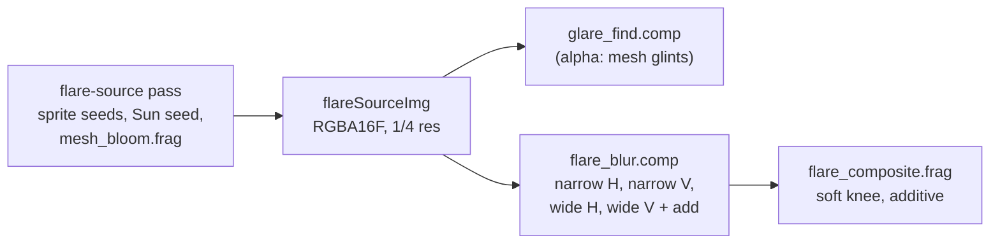

# Points, bloom and glare

How point sources are drawn: satellites, stars, planets and far city lights all become Gaussian sprites from
one shared point-spread model, depth- and cloud-tested against the background, with a quarter-resolution bloom
and full-resolution glare on top. The photometry that decides *how bright* a satellite is belongs to
[Satellite photometry](../simulation/photometry.md) and [Seeing a satellite from the ground](../simulation/visibility.md);
satellites large enough to resolve are drawn as [meshes](satellite-meshes.md).

## The visible list

Satellites reach the screen through one **compact visible list** (`satVisibleBuf`, records of `GpuSatVisible`,
32 bytes), with its counts and indirect arguments in `satListBuf`:

1. `sat_orbit.comp` appends every satellite above the observer's horizon, one shared-memory count per
   workgroup and one global atomic per 64 satellites, and keeps the indirect arguments current with
   `atomicMax`.
2. `sat_flare.comp`, dispatched indirectly over that list, finishes each record **in place**: the day and
   Moon sky dimming, line-of-sight extinction, light pollution, a soft ceiling, the mesh hand-off and the sprite
   size. Its output brightness is **effectFlare**, with 0.008 equal to magnitude 6.
3. `city_sprites.comp` appends finished records for far city lights.
4. The point, flare-source, glare and trail draws are `vkCmdDrawIndirect` over the list.

| Field | Meaning after `sat_flare.comp` |
|---|---|
| `skyDir` | unit direction in observer ENU |
| `flareIntensity` | effectFlare |
| `color` | `packUnorm4x8`, eclipse-tinted |
| `angularSize` | sprite edge in pixels, from the PSF |
| `rangeM` | distance (m); 0 for stars and planets |
| last float | before photometry the mesh's on-screen size (`meshPx`); after it, the glare of a still point-like mesh (`glareFlare`); −1 marks a city sprite |

!!! warning "Invariant"
    Slot order in the list is nondeterministic (atomic append). That is harmless only because every point
    pipeline blends additively (ONE/ONE) and writes no depth. Never key anything per satellite off
    `gl_VertexIndex` in these shaders: it is a list slot, not a satellite index. The satellite index of a
    slot is in `satVisibleIdxBuf` (0xFFFFFFFF for a city sprite, which picking skips).

Stars and planets have their own small host-written buffers in the same record format, filled each frame by
`updateStars()` and `updatePlanets()`, and drawn with `star_point.vert/.frag` (planets with twinkle off).

## The shared point-spread model

`shaders/include/point_style.glsl` (`pointPsf()`, CPU mirror `SatelliteSim::pointPsf()`) maps an apparent
magnitude **as drawn**, after every dimming term, to a Gaussian. Satellites, stars, planets and city lights all
use it, so a magnitude-3 satellite looks like a magnitude-3 star.

\[
D = 10^{-0.4\,\gamma\,(m - m_\text{ref})} - 10^{-0.4\,\gamma\,(m_\text{lim} - m_\text{ref})}
\]

- \(D \le 1\): a Gaussian of peak D and sigma \(\sigma_0\).
- \(D > 1\): the point saturates. Its sigma grows as \(\sigma = \min(\sigma_0\sqrt{D},\ \sigma_\text{max})\) with
  peak \(D\sigma_0^2/\sigma^2\), so the drawn flux keeps growing as D; past \(\sigma_\text{max}\) the core
  brightens instead.
- The sprite edge is \(2(3\sigma + 1)\) pixels: three sigma plus a pixel of margin each side, never smaller
  than about 5 px, which keeps a sub-pixel point from flickering as it crosses pixel boundaries.
- Subtracting the value at the limit magnitude makes a point fade to exactly nothing there; `sat_flare.comp`
  writes a zero record past it, so faint satellites cost no fill.

Each shader converts its own units first: satellites from effectFlare (`satFlareToMag()`, 0.008 ↦ 6), stars and
planets from relative flux \(10^{-0.4m}\) (`relFluxToMag()`). The parameters live in a small UBO
(`GpuPointStyle`, rewritten every frame). The effective reference and limit magnitudes shift with the global
exposure, so stars and satellites dim with the sky's exposure (see
[Atmosphere and sky](atmosphere-and-sky.md#exposure)).

## Drawing points and occluding them

All point pipelines are additive, depth-test LESS, and **write no depth**. The background has already written
the nearest of terrain, sea, opaque cloud, mesh and Moon into the unified depth
([Rendering overview](index.md#two-depth-representations)), so the hardware test does the rest.

| Source | Depth z | Cloud test | Terrain and mesh test |
|---|---|---|---|
| satellites (`sat_point`) | their range, in the unified log encoding | `cloudPointVisibilityAt()`, per fragment, power 2 | hardware depth; a manual half-res test on the trail draws and at render scale below 1 |
| stars, planets (`star_point`) | infinity (`kDepthFar`) | the filtered cloud alpha (any opaque cloud hides) × transmittance to a power | hardware depth, plus a cull inside the Moon's disc |
| city sprites | their range × 0.995 | as satellites | as satellites; the manual test takes them at 95 % of their range |
| a sprite handing over to its mesh | 98 % of its range | as satellites | stays in front of its own mesh |

**Cloud occlusion of a point** (`shaders/include/cloud_occlusion.glsl`). The cloud target's alpha is a **signed
distance in km**: ≥ 0 an opaque cloud, < 0 minus the mean distance of translucent cloud. For each of the four
texels gathered around the point:

- an opaque cloud nearer than the source hides it completely;
- a translucent cloud dims it by \(T^p\), faded in around the cloud's distance (±1 % + 300 m), so a cloud
  behind the source does nothing.

The four results are blended with bilinear weights. Testing per texel avoids filtering the alpha first, which
would blend a real distance with the no-cloud sentinel (−60 000 km) into something near 0 km at every cloud
outline and hide every satellite in front of it.

Kilometres, not metres: in an RGBA16F alpha any distance past 65.5 km would overflow to infinity.

## City sprites

`city_sprites.comp` draws **far** city lights as point sources, so a distant horizon seen from the ground or an
aircraft is a field of crisp points where the surface can only draw the night map's blur. It walks a
world-fixed lattice whose cell grows with distance, in 7 levels (64 m cells out to 8 km, doubling per level, to
about 1000 km), and appends at most `kCitySpriteMax` = 131 072 records. A cell holds a light with a probability
set by the night map's density, a few metres above the DEM, above the sea-level horizon, within the city's
terrain limit, and only where a pixel spans more ground than "City sprites from (m/px)": near the eye the
ground pattern draws the lights instead. Each light's effectFlare follows the cell's area and \(1/r^2\), the air
along the slant path and scintillation, capped at 8 so it never glares. Their placement and colours belong to
[Cities, farms and solar parks](cities.md).

## Bloom

The bloom is a quarter-resolution broad glow, built in three stages.

1. **Flare source** (`flare_source.vert/.frag`, its own render pass).
    - Each satellite seeds a small Gaussian of strength \(\operatorname{clamp}(\log_2(\text{effectFlare})/2,\ 0,\ 4)\),
      tested per fragment against cloud (`cloudPointVisibilityAt()`, power 1) and the half-res scene depth.
    - The Sun adds its own seed (instance index 1), × its cloud transmittance and the share seen past the Moon.
    - `mesh_bloom.frag` adds the satellite meshes' light (see
      [Satellite meshes](satellite-meshes.md#how-meshes-join-the-frame)).
2. **Blur** (`flare_blur.comp`, four dispatches, ping-pong between the source and a scratch image): a narrow
   separable 9-tap Gaussian (the corona right around each source), then a wide one (σ = 10 texels, about 40
   screen pixels, taps every 2 texels to 3.6 σ) scaled by "Flare streak" and added. Both are separable
   Gaussians, so the glow is exactly round with no truncation edge.
3. **Composite** (`flare_composite.frag`, additive, after the planets). Scaled by "Flare glow gain" × an eye
   adaptation gain (0.35 by day to 1 at night). A **soft knee on luminance** caps it: unchanged below 0.45,
   then an exponential approach to 0.8 with a continuous slope. The cap keeps a satellite's own core brighter
   than its glow, and the soft knee keeps overlapping glows of a dense constellation from flattening into white
   plateaus with hard edges.

The bloom has no spikes: those are the glare.

## Glare

The glare is the sharp part of a bright source: a full-resolution sprite drawn over the bloom. One profile
serves every source, as a camera's aperture gives every point light the same spikes
(`shaders/include/glare.glsl`, `glareProfile()`):

- a **core**, a Gaussian about a pixel and a half wide;
- a tight **halo**, \(\exp(-r / (0.05R + 1.5))\);
- **spikes** ("Glare spikes" of them), each with its own hashed length (45-100 % of the radius), brightness and
  angular offset, drawn as a line of **constant pixel width** so it stays sharp and anti-aliased at any radius,
  fading along its length as \((1 - r/\text{len})^{\text{falloff}}\);
- everything windowed by \((1 - x^2)^2\) to zero at the sprite's edge, so overlapping glares sum softly.

**Which sources glare.** A source's bloom response is \(b = \operatorname{clamp}(\log_2(\text{effectFlare})/2,\ 0,\ 4)\);
it glares when \(b\) exceeds "Glare threshold". The sprite radius is

\[
R = \text{sizePx} \cdot (0.6 + b - \text{threshold}) \cdot \text{near}(r),
\qquad \text{sizePx} = \text{"Glare size"} \cdot H / 1080
\]

so the size is independent of resolution, clamped to the device's maximum point size.

**Proximity** (`glareNearScale()`). `near(r)` ramps smoothly from "Glare near gain" at range 0 to exactly 1 at
"Glare near range" and beyond (and is 1 for an unknown range). A satellite seen from the ground keeps the
distance-tuned look, while a mesh resolved metres from the camera spreads a much wider glare. The range comes
from the record itself: a sprite's `rangeM`, a glint's stored range.

### Satellite glare

`glare.vert/.frag`, one point sprite per listed satellite, drawn over the bloom composite. It takes the larger of
the record's effectFlare and its `glareFlare` (the glare a point-like mesh hands back to its sprite). Visibility
is tested **once, at the source's screen position**: per-texel cloud occlusion and the half-res scene depth.

### Mesh glints

A mesh has no single point to glare from; its light is wherever its surfaces glint.

1. `mesh_bloom.frag` writes each quarter-res texel's mesh light into the flare source's **alpha**, in effectFlare
   units (instance `glareNorm` = the sprite's effectFlare per unit of bloom seed). Satellite sprites write
   alpha 0. Like the bloom seed, it takes only the pixel's photometric share of the light, so render-only
   components (which are not in the photometric model) neither bloom nor glare. Only **Sun-like** surface
   brightness counts, ramped in between 150 and 1500 in the mesh units (π × radiance / irradiance): the Sun in a
   mirror reaches about 4 × 10⁴, an OSR radiator about 2000, while a rough-metal edge glint stays below about 50.
   The value is stored as \( \log_2(1 + \text{effectFlare}) \): the half-float target overflows past 65 504,
   and a linear cap would turn a close mirror into a plateau of equal texels whose maximum is picked by texel
   order rather than at the Sun's image.
2. `glare_find.comp` (only in frames that drew meshes, before the blur) lists every 5 × 5 local maximum of the
   alpha whose 5 × 5 sum passes the threshold, at most 64 (`GpuGlintList`, `include/glint_list.glsl`). The
   position is the light-weighted centroid of the 3 × 3, so the glare moves smoothly rather than a texel at a
   time.
3. `glare_mesh.vert/.frag` draw them with the same profile, through their own indirect arguments.

**Point-like meshes.** While a mesh is still small on screen (below `kGlarePointPx` = 12 px, fully resolved by
three times that), its glare stays the **sprite's**, at the sprite's position: `sat_flare.comp` writes
effectFlare × the CPU's glare keep weight into the record's last field. Counting all of a small mesh's light as
glints would put its one glare on whichever few texels happen to be brightest, and it would jump about.

!!! note
    Mesh bloom and mesh glints are not occlusion-tested: they come from the mesh's own rendered pixels, which
    the march's half-resolution depth may not hide behind thin terrain or cloud.

## Star trails

A long-exposure accumulation, toggled by the HUD's "Star trails" button (default key F):

1. `trail_fade.comp` multiplies the persistent `trailAccumImg` (RGBA16F, full resolution) by
   \(\exp(-\Delta t_\text{wall} / \text{decay})\) using wall-clock time, so the exposure keeps ageing while sim
   time is paused, like a real shutter. A very high hard ceiling only bounds drift over a long session.
2. The satellites, stars and planets are splatted additively into it with the point pipelines, with the manual
   depth test (`manualTerrainTest` = 2 on these draws) since there is no depth attachment. City sprites skip the
   trail pass.
3. `trail_composite.frag` adds it to the frame through a Reinhard curve \(c/(1+c)\), scaled by "Trail gain". A hard
   clamp would map every steady-state point (about \(1/(1 - \text{decay factor})\) frames of light) to the same
   value and erase the relative dimming of extinction, pollution and cloud along a trail.

## Settings

| UI label (tab) | `settings.json` key | Default |
|---|---|---|
| Point peak mag (Photometry) | `photometry.point_ref_mag` | 1.5 |
| Point contrast (Photometry) | `photometry.point_gamma` | 0.8 |
| Point limit mag (Photometry) | `photometry.point_limit_mag` | 8.0 |
| Point size (px) (Photometry) | `photometry.point_sigma_px` | 0.45 |
| Point max size (px) (Photometry) | `photometry.point_sigma_max_px` | 6.0 |
| Flare glow gain (Photometry) | `photometry.flare_glow_gain` | 0.005 |
| Flare streak (Photometry) | `photometry.flare_streak_gain` | 0.35 |
| Glare gain (Photometry) | `photometry.glare_gain` | 0.684 |
| Glare size (px) (Photometry) | `photometry.glare_size_px` | 29.79 |
| Glare threshold (Photometry) | `photometry.glare_threshold` | 1.765 |
| Glare falloff (Photometry) | `photometry.glare_falloff` | 4.678 |
| Glare spikes (Photometry) | `photometry.glare_spikes` | 10 |
| Glare near gain (Photometry) | `photometry.glare_near_gain` | 8.0 |
| Glare near range (km) (Photometry) | `photometry.glare_near_range_km` | 21.86 |
| Trail decay (s) (Photometry) | `photometry.trail_decay_seconds` | 4.0 |
| Trail gain (Photometry) | `photometry.trail_composite_gain` | 1.0 |
| Star trails (HUD) | `display.trail_enabled` | off |

The glare defaults are the values tuned on screen for satellites seen from the ground at a distance; the
proximity scaling leaves exactly those untouched beyond the near range. City sprite settings are on
[Cities, farms and solar parks](cities.md).

## Where in the code

- `shaders/include/point_style.glsl`, `shaders/include/cloud_occlusion.glsl`, `shaders/include/glare.glsl`,
  `shaders/include/glint_list.glsl`.
- `shaders/sat_point.vert/.frag`, `shaders/star_point.vert/.frag`, `shaders/city_sprites.comp`.
- `shaders/flare_source.vert/.frag`, `shaders/flare_blur.comp`, `shaders/flare_composite.frag`,
  `shaders/mesh_bloom.frag`.
- `shaders/glare.vert/.frag`, `shaders/glare_find.comp`, `shaders/glare_mesh.vert/.frag`.
- `shaders/trail_fade.comp`, `shaders/trail_composite.frag`.
- `src/simulations/SatelliteSim.cpp`: `recordCompute()` (flare source, glare find, blur, trails),
  `recordDraw()` (points, stars, planets, composite, glare), `updateStars()`, `updatePlanets()`, `pointPsf()`.
