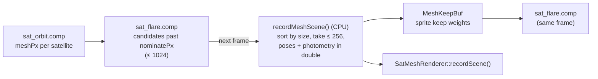

# Satellite meshes

How satellites with a geometry model are drawn as 3D meshes once they are large enough on screen: the mesh
renderer and its lighting, how the frame decides which satellites get a mesh and hands each one over from its
point sprite, the environment probes and sharp mirror reflections that give the meshes the full renderer's
Earth to reflect, and the model viewer in the satellite info window. The models themselves (components,
materials, attitude groups) are described in [Satellite models](../modding/satellite-models.md) and
[Satellite photometry](../simulation/photometry.md).

## Two tessellations of one model

Every geometry model is tessellated twice:

| | Photometric | Render |
|---|---|---|
| Built by | `bakeSatLobes()` (`SatModel.cpp`) | `buildSatRenderMesh()` (`SatMesh.cpp`, 48 segments per revolved primitive by default) |
| Purpose | merged facet lobes for millions of satellites in `sat_orbit.comp` | the pixels of one close-up satellite |
| Normals | one per facet, merged | smooth normals on cylinders, cones and spheres |
| Extras | none | UVs in metres (for the procedural patterns), the component index, the attitude group |

Both share the rest pose and the body frame, so `evalGroupPoses()` poses the render mesh exactly as it poses the
lobes, and the occluders `buildSatOcclusion()` makes for the photometry line up with the drawn geometry.
`SatMeshRenderer` keeps every model's render mesh in one vertex and index buffer, with its materials, occluders
and per-component pivots in storage buffers.

## Units and BRDF

The mesh shader (`shaders/sat_mesh.frag`) works in the sky pass's units: **pre-exposure π × radiance per unit
solar irradiance**, so a sunlit white Lambertian face reads albedo × cos, like terrain. Its BRDF is the
photometry's, per pixel:

- Lambert diffuse;
- GGX (or Beckmann, per material) × Schlick Fresnel × Smith shadowing (Walter's rational fit for Beckmann);
- the Sun's angular disc folded into the roughness, \(\alpha^2 \leftarrow \alpha^2 + 0.0023^2\) (`SUN_ALPHA`).

Because the units and BRDF match, summing a render's pixels reproduces the lobe model's radiant intensity; the
[photometric check](#the-photometric-check) measures exactly that.

## Lighting

| Light | Treatment |
|---|---|
| **Sun** | the instance's Sun direction × `litFactor` (the Earth's umbra and penumbra) × a reddening tint near the shadow edge; shadowed per pixel by rays against the model's own primitives |
| **Transmission** | light on the far side of a translucent blanket (ISS-style Kapton arrays) leaves this side diffusely, \(T \cdot E \cdot (-n\cdot s)_+\), tinted (amber for Kapton) and, with the solar-cell pattern, only through the gaps between cells |
| **Earthshine** | diffuse light from the whole lit Earth cap: an order-4 spherical-harmonic fit of the cap's irradiance on a plane, floored by the exact vector value, \(E(n) = \max(\text{SH}(n),\ E\,(n\cdot d)_+)\), the same table the photometry uses; or, with an environment probe, the probe's SH irradiance |
| **Moonlight** | diffuse, directional, × the Moon's light |
| **Reflections** | the reflected ray into the sharp-reflection G-buffer, else an environment probe, else the analytic `earth_env.glsl` fallback (see below) |

**Self-shadowing** follows the photometry's rule: **a primitive never shadows its own surface.** Every part is
convex or flat, so this is exact, and without it a faceted cylinder's surface would shadow itself. Open-lattice
parts (trusses) never shadow (their occluder kind is 0xFF). The ray test in `rayBlocked()` mirrors
`rayHitsOccluder()` in `SatModel.cpp` and `sat_orbit.comp`.

**What the bloom counts.** Only sunlight, transmission and the photometric earthshine are part of the lobe
model. The pixel's alpha carries that **photometric share** of its light alongside the instance slot, and the
bloom seeds only that share. Reflections and moonlight are drawn but not counted: feeding them to a bloom
normalised by the model's intensity would make a satellite edge-on to the Sun (model intensity near zero,
reflections bright) explode into glow.

### Procedural surface detail

A material's `pattern` (`SatSurfacePattern`: none, solar cells, MLI, panel seams; by default chosen from the
preset) adds visible structure that is **photometrically neutral**:

- each pattern scales the diffuse albedo by a factor whose **area-weighted mean is 1**, leaving the specular
  alone (the cover glass over cells is continuous);
- each is an exact box filter (`lineCover()`, `gridCover()`), so it keeps its mean at any distance and fades to
  the plain material when its features drop below a pixel;
- the features are large enough to see with the whole model in frame: 0.4 m array modules with gaps and a
  0.25° tilt per module, cells within them, MLI quilting seams and 12 cm crinkle.

The viewer's "Detail" button toggles the patterns.

### Open lattices

A material with `coverage` below 1 (the `truss` preset) is an open lattice. The photometry counts
coverage × area; the renderer cuts the members out (`latticeCover()`: a bay grid plus alternating diagonals,
member width solved on the CPU for the same area fraction). Each pixel is kept against a fixed per-pixel hash
threshold, so sub-pixel members at a distance become the right fraction of pixels, with the far side's inner
faces visible behind them. The cut-outs are real geometry: the Detail toggle does not remove them.

## Which satellites get a mesh

Any model satellite whose mesh spans more than about 1.5-3 px on screen is drawn as a mesh, with no selection
needed.

1. **Size.** `sat_orbit.comp` writes each model satellite's on-screen diameter into the pre-photometry record
   (`meshPx`), from the type's mesh radius and the pixel angle (0 when meshes are off).
2. **Nomination.** `sat_flare.comp` lists every satellite past the CPU's nomination size into
   `GpuSatListHeader::meshCand[1024]` (satellite, size, final effectFlare, sprite size).
3. **Choice.** The CPU sorts last frame's candidates by size and meshes the largest 256
   (`kMaxMeshInstances`; one slot is kept for the followed satellite). There is one frame of lag in **which**
   satellites are meshed, none in **where** they are.
4. **Adaptive fade size.** `meshFadePx` (minimum 1.5 px) eases toward the size of the 80 %-of-the-cap'th
   largest candidate (rising in about 0.15 s, falling in about 1 s) but never below the cap'th, so no more than
   the cap ever fade in and none is cut off part-way through its fade. It rises by 30 % while the candidate
   list overflows. With a fixed threshold, in the AI ring about 250 satellites are mesh-sized at once, and
   which of them got a mesh would change every frame.
5. **Per instance**, evaluated in parallel on the CPU in double: the pose (`evalGroupPoses()`), the photometry
   (`evalSatPhotometry()`: lit factor, earthshine), the fades, the bloom scale, the glare normalisation and the
   glint direction.

**The followed satellite** is always meshed, decided on the CPU, even in the Earth's shadow where the GPU never
lists it.

### The hand-off from sprite to mesh

| | Range (× `meshFadePx`) | Default |
|---|---|---|
| mesh fades in | 1 → 2 | 1.5 → 3 px |
| sprite fades out | 1 → 6.7 | 1.5 → 10 px |

The sprite (the magnitude-based point, bloom and glare) fades over a wider range than the mesh fades in, so
the flare the observer expects stays with the satellite while its model resolves. The CPU writes the sprite
weights to `MeshKeepBuf` (`GpuMeshKeepList`), which `sat_flare.comp` reads **in the same frame**; if the GPU
faded the sprite the frame it nominated it while the mesh arrived a frame later, the satellite would blink out
for a frame.

While handing over, a meshed satellite's sprite is placed **on its glint**: at the Sun's image in its dominant
lobe, weighted by that lobe's specular share, rather than at the model's centre, so the flare does not jump
when the mesh's own glints take over. It is drawn at 98 % of its range so its own mesh does not depth-hide it.

**Energy-matched bloom.** Each instance's `bloomScale` is the bloom seed its sprite would have put down,
\(b(\text{effectFlare}) \times\) the point disc area, per unit of rendered flux \(\sum L\,\Omega\,r^2/\pi = I\),
times the share the sprite has given up. Sprite bloom plus mesh bloom therefore stays constant as a satellite
resolves, and on a large model the glow sits on the glint. `glareNorm` (the sprite's effectFlare per unit of
seed) lets a mesh glint glare as the sprite did (see [Points, bloom and glare](points-bloom-glare.md#mesh-glints)).

**Picking.** Meshed satellites are hit-tested against their model's bounding circle (`meshDrawn`), ahead of
sprites, since they have no sprite left to click.

## Rendering the scene meshes

`SatMeshRenderer::recordScene()` runs first in `recordCompute()`, before `scene_depth.comp`, so that clouds and
beams stop at a mesh.

- **Positions** are camera-relative, from double, in ECEF axes with the origin at the eye. The camera rotation
  is ENU(observer) × `SkyCamera`, the same basis the sky uses.
- **Projection.** Infinite **reverse-Z**: depth = 2 cm / distance, compare GREATER, cleared to 0. Float depth
  then keeps precision from 1 cm to beyond 1000 km.
- **Two draws per mesh.**
    1. A depth pre-pass (`sat_mesh.frag -DMESH_DEPTH_PASS`): only the open-lattice discard.
    2. The shading pass (`-DMESH_SCENE_PASS`) with depth **EQUAL**, depth writes off and
       `early_fragment_tests`, so each covered pixel runs the shader once. With the discard in the shading
       pass early-Z would be off, and every overlapping layer of a close-up station would pay the full shader
       and its shadow rays.

!!! warning "Invariant"
    `sat_mesh.vert` declares `invariant gl_Position`. The depth pre-pass and the EQUAL shading pass are
    separate pipelines; without invariance their depths can differ in the last bit and the EQUAL test drops
    pixels.

- **Targets** (full swap extent, `VK_IMAGE_LAYOUT_GENERAL`, cleared every frame):

| Target | Format | Holds |
|---|---|---|
| radiance | RGBA32F | pre-exposure radiance × the mesh fade; alpha = instance slot + 1 + the photometric share |
| distance | R32F | **true** distance from the camera (0 = none) |
| reflection G-buffer | RGBA32UI | for mirror-smooth pixels: octahedral reflected direction, Fresnel × tint × fade weight (half floats), slot + 1 |

### How meshes join the frame

The mesh targets are read with `imageLoad`, because `sat_sky.frag` sits at the 16 sampled-image floor.

| Consumer | Reads | Effect |
|---|---|---|
| `scene_depth.comp`, half pass | the mesh distance, minimum over the covered full-res texels | the shared depth includes meshes, so clouds and beams stop at them |
| `sat_sky.frag` | radiance and distance | a nearer mesh **is** the pixel's surface: the atmosphere loop stops there and attenuates it, disc gates hide behind it, the cloud composite is skipped where the cloud is farther, and the unified depth includes it |
| `mesh_bloom.frag` (inside the flare-source pass) | radiance | each quarter-res texel sums its pixels' photometric light × `bloomScale` into the bloom seed, and their Sun-like light × `glareNorm` into the glint alpha |
| hardware depth | via the sky pass | a sprite at 98 % of its range stays in front of its own mesh |

Meshes are not drawn under the Potato tier (`sat_sky_minimal.frag` has no composite for them) or with knockout
bit 2097152.

## Reflections

A reflection takes the first available of three sources:

1. **Sharp reflections** (mirror-smooth pixels of up to four chosen instances);
2. an **environment probe** of the full renderer seen from the satellite;
3. **`earth_env.glsl`**, an analytic fallback: the Potato sky's closed-form atmosphere, the textured ground
   and a flat cloud deck, rewritten in ECEF from any origin and scaled into the scene's units, read at a mip
   matching the reflected footprint on the ground.

The Sun is in none of them: the GGX Sun lobe is the glint.

### Environment probes

`SatEnvProbes` renders `sat_sky.frag -DSKY_ENV` as the six faces of a cube around a satellite's position, in
pre-exposure HDR (see [Atmosphere and sky](atmosphere-and-sky.md#shader-variants) for what that variant draws).
A probe is:

- an RGBA16F cube, 256² per face for scene probes (0.35° per texel) and 512² for the model viewer's (0.18°);
  128² reads as pixelated in a mirror;
- a full box-filtered mip chain: `sat_mesh.frag` reads the mip whose texel spans about 2α of the lobe, with
  the texel size and the last useful level taken from the bound cube itself;
- an order-2 SH irradiance fit (`env_probe_sh.comp`: 1024 Fibonacci-sphere directions read from a blurred mip),
  used as the diffuse Earth light in place of the photometric earthshine.

Each probe has its own cube image and descriptor set (pipeline set 1, bound per draw), so no cube-array
feature is needed. There are 8 slots: slot 0 belongs to the model viewer, slots 1-7 are shared by the scene
instances.

**Ownership.** A probe belongs to the satellite it was made for and **follows it**: its owner keeps it however
far it drifts between refreshes. Another instance shares the nearest probe within max(20 km, 2 % of its
altitude), or adopts one nobody claimed this frame (instances are assigned largest first), else takes the least
recently used slot. Until its own probe exists an instance borrows the nearest rendered one within 1000 km; only
with none does it fall back to `earth_env.glsl`. Tying probes to positions instead would let a satellite at
high time warp outrun the reuse radius every frame and flicker between probe light and fallback light.

**Refresh** (`renderScheduledEnvProbes()`, one probe per frame, `kEnvRendersPerFrame`):

| Priority | Probe | Faces |
|---|---|---|
| 1 | new | all six |
| 2 | drifted past max(2 km, 0.2 % of altitude) from where it was made, the furthest first | two |
| 3 | older than 3 s (clouds drift, the Earth turns, settings change) | two |

A refresh renders two faces at a time, so a satellite crossing the drift threshold every few frames does not
pay for a whole cube each frame; its recorded position updates once all six faces are redone. The viewer's
probe is refreshed a face per frame (all six for a new satellite, two per frame while it is over 20 km from
where the cube was made).

Probes are off under Potato, with the mesh knockout, or with "Full-renderer reflections" off.

### Sharp mirror reflections

A probe texel is 0.35°: a membrane mirror filling the screen would magnify each texel over dozens of pixels.
For the mirror-smooth pixels of up to `kMaxSharpReflInstances` = 4 instances (those whose type has a
mirror-smooth material, largest on screen first):

1. The scene shading pass writes the **sharp share** \(1 - \operatorname{smoothstep}(0.004, 0.02, \alpha)\) of the
   reflection to the G-buffer instead of reading a probe: the `mirror` preset entirely, an OSR radiator about
   three quarters. The rest of the lobe still reads the probe.
2. `SatMeshRenderer::recordReflections()` draws `sat_sky.frag -DSKY_ENV -DSKY_REFL` once per instance, from the
   instance's own position, inside its screen rectangle, into an RGBA16F target. Each pixel discards unless it
   belongs to that instance and renders the sky along the stored reflected direction, × the stored weight.
3. `mesh_refl_add.comp` adds that into the mesh radiance over the union of the rectangles, rescaling the alpha's
   photometric share, since a reflection is not part of the model the bloom is normalised by.

This is exact for a flat mirror at any zoom, and costs a sky render of the mirror's screen area.

## The model viewer

The satellite info window and its pop-out 3D view show a real satellite where it is now, rendered offscreen by
`recordModelViewer()` (in `recordCompute()`, whenever either window is open):

- **One target** serves both views, sized to whichever is larger; each view samples a centred sub-rectangle of
  its own aspect, so neither is stretched. 4 × MSAA where the format supports it, resolved into a
  swapchain-format image shown through a `UIImage` (a Clay custom element with its own descriptor set).
- **Position and pose** come from the CPU evaluator in ECEF; the model sits at its real distance from the
  camera.
- **Lighting.** "Live" uses the sim's Sun (including the Earth's shadow), the viewer's own probe (slot 0) for
  reflections and diffuse Earth light, and a background rendered by the same `SKY_ENV` pipeline at the viewer's
  camera (`SatEnvProbes::recordViewerBg()`, tonemapped by `sat_mesh_bg.frag`). "Studio" uses a fixed Sun at
  35° and the analytic `earth_env.glsl`.
- **Exposure** follows the sky's rule at the satellite: the same curve on the Sun's elevation in the
  satellite's local sky, so a lit satellite over the twilight Earth is shown under the night exposure, as in the
  main view.
- **Display-space terms** in the background and the slot-0 probe (stars, Milky Way, zodiacal light) are divided
  back by the viewer's exposure and gated by the viewer's Sun glare, so a mirror does not show a Milky Way the
  Sun has washed out.
- **Markers** (`sat_mesh_marker.frag`): a fullscreen pass after the model, depth-tested without depth writes.
  Each line pixel takes the line's own depth there, so the model hides the part of a line behind it; the dots
  are always visible unless the Earth hides them. Segments are clipped in clip space (w ≥ 10⁻³, |x|, |y| ≤ 1.5 w)
  before the divide, so a line passing near or behind the camera does not project to millions of pixels. The
  observer marker is the parked ground observer, never the camera.

### Glare on the viewer's glints

With "Glare" on (Live light, a tracked satellite), `SatMeshRenderer::recordViewerGlare()` draws the main view's
glare on the glints that make the flare the ground observer sees:

1. a half-resolution Sun-only render from the viewer camera, in shading **mode 3** (the check's shading,
   writing the **specular** sunlight as \(L d^2\));
2. `viewer_glare_find.comp` converts each texel to effectFlare (\(L d^2 \Omega/\pi\) × the observer's flare
   per unit intensity, including extinction) and finds 5 × 5 maxima as `glare_find.comp` does;
3. `glare_mesh.vert/.frag` draw them additively onto the resolved image.

Only reflections glare, so a Sun-facing rough array does not. The glints carry the viewer camera's range, so
they take the full proximity glare size. At the "Observer" camera preset the glints carry exactly their share
of the ground flare.

### The photometric check

"Check" renders the model Sun-only into a 512² R32F target, single-sampled, from the viewer's current direction
at 60 model radii (shading mode 1: scalar, no patterns, writing \(L d^2\)). The next frame reads it back and
integrates

\[
I = \sum_\text{pixels} L\,d^2\,\frac{\Omega_\text{px}}{\pi}
\]

which is the radiant intensity per unit irradiance. It is compared, as magnitudes at 1000 km, with
`evalSatLobesPosed()` for the same pose, Sun and direction. With shadows on the two differ by the lobe model's
occlusion sampling error; with shadows off, by render tessellation and smooth normals against baked lobes. The
accepted errors are listed in [Results and known residuals](../accuracy/results.md).

## Follow mode

In follow mode ("Go to") the camera rides with a satellite: the eye is satellite + an offset in its
along/cross/radial frame, in double, and the sky shaders receive it as the observer. The followed satellite is
always meshed (even in shadow), its sprite fade goes through the same keep list, and the scene projection's
reverse-Z keeps a mesh centimetres from the camera precise. The camera and flight logic belong to
[Controls](../using/controls.md).

## Settings

| UI label (tab) | `settings.json` key | Default |
|---|---|---|
| Full-renderer reflections (Photometry) | `photometry.full_renderer_reflections` | on |
| Sharp mirror reflections (Photometry) | `photometry.sharp_mirror_reflections` | on |
| Satellite part occlusion (Photometry) | `photometry.sat_part_occlusion` | off |

The mesh pass's knockout bit (2097152) is a profiling switch, not a setting.

## Where in the code

- `src/simulations/SatMeshRenderer.h/.cpp`: the renderer (`recordScene()`, `recordBloom()`,
  `recordReflections()`, `recordViewer()`, `recordViewerGlare()`, `recordCheck()`), `GpuMeshInstance`.
- `src/simulations/SatEnvProbes.h/.cpp`: probes and the viewer background.
- `src/simulations/SatMesh.h/.cpp`: `buildSatRenderMesh()`.
- `src/simulations/SatelliteSim.cpp`: `recordMeshScene()`, `renderScheduledEnvProbes()`,
  `nearestRenderedProbe()`, `envActive()`, `recordModelViewer()`; `src/simulations/SatelliteSimUI.cpp`:
  `updateViewerView()`, the info window and pop-out.
- `shaders/sat_mesh.vert/.frag`, `shaders/include/sat_mesh_common.glsl`, `shaders/include/earth_env.glsl`,
  `shaders/mesh_bloom.frag`, `shaders/mesh_refl_add.comp`, `shaders/env_probe_sh.comp`,
  `shaders/sat_mesh_bg.frag`, `shaders/sat_mesh_marker.frag`, `shaders/viewer_glare_find.comp`.
