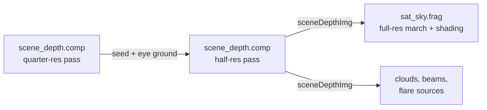

# Terrain

The ground is a ray-marched height field: a global elevation model (DEM) plus procedural detail that adds
ridgelines, gullies and rock relief the DEM is far too coarse to hold. This page covers the height function,
the water map, the march that finds the surface, and how land is shaded. The ocean surface has its own page,
[The sea](sea.md); the patterns drawn on the ground (cities, farms, solar parks, beaches) are on
[Cities, farms and solar parks](cities.md); the air in front of the ground is
[Atmosphere and sky](atmosphere-and-sky.md).

## Overview

One height function, \( H = \text{DEM} + \text{water} + \text{detail} \), is evaluated by three passes at
three resolutions. They agree on where the surface is because they call the same code with the same level
of detail:

The half-resolution result, `sceneDepthImg`, is the frame's shared depth: every volumetric march and
occlusion test stops at it. The full-resolution march in `sat_sky.frag` finds the exact hit and shades it.

## The DEM

`assets/textures/earth_elevation.png` is a land-only elevation map, 14999 x 7500 texels of R8 (about
2.67 km per texel, about 35 m per 8-bit step). It is **not** ETOPO1 and holds no bathymetry.

| Pixel value | Meaning |
|---|---|
| 0 - 14 | compression noise in ocean regions; treated as sea level |
| **15** | **the ocean / sea-level baseline** |
| 16 - 255 | land, linear above sea level |
| 255 | about 8848 m |

The one decode, in `shaders/include/terrain.glsl`, is

\[ h = \max\!\left(0,\; v \cdot 9000\,\text{m} - \tfrac{15}{255} \cdot 9000\,\text{m}\right) \]

with `kElevRange` = 9000 m and `kElevOffset` = 15/255 x 9000 = about 529 m.

!!! warning "Invariant: subtract the sea baseline"
    Every elevation read must subtract `kElevOffset`. Without it, sea-level land decodes to 529 m above the
    ocean sphere (which sits at exactly `R_EARTH`), and every coastline on Earth becomes a 529 m cliff.
    Pixel value 0 does not mean sea level. Use the decode in `terrain.glsl`; don't write a second one.

`kMaxTerrain` (9000 m) is the top of the terrain shell; nothing above it can be ground.

### Raw textures

The app does not decode the big single-channel PNGs at launch. `tools/make_raw_textures.py` writes them as
raw `.r8` files: a 16-byte header (`"SLR8"`, width, total height, first row, little-endian) followed by the
rows top to bottom, one byte per texel, values identical to the PNG. The DEM is split into
`earth_elevation_0.r8` and `earth_elevation_1.r8` to stay under GitHub's 100 MB file limit;
`8k_earth_specular_map.r8` is the 8192 x 4096 water mask. `readRawR8()` in
`src/simulations/SatelliteSim.cpp` reads them. The PNGs remain the source (re-run the tool after editing one)
and the logged fallback when a `.r8` file is missing. Decoding these PNGs with stb_image at launch is a
suspect in the machine freezes described in `docs/FREEZES.md`; PIL decodes them safely offline.

## Water: the water map

The "specular" binding (`earthSpecTex`) is the **water map**, an R8G8 image baked by
`tools/make_water_map.py` and interleaved at load from `earth_water_sdf.r8` and `earth_water_level.r8`:

| Channel | Holds |
|---|---|
| R | a smoothed signed distance to the shore: \( 0.5 + d / (2 \cdot 19.5\,\text{km}) \), \( d > 0 \) in water. `r > 0.5` therefore still means "water" to any consumer of a plain mask. |
| G | the surface level of the nearest water body, in DEM units (15 = sea level, decoded like the DEM) |

The bake takes the shoreline from Natural Earth 10 m land and lakes (public domain), rasterised at 16K between
60 S and 72 N; the distance field is averaged down to the 8K texels, so the zero crossing (the coast) is
sub-texel, about 1 km accurate. Outside that latitude band (ice shelves, sea-ice coasts) it uses the 8K mask.
Each connected water body's level is the median DEM over its interior: the DEM stores a lake's flat surface.
Land texels carry their nearest body's level, so the shore code knows what it meets. Natural Earth zips are
cached in `build/ne_cache/`.

`waterAdjustHeight()` turns a DEM height and a water-map sample into the ground height:

- **Water** (\( d > 0 \)) returns its body's level, 0 for the sea. Levels below 1 m snap to exactly 0, so the
  open ocean is never a "lake" a few microns above the sea sphere.
- **Land within 3 km of a shore** (`kShoreBankM`) is banked up to at least the level, fading over those
  3 km, so no wall of water stands above a dip.
- **Land near the shore** is capped by a ramp rising 0.25 m per metre from the waterline (`kShoreSlope`).
  The DEM's land baseline (16/255) is 35 m above the sea, and without the ramp every coast would be a 35 m
  step. The cap lets go between 1.5 and 3 km inland (`kShoreRampM`), so a mountain rising from a lake keeps
  its slope.
- If the map was not baked (G = 0), the old rule applies: water only where the mask says water and the DEM
  is below 160 m, at sea level.

**Coves and headlands.** The baked shore is a smooth curve at km scale. `tdShoreOffset()` moves the shoreline
by one octave of anchored 1024 m value noise, up to 700 m either way, only within about 1.1 km of the shore
and only with the detail on. It runs inside `tdDemAt()`, so every pass sees the same coast.

**Cost control.** The water map is fetched only where its mip 2 is non-zero, i.e. within about 15 km of
water. Near the observer (within 4 km) and near a shore it is filtered by hand from four `texelFetch`es,
because hardware filtering's 8-bit sub-texel weights step the shoreline every ~20 m.

A water point is marked by setting the regional height `hMip3` to `kTdWaterMark` (\(-10^4\)). That mark
turns the detail amplitude off there and lets a hit tell water from land.

## The height function

`tdDemAt()` (`shaders/include/terrain_detail.glsl`) returns two things for a point:

- `h0`, the DEM height with the water adjustment;
- `hMip3`, the DEM at mip 3 (about 21 km mean), used for roughness, or the water mark.

The procedural detail `D` is then added: \( H = h_0 + D \).

### Precision: the anchored lattice

The detail is world-fixed: it never swims as the observer moves, anywhere on the globe. That needs care,
because an absolute ECEF coordinate (6.4e6 m) has 0.5 m float steps.

- The CPU (in double) passes the observer's sea-level point as an **integer 2048 m cell**
  (`terrainAnchorCell`) plus the offset inside it (`terrainAnchorRel`).
- Every shader point is built as `q`, its offset from the observer's sea-level point in the observer's ENU
  axes. Heights use `tdAltitude(q)` and `tdSphereOffset(q)`, which are written to avoid cancellation.
- Each octave's integer lattice offset is the anchor cell shifted left by the octave index, so lattices are
  exact integers at every scale.

!!! warning "Invariant: never form an absolute ECEF position in float"
    Any new noise or pattern on the ground must use the anchored lattice (`terrainAnchorCell` /
    `terrainAnchorRel`) and observer-relative `q`. A float ECEF coordinate swims and stretches.

**Exact DEM sampling near the observer.** Within 4 km (`kTdExactDemM`) the DEM is filtered by hand:
`tdDemTexel()` forms the texel coordinate from the CPU's observer texel (integer plus fraction, double
precision) plus the point's small local offset, and `tdDemBilinear()` blends four `texelFetch`es in float.
The float UV route resolves only about 2.4 m, and hardware bilinear of an R8 texture has 8-bit sub-texel
weights; together they build metre-high shelves on a steep wall seen from 10 m. Beyond 4 km, one hardware
fetch is used; the steps are far below a pixel there. The choice depends on `q` alone, so every pass makes
the same one for the same point.

### Value octaves

Eight octaves of 3D value noise on the sea-level sphere, cells from 2048 m down to 16 m, each with an
analytic gradient (`tdNoised()`). The hash is a two-round lowbias32; a single round correlates the lattice
along one direction and streaks the detail.

\[ D = \sum_k a_k \, \frac{n_k(p)}{1 + e \, |\textstyle\sum \text{slope}|^2} \]

The slope damping (after Inigo Quilez's "Elevated") keeps steep flanks smooth and lets fine detail gather on
ridges and in valleys: the look of eroded terrain without a simulation. `e` is "Detail erosion".

The octave-0 amplitude (`tdAmp0()`) is "Detail height" x "Terrain detail" x **roughness** x a coast fade
(`smoothstep(0, 80 m, h0)`), and zero on water. Each further octave is scaled by "Detail roughness" (the
gain, default 0.5).

**Roughness** (`tdRoughness()`) is the DEM's *signed* relief against the 21 km mean, plus elevation:

\[ r = \text{clamp}\big(0.12 + 0.88\,\text{ss}(-250, 450, h_0 - h_{\text{mip3}}) \cdot (0.35 + 0.65\,\text{ss}(400, 2500, h_0)),\; 0.06,\; 1\big) \]

Ridges and peaks, above their surroundings, are rugged; valley floors, below them, are the flattest ground.
Using the absolute relief instead would dig pits into every valley floor, where the observer usually stands.

### Erosion octaves

Between the coarse and fine value octaves, two octaves of slope-aligned stripe noise cut gullies that run
downhill and branch (`tdErosion()`, after clayjohn 2018 and Fewes 2023, "eroded terrain noise"). They are part
of the marched surface, so they notch ridgelines and change silhouettes.

- **Cells**: 512 m and 256 m, times "Erosion size" (0.5, 1, 2 or 4). Only powers of two keep the lattice
  exactly world-fixed on the 2048 m anchor cells; cells larger than 2048 m carry the anchor's remainder.
- **Domain**: the ECEF plane perpendicular to the dominant axis of up (dropping one coordinate keeps the
  anchor's integer cell exact), blended between two faces within a narrow band of a cube-face edge. The
  stripes vary across the *projected* slope, and the projection is linear on the tangent plane, so grooves
  run exactly downhill whatever the stretch.
- **Kernel**: a 3 x 3 neighbourhood of points jittered within the middle half of their cell, each weighted by
  the compact \( (1 - d^2/R^2)^3 \), \( R \) = 1.25 cells. Every point that can reach a pixel is in the 3 x 3,
  so there is no seam at cell borders. Each point draws a cosine stripe at its own frequency (0.75-1.25 per
  cell), so a far slope does not read as regular ripples.
- **Steering**: the DEM slope by central differences over one texel each side (continuous across texel
  borders), plus the two largest value octaves' gradient. Each erosion octave also follows the gullies of the
  octave before it, scaled by "Erosion branching": tributaries run down the walls of the gully they feed.
  Where the slope is gentler than about 0.03-0.25 there are no gullies (`smoothstep(0.03, 0.25, |g|)`).
- **Amplitude**: "Erosion strength" x the octave-0 amplitude; octave weights 0.5 and 0.25, so the bound is
  0.75 x that (`tdErosionBound()`).
- **LOD**: an erosion octave needs a cell of twice the value octaves' margin (it fades in over 2-4 LODs): a
  stripe pattern at the resolution limit reads as ripples.

**Evaluation order** (`tdOctaves()`): the four coarse value octaves, then the erosion once, then the four
fine value octaves. The erosion has exactly one call site, outside the octave loop, and its loops are
`[[dont_unroll]]`.

!!! note "Why the code is shaped around one erosion call site"
    GLSL inlines everything, and a shader's registers are sized for its largest path. Erosion code that is
    duplicated (inside an unrolled octave loop, or at a second face-evaluation site) slows every terrain
    pixel even when the erosion is switched off. Coarse-only paths pass `allowEro` as a literal `false` so
    they compile without it.

### Level of detail

\[ \text{lod}_{\text{geom}} = \max(2 \cdot \text{pixAngle} \cdot t,\; 0.012\,t) \qquad
   \text{lod}_{\text{shade}} = \max(3 \cdot \text{pixAngle} \cdot t,\; 0.25\,\text{m}) \]

An octave contributes to the geometry while its cell is above the geometry LOD, faded in over
`smoothstep(lod, 2 lod, cell)`. At any normal field of view the 1.2%-of-distance term dominates, so the
geometry LOD depends on distance alone. **That is what makes the quarter-, half- and full-resolution passes
march the same surface.** Finer octaves still reach the shading normal down to the shading LOD.

### Shading-only extras

Not part of the marched surface:

- `tdMicroBump()`: gradient-noise octaves from 8 m to 0.25 m cells at a constant slope, solid in 3D (so a
  steep face seen edge-on is not a vertical smear), perturbing the normal. Gradient noise, because value
  noise's lattice shows as sheared boxes in the lighting at pebble scale. Reduced to 0.3 x on day-map snow
  and floored at 0.25 of the rough value on smooth ground, since a snowfield under a low Sun otherwise turns
  half its metre-scale facets black.
- `tdMicro()`: a world-fixed albedo mottle, four octaves at 32, 8, 2 and 0.5 m, each faded out as the pixel
  footprint reaches its cell.

### The observer's ground

`observerEffHeightDetailed()` evaluates the full height function under the eye and takes the maximum with
the user's height offset. The quarter-resolution pass computes it once per frame into `terrainFrameBuf`
(`.x`; `.y` is the same without the user offset), and the sky pass and cloud passes read it. The eye is 2 m
above it (`observerPos()`), so the eye can never sit inside a detail bump.

!!! warning "Invariant: one eye height"
    Every pass that produces or consumes a distance must use the same eye height. A pass with its own idea of
    the eye computes distances that disagree with the shared depth buffer.

## The terrain march

`terrainMarchDetailed()` in `terrain_detail.glsl` is the one march; every pass calls it.

### Bounds

- **Gate**: the ray must point below `dir.z < 0.7` (about 44 deg above the horizontal) and cross the terrain
  shell \( R + 9\,\text{km} \).
- **End**: `tExit` is the sea-sphere hit, else the shell exit, capped by
  `mix(250 km, 3600 km, eyeAlt / 400 km)` so terrain is visible from low orbit.
- **Range**: if `tExit` is beyond "Terrain fade end" (default 900 km), the march is skipped and the sea
  sphere stands in (the relief is sub-pixel there). See [Past the march's range](#past-the-marchs-range).

### Stepping

Each step reads the DEM, then works from cheapest to dearest:

1. **Far above everything.** If the ray is above `DEM + tail bound + erosion bound`, step on that gap. Only
   the DEM was fetched.
2. **Near.** Evaluate the coarse octaves; take the gap against `coarse height + tdRemainingBound()`, the most
   the octaves not yet run can add.
3. **Close.** Only if that gap is not positive, evaluate the full height with the erosion and take the true
   gap.

A step is `clamp(0.6 * gap, minStep, maxStep)` with

\[ \text{minStep} = \max(0.5\,\text{m},\; t \cdot \text{mix}(1.5\%, 5\%, (i/N)^2)), \qquad
   \text{maxStep} = \text{clamp}(0.3\,t, 20\,\text{m}, 12\,\text{km}) \]

- **Hit**: \( 0 \le \text{gap} < \text{pixAngle} \cdot t \): within one pixel footprint of the surface. A ray
  skimming a slope would otherwise creep along it in ever-smaller steps.
- **Bracket**: a negative gap brackets the crossing, refined by three regula-falsi steps on
  `terrainHeightLinEro()`. Inside a bracket a few metres long the 256-512 m gullies are flat to centimetres,
  so the erosion is taken as the plane the last full evaluation left (height and gradient), which saves an
  erosion evaluation per refinement step.
- **Landing on the exit**: a step that would pass `tExit` lands on it once (`atExit`), so a crossing in the
  final step is still bracketed. The step floor is about 1 km at 70 km, and without this a steep ray over low
  land jumps past the sea sphere and reports a miss.
- **Out of budget is not a miss**: if the step budget runs out before `tExit` (long grazing rays), a tail
  march of at most 48 steps on the DEM plus coarse octaves, then a bisection, finishes the ray. A miss there
  would tell the depth pass "sky" and punch holes through distant hills.

The shading pass keeps the hit's erosion plane in `gTdHitEro`, so the shading normal reuses it
(`terrainDetailLinEro()`).

### The seed pyramid

The march is the most expensive per-pixel work at ground level. Each pass starts from a coarser pass's
answer instead of from the eye:

| Pass | Resolution | Max steps | Starts from | Writes |
|---|---|---|---|---|
| `scene_depth.comp`, quarter | 1/4 of the swap extent | 192 | the eye | `sceneDepthQImg`; `terrainFrameBuf` (the eye's ground) |
| `scene_depth.comp`, half | 1/2 | 192 | the minimum of its 2 x 2 quarter texels, x 0.995 - 0.5 m; rays whose four seeds were all sky are skipped | `sceneDepthImg` = min(terrain or sea, satellite mesh distance) |
| `sat_sky.frag` | full (or the render scale) | 224 | the minimum of its 2 x 2 half texels, same rule | its own hit, for shading |

**Why seeding is conservative.** A coarser pass's hit tolerance is one of *its* pixels, so it is wider: it
stops early and counts near misses of a crest as hits. A seed is therefore never past the surface the finer
pass will find, and the 0.5% slack covers only float error. Each pass's descriptor set samples the *other*
image (binding 7), so neither is read in the layout it is being written in.

`sceneDepthImg` is R32F, linear metres along the view ray, `kNoSurfaceT` (1e30) for sky. Its size is half the
swap extent regardless of render scale, so `cloud_march.comp` can read it 1:1 with `texelFetch`. Knockout bit
1024 fills it with "nothing" (meshes only) and skips both passes. See
[GPU conventions](../development/gpu-conventions.md) for the shared-depth contract.

### Classifying the hit

After the full-resolution march, `sat_sky.frag` decides what the pixel's surface is:

1. **A hit on water** (`hMip3 <= kTdWaterMark`):
    - a **lake** (its level above 0) becomes water at its own level: `tSeaLvl` is the hit distance and
      `waterLevelM` the level, and the pixel takes the ocean path;
    - the **sea** voids the hit.
2. **A miss that ends on the sea sphere over land** becomes a terrain hit there. Land can read 0 m (river
   deltas), and whether the march landed on the sphere or passed it is step-size luck.
3. **Any other miss that meets the sea sphere** is tested once with `tdDemAt()` at that point, so water or
   land follows the march's own shoreline (with the coves), not the raw map's.

!!! warning "Invariant: the sea is not terrain"
    Over water, the height function returns exactly the sea sphere, which also bounds the march. Whether a ray
    lands on it is step-size luck that flips with distance, drawing rings about the nadir. A hit on the water
    mark must be voided (sea) or turned into the water path (lake); it must never be shaded as land. Test the
    water mark (`hMip3`), which is the march's own height function, not a separate mask.

### Past the march's range

Beyond the march (no `tdDemAt` decision, `waterPx` = -1), land would otherwise sit on the sea-level sphere
under the whole atmosphere column; from orbit a plateau inside the march range would look clear and the same
plateau past it hazy. Instead, two fixed-point re-intersections place the ground on the sphere
\( R + h_{\text{DEM}} \) (not in environment probes, and only with the detail on). Water there is decided by the
water map directly.

A satellite mesh nearer than all of this becomes the pixel's surface ([Satellite meshes](satellite-meshes.md)).

### Terrain sun shadow

`terrainSunShadow()` marches 16 steps toward the Sun over the DEM plus the first three octaves:

- **Start**: biased off the surface along the normal by \( 1 + 1.5\,\text{lod} \), and lifted onto the coarse
  surface where that is higher than the hit. The shadow's surface is coarser than the drawn one; starting on
  the drawn surface shadows sun-facing facets in texel-sized blocks (acne) and dark blobs on gentle slopes.
- **Penumbra**: the minimum of \( 6 \cdot \text{gap} / t \) along the ray, so it widens with distance.
- **Steps**: \( \text{clamp}(0.7\,\text{gap}, \max(6\,\text{m}, 0.08\,t), 5\,\text{km}) \); stop above 9.6 km or
  past 50 km.
- Only where the Sun is up at the point and the face can see it. Not in `SKY_LITE` or `SKY_ENV`.

## Land shading

### The normal

The shading normal combines, in ECEF:

1. the DEM gradient by central differences over one texel each side (bilinear, so continuous);
2. the detail gradient at the shading LOD, with the hit's erosion plane;
3. the micro bump, smoothed on day-map snow;
4. the close-up texture's normal, where those textures are active.

### Albedo

In order of application:

1. **The day map** (8K), sampled with `textureGrad` and derivatives corrected across the antimeridian (where
   the longitude wraps, `dFdx` would jump by a whole texture width and select the blurriest mip).
2. **City, farm, solar-park and beach patterns**, each a ratio to its own expected mean, so it converges to
   exactly the map once unresolved. See [Cities, farms and solar parks](cities.md).
3. **Procedural material** ("Terrain materials"): the day map stays the authority on what the ground is (its
   colour is the biome, its white is snow), and this adds what 5 km texels cannot hold:
    - the `tdMicro` mottle;
    - **rock** on steep faces (`smoothstep(0.30, 0.62, 1 - n.up)`), dark rock where the map says snow;
    - **snow** shed from steep faces with a noisy edge;
    - crevice darkening from the detail height, as an AO term scaled by roughness.

    Snow is detected in the map as bright (luminance 0.40-0.62) and unsaturated (saturation below 0.10-0.28).
    All of it fades out as the pixel footprint passes 60-400 m, so orbit views show the day map untouched.
4. **Close-up material textures** ("Close-up textures"): see below.

### Close-up material textures

Within a few metres per pixel, six CC0 texture sets from ambientCG take over the ground's structure: grass,
forest floor, rock, snow, sand and dirt. `tools/make_terrain_materials.py` bakes them into
`assets/textures/terrain_materials.rgba8` ("SLTA" header, then raw RGBA8 layers; mips are box-filtered at
load). Two layers per material:

| Layer | Holds |
|---|---|
| 2m | albedo as a linear ratio to the set's own mean colour, x 0.4; A = height |
| 2m + 1 | normal XY (OpenGL convention), roughness, AO |

The array is binding 27 of the sky pass, a `sampler2DArray`: the stage's 16th and last sampled image (see
[GPU conventions](../development/gpu-conventions.md)).

- **Selection** from the day map: green is grass (dark green forest floor), bright and unvegetated is sand,
  else dirt; steep (`smoothstep(0.28, 0.55, 1 - n.up)`) is rock; the map's white is snow; a beach
  ([Cities](cities.md#beaches)) is sand. The two strongest are sampled and blended by their height maps over a
  narrow band, so rock pokes through grass rather than cross-fading.
- **Sampling** (`tmSample()`): biplanar in ECEF on the anchored lattice with 4 m tiles (`kTmTileM`; 2048 is a
  multiple, so the tiles are world-fixed), the two projections along the normal's two largest axes. The
  weights have a +0.02 floor, so near the cube diagonal (all three components about 0.58) they tend to an
  even blend instead of zero. The LOD is explicit from the footprint, since derivatives are undefined in this
  divergent branch. A second read of the main material at 16 m, multiplied in, breaks the 4 m repeat.
- **Application**: the ratio multiplies the day map's colour, so the hue at a distance is unchanged; the
  normal perturbs the shading normal; the AO joins the terrain AO.
- **Fade**: in below a 0.6-3 m pixel footprint, and off inside cities (the city layout owns that ground).

### Lighting

| Term | Form |
|---|---|
| Day gate (`dayFrac`) | the Sun's elevation at the point's **geographic** horizon, `smoothstep(-0.03, 0.02, up.sun)`. Independent of the shading normal: a detail facet turned away from the Sun still sees the sky. |
| Twilight gate (`twilightFrac`) | `smoothstep(sin(-6 deg), 0.02, up.sun)`: civil twilight. Albedo is dimmed by light, not replaced by the night map, all the way down. |
| Sun visibility (`sunDiscVis`) | the Sun's disc above this point's own **dipped** horizon (\( \sin \text{dip} = \sqrt{1 - (R/|p|)^2} \)), with a soft edge of the solar radius, times the eclipse factor ([Moon and eclipses](moon-and-eclipses.md)) |
| Sun colour | the transmittance toward the Sun (`optDepth`), hue-normalised (`sunSpecTint`), with the direction clamped to the local horizon so ground below the shadow line keeps the sunset's red. Its brightness is kept separately (`sunTransMax`) for glints. |
| Direct sun | `albedo x sunSpecTint x (sunLit x mix(0.15, 1, terrainShadow) + bounce) x cloudShadow x dayFrac x sunDiscVis`. `sunLit` is 1.5 x Lambert reaching a 0.05 floor smoothly (a hard clamp draws contour rims around facets). |
| Ground bounce | `0.3 x "Terrain materials" x day-map luminance x the Sun's local height`: light off the sunlit ground around a face. Snow (about 0.8) lifts its shaded faces; forest barely moves. |
| Cloud shadow | `cloudMarchTargetB.a`, read through a [1 2 1] x [1 2 1] tent at one half-res texel, which averages the cloud march's 2 x 2 ordered shadow jitter exactly. Direct sun only. |
| Sky light | `albedo x skyAmbientTerrain x 0.4 x "Terrain sky light" x skyView x twilightFrac`. `skyAmbientTerrain` is a 4-step single-scatter integral up the local zenith (2 steps in `SKY_LITE`), times the eclipse sky light; `skyView = 0.5 + 0.5 n.up` (1 flat, 1/2 vertical). |
| Moon | `albedo x max(n.moon, 0) x horizon gate x the Moon's phase-law brightness x moon gain` |
| Night sky | `albedo x (moonlit sky + "Night sky light") x moon gain x skyView`, slightly cool. The moonlit sky is 0.15 of the direct Moon; "Night sky light" is the moonless sky (starlight and airglow) as a fraction of the full Moon overhead. |
| City lights | emission from the night map, see below |

\[ \text{surface} = (\text{direct} + \text{sky} + \text{night sky}) \cdot \text{AO} + \text{city} + \text{moon} \]

Flooded paddies and solar-park glass add their own sky reflection and Sun glint
([Cities](cities.md)). Reflect-beam ground spots are added after the land or sea branch
([Reflectors and beams](../simulation/reflectors.md)).

### City light emission

The night map is a Black Marble composite with a blue base under every texel (land about sRGB (12, 13, 25)).
Used directly as emission, that base out-shines full-moon terrain and turns the night side into a flat blue
texture. The terrain takes only the lights:

\[ \text{cityLights} = \max(\text{night} - (0.006, 0.006, 0.0132), 0) \]

A plain subtraction in linear light, with no knee: it is linear above the base, so subtracting after the
texture filter equals subtracting before it, while a knee on the filtered value would draw every 5 km texel
as a hard square from orbit. The lights are limited to a terrain contour above the regional ground
(`cityTerrainLimit()`), multiplied by the procedural pattern, joined by the street lamps' pools on the final
albedo, scaled by 0.12 and faded in as twilight closes. Under cloud the finished light is blurred toward the
map's mean by the cloud's opacity. All of this is described on [Cities](cities.md).

Other consumers of the night map (the light-pollution dome, ambience, the clouds' city glow) read it with their
own response curves; only the terrain emission subtracts the base. The aurora puts no light on the ground: its
light reaches the terrain through the sky ambient.

### Aerial perspective

The surface is not lit through a separate fog. The atmosphere loop integrates from the atmosphere entry up to
the surface distance and attenuates the surface by the camera-side optical depth; see
[Atmosphere and sky](atmosphere-and-sky.md).

## Variants

| Variant | Terrain |
|---|---|
| Full sky shader | everything on this page |
| `SKY_LITE` (Planetarium) | DEM only (`tdEnabled()` is false); no terrain shadow; 2-step sky integral |
| `SKY_ENV` (environment probes, mirror reflections) | DEM only, its own eye height (the probe's), no seed from the shared depth |
| Potato (`sat_sky_minimal.frag`) | no march: the flat textured Earth |

The presets turn detail, shadows, materials and close-up textures on for Medium, High and Ultra, and off for
Low, Planetarium and Potato (`applyGraphicsPreset()`). See [Weak-hardware tiers](hardware-tiers.md).

## Cost

Measured on an RTX 3070 Ti at 1600 x 900 with the harness's `perf` command, clouds off:

| Situation | Extra cost of the detail |
|---|---|
| On the ground in mountains, High | +4 to 6 ms (of which the depth passes take 1.5-2.1 ms and the sky pass about 4-5 ms, shadows included) |
| Of that, the erosion octaves | +2.5 to 3 ms on the ground, about 0 from 10 km up |
| From aircraft altitude | about +1 ms |
| From orbit | about 0 |
| Water map near shores (Geneva, Big Sur from 1.5 km) | +0.5 to 0.7 ms; 0 inland |
| Close-up textures (Alpine meadow from 2 m) | +0.27 ms |

Two optimisations that measure *slower* and are not used: an empty-space-skipping max-mip chain of the DEM
(the rays that cost are those just above the horizon, which stay within the local maximum's bound for tens of
km), and a per-cell erosion cull (divergence).

## Settings

All on the Terrain tab, stored in `settings.json` under `clouds`. "Night sky light" is on the Night lights tab.

| UI label | Key | Default | Effect |
|---|---|---|---|
| Terrain detail | `terrain_detail_strength` | 1 | master for the detail; 0 = the plain DEM |
| Detail height (m) | `terrain_detail_amp_m` | 160 | octave-0 amplitude before roughness |
| Detail roughness | `terrain_detail_gain` | 0.5 | amplitude ratio between octaves |
| Detail erosion | `terrain_detail_erode` | 0.7 | value octaves' slope damping |
| Erosion strength | `terrain_erosion_strength` | 0.6 | gully octaves, fraction of the detail amplitude |
| Erosion size (x, 0.5/1/2/4) | `terrain_erosion_size` | 1 | gully cell scale |
| Erosion branching | `terrain_erosion_branch` | 1 | how much each gully octave follows the one before |
| Terrain fade end (m) | `terrain_dist_fade_end_m` | 900000 | beyond this march reach, no terrain march |
| Terrain materials | `terrain_material_strength` | 1 | rock, snow, mottle, AO, ground bounce |
| Close-up textures | `terrain_texture_strength` | 1 | the six texture sets |
| Terrain shadows | `terrain_shadow_strength` | 1 | the terrain sun shadow |
| Terrain sky light | `terrain_sky_light` | 1 | x the sky ambient on the ground |
| Night sky light | `terrain_night_sky_light` | 0.2 | moonless night sky on the albedo, fraction of the full Moon |

The presets override the four strengths and the fade distances.

!!! question "Unverified"
    "Terrain fade start (m)" (`terrain_dist_fade_start_m`) is persisted and sent to the GPU, but no shader in
    the current code reads it; only the end distance gates the march.

## Debugging

Harness `debugview <name>` (see [Automation harness](../development/harness.md)) overrides terrain pixels:

| Name | Shows |
|---|---|
| `normals` | the shading normal |
| `detail` | the detail height relative to its amplitude |
| `steps` | march steps, blue (few) to red (the budget) |
| `albedo` | the final day colour |
| `shadow` | terrain shadow x Lambert |
| `rough` | R roughness, G rock, B snow |
| `elevzebra`, `distzebra` | stripes every 25 m of elevation / 100 m of hit distance: broken stripes are height or distance instability |
| `erosion` | the gully octaves alone (blue where too flat for any) |
| `terms`, `direct`, `skyamb`, `night`, `moon`, `nightsky`, `citylights` | lighting terms as linear radiance x 100 (x 20 for the maps), so a capture's pixels are the numbers |
| `gates`, `factors`, `aofactors`, `geodot`, `sunvis`, `suntint`, `skyambraw`, `day`, `nightmap` | the gates and factors behind them |
| `solar` | solar-park coverage |

The harness's `probe x y` runs the march for one pixel in `shaders/terrain_probe.comp` and reports seed, steps
and hit. Note that it does not run the fragment shader's classification step.

## Where in the code

| File | What |
|---|---|
| `shaders/include/terrain.glsl` | DEM decode, `waterAdjustHeight()`, `cityTerrainLimit()`, `observerEffHeight()`, ENU basis |
| `shaders/include/terrain_detail.glsl` | `tdDemAt()`, value and erosion octaves, LODs, `terrainMarchDetailed()`, `terrainSunShadow()`, `observerEffHeightDetailed()` |
| `shaders/scene_depth.comp` | the quarter and half passes, `terrainFrameBuf` |
| `shaders/sat_sky.frag` | the seeded full-res march, hit classification, `tmSample()`, land shading |
| `shaders/terrain_probe.comp` | the harness probe |
| `src/simulations/SatelliteSim.cpp` | texture loading (`readRawR8()`), the anchor cell and observer texel in the CloudParams fill |
| `tools/make_raw_textures.py`, `tools/make_water_map.py`, `tools/make_terrain_materials.py` | the offline bakes |
