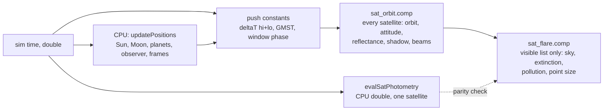

# Simulation

This section describes the physical model behind SAT LIGHT SIM: where things are, how they are oriented,
how bright they are and how much of that light reaches an observer. It is written for a reader who wants
to check the physics. How the results are drawn on screen is in [Rendering](../rendering/index.md); how
well the brightness model matches published measurements is in [Accuracy](../accuracy/index.md).

## What is simulated and what is approximated

The simulator answers one question for up to about ten million satellites, every frame: *how bright
does each satellite look from here, right now?* Everything else (beams, glare, sound) hangs off that
answer.

| Quantity | Model | Main approximation |
|---|---|---|
| Time | Seconds since J2000, real UTC through GMST | UT1 = UTC = TT; no leap seconds, no nutation |
| Earth | Sphere, \( R = 6371 \) km, rotating at the GMST rate | No oblateness in geometry; J2 only drives sun-synchronous precession |
| Orbits | Circular, two-body, fixed radius | No drag, no eccentricity, no perturbations besides the SSO node drift |
| Constellation phasing | Walker planes, random shells, terminator-aligned disks | Phases are synthetic (seeded random), not real catalogue elements |
| Attitude | Rigid groups with closed-form pointing laws and 1-DOF joints | No attitude noise or control error |
| Reflectance | Facet lobes: Lambert + GGX or Beckmann microfacet, Schlick Fresnel, Smith shadowing | Merged facets beyond a lobe budget; material values partly estimated |
| Earthshine | Exact irradiance from the lit cap of a Lambertian Earth, albedo 0.3 | Uniform albedo, no clouds or ocean glint |
| Self-shadowing | Ray tests between a model's primitives (opt-in) | 16 sample points per component |
| Earth's shadow | Umbra/penumbra cones from the Sun's and Earth's real sizes | Smoothstep across the penumbra, no refraction into the umbra |
| Atmosphere (point sources) | Two-component Chapman extinction, sky-brightness suppression, light-pollution dome | Fixed scale heights, no weather in the extinction |
| Sun | Astronomical Almanac low-precision series, about 0.01 deg | Mean equinox of date |
| Moon | Meeus chapter 47 main terms, about 0.05 deg | Truncated series |
| Planets | JPL approximate Keplerian elements, Schlyter magnitudes | No light time, no Saturn rings in the magnitude |
| Stars | Yale Bright Star Catalogue, 8404 stars to V = 6.5 | J2000 positions, no precession or proper motion |

The model stops at the top of the atmosphere for brightness: a magnitude computed by the photometric
model is the **above-atmosphere** (exo-atmospheric) apparent V magnitude. Extinction, sky brightness and
light pollution are then applied separately, see [Seeing a satellite from the ground](visibility.md).

## The CPU and the GPU

Two implementations of the same model exist, on purpose.

- **The GPU (float32)** evaluates every satellite every frame. `shaders/sat_orbit.comp` computes the
  orbit, attitude, reflectance and Earth shadow of each satellite and appends those above the horizon to
  a compact list. `shaders/sat_flare.comp` then applies everything that depends on the observer's sky.
- **The CPU (float64)** owns everything that is computed once per frame (the Sun, the Moon, the planets,
  the observer's frame) and is the reference for anything that must be *measured*: the selected
  satellite's magnitude readout, pass traces, bulk exports and the SatBench campaigns in
  [Accuracy](../accuracy/index.md). `evalSatPhotometry()` in `src/simulations/SatPhotometry.cpp` is a
  hand-kept double-precision mirror of the GPU chain.

Every frame the selected satellite is evaluated by both, with the CPU using exactly the inputs the GPU
dispatch used. A difference above 0.02 mag is logged. See
[Satellite photometry](photometry.md#the-cpu-evaluator-and-the-gpu-parity-check).

!!! warning "Invariant"
    The CPU and GPU copies are hand-mirrored: `satOrbitStateAt()` / `satEciAt()`,
    `evalGroupPoses()` / `groupFrame()`, `evalSatPhotometry()` / `modelFlux()`,
    `satGroundSiteIdeal()` / the ground-site block of `processSatellite()`, and
    `atmExtinctionMag()` in C++ and GLSL. A change to one without the other shows up as a parity
    mismatch, or worse, as benchmarks that stop describing what is drawn.

## Reversibility: state is a function of sim time

Every quantity in the satellite pipeline is a **pure function of the current sim time** (and of the
satellite's index). There is no integrated state: no velocity is stepped, no attitude is accumulated, no
"current target" is remembered from frame to frame. Consequences:

- Playing time backwards to an instant gives exactly the picture that playing forwards to it gives.
- Jumping by a year costs the same as advancing one frame.
- A screenshot, a benchmark sample and a trace row can each be reproduced from a timestamp alone.

This shapes several designs that would otherwise be simpler with state. The clearest example is the
mirror satellites: they choose a target per fixed time window and ease between aims in closed form,
rather than slewing step by step (see [Reflectors and beams](reflectors.md)).

A few things outside the satellite pipeline are deliberately eased over wall-clock time and are therefore
not reversible: the brightness of clustered beam lights on clouds, the solar trackers on the ground,
the dark-sky fade of the Milky Way and the Sun-glare gate. They are display smoothing, never inputs to a
magnitude.

## Precision strategy

Float32 has 24 bits of mantissa: about 0.4 m at Earth's radius, and much worse for products like an
orbital phase after a week. The rules that keep the simulation accurate:

1. **Time is split** into whole days and seconds within the day, both on the CPU, so it never loses
   precision however far it runs.
2. **The GPU sees small numbers.** Orbits are rebaked weekly so the elapsed time the shader multiplies is
   under seven days, and the phase product is formed in two-float arithmetic. See
   [Orbits](orbits.md#the-orbital-phase-in-two-float-arithmetic).
3. **Large-magnitude geometry is camera-relative.** Meshes, follow mode and terrain detail are placed
   in double on the CPU and handed to shaders relative to the eye or to an anchored lattice. See
   [Time and reference frames](time-and-frames.md#precision).

## Pages in this section

| Page | Covers |
|---|---|
| [Time and reference frames](time-and-frames.md) | sim time, J2000, GMST, ECI/ECEF/ENU, the observer's eye, precision |
| [Orbits and constellations](orbits.md) | circular orbits, Walker/RandomShell/Disk, SSO, the GPU orbit pass, error budget |
| [Attitude](attitude.md) | rigid attitude groups, pointing laws, joints, kinematic trees, legacy modes |
| [Satellite photometry](photometry.md) | facet lobes, BRDF, earthshine, self-occlusion, magnitudes, CPU evaluator |
| [Seeing a satellite from the ground](visibility.md) | Earth shadow, extinction, sky brightness, light pollution, point drawing |
| [Reflectors and beams](reflectors.md) | targeted mirrors, lock windows, beams, cloud occlusion, ground spots |
| [Sun, Moon and planets](sun-moon-planets.md) | ephemerides, eclipses, planets, the star catalogue |

## Where in the code

| File | What |
|---|---|
| `src/simulations/SatPhotometry.h/.cpp` | time and frame helpers, Sun and Moon, orbit state, earthshine, extinction, the CPU evaluator |
| `src/simulations/SatModel.h/.cpp` | attitude groups, geometry models, lobe baking, occlusion |
| `src/simulations/SatelliteSim.cpp` | `updatePositions()`, `buildOrbits()`, `uploadSatOrbits()`, stars and planets |
| `shaders/sat_orbit.comp` | per-satellite orbit, attitude, reflectance, Earth shadow, beams |
| `shaders/sat_flare.comp` | per-visible-satellite sky effects and point size |
| `shaders/include/atmosphere.glsl` | extinction along a line of sight |
| `shaders/include/point_style.glsl` | magnitude to point-spread function |
