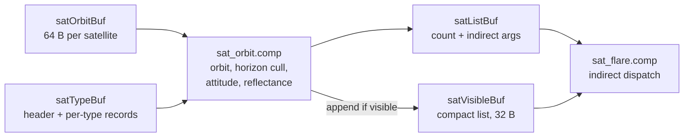

# Orbits and constellations

The orbit model, the three ways a constellation is laid out, sun-synchronous precession, and how the GPU
evaluates millions of orbits per frame without losing precision. How a constellation is declared in
`constellations.json` is on [Constellations](../modding/constellations.md).

## The orbit model

Every satellite flies a **circular two-body orbit** of fixed radius \( a = R + h \), with
\( R = 6371 \) km and \( h \) its altitude. Its state at time \( t \) (seconds since J2000) follows in
closed form from four numbers: the right ascension of the ascending node \( \Omega \), the inclination
\( i \), the argument of latitude at epoch \( u_0 \), and the mean motion

\[
n = \sqrt{\frac{GM}{a^3}}, \qquad GM = 3.986004418 \times 10^{14}\ \text{m}^3\,\text{s}^{-2}.
\]

The argument of latitude advances linearly, \( u(t) = u_0 + n t \), and the position in ECI is

\[
\mathbf{r} = a \begin{pmatrix}
\cos\Omega\cos u - \sin\Omega\sin u\cos i \\
\sin\Omega\cos u + \cos\Omega\sin u\cos i \\
\sin u \sin i
\end{pmatrix}.
\]

The unit along-track velocity is \( \partial\mathbf{r}/\partial u \) divided by \( a \):

\[
\hat{\mathbf{v}} = \begin{pmatrix}
-\sin u\cos\Omega - \cos u\cos i\sin\Omega \\
-\sin u\sin\Omega + \cos u\cos i\cos\Omega \\
\cos u\sin i
\end{pmatrix},
\]

already of unit length for a circular orbit. Nadir is \( -\hat{\mathbf{r}} \). These three vectors are
the inputs to every attitude law (see [Attitude](attitude.md)).

### What is left out

| Effect | Size in LEO | Status |
|---|---|---|
| Eccentricity | operational shells are near-circular (\( e < 0.001 \), under 7 km) | not modelled |
| J2 node regression for non-SSO shells | several deg/day | not modelled; only SSO disks precess |
| J2 apsidal and along-track effects | km per day | not modelled |
| Drag, solar radiation pressure, third bodies | decay over months | not modelled |
| Station-keeping, real phasing | n/a | phases are synthetic |

The positions are therefore **statistically** right for a shell (the right altitudes, planes and
density), not a prediction of where a particular real satellite is. For brightness statistics, which is
what the [benchmarks](../accuracy/benchmarks.md) compare, the shell geometry is what matters.

## Constellation layouts

A constellation entry produces `numPlanes × perPlane` satellites in one of three distributions
(`OrbitDistribution` in `src/simulations/SatelliteSim.h`, built by `buildOrbits()`).

### Walker

`numPlanes` planes with ascending nodes evenly spaced over 360 deg, all at the constellation's
inclination and altitude, `perPlane` satellites in each. Each satellite's \( u_0 \) is drawn uniformly at
random. This is not a Walker-delta phasing pattern with a fixed inter-plane phase offset: the planes are
regular, the satellites within a plane are not.

### RandomShell

`numPlanes × perPlane` independent satellites, each with

- \( \Omega \) uniform in \([0, 2\pi)\),
- \( i \) uniform in \([0, i_\text{max}]\) where \( i_\text{max} \) is the constellation's inclination,
- \( u_0 \) uniform,
- altitude \( h \pm \) a uniform jitter of `altJitterM`,
- a random tumble axis (uniform on the sphere), phase, and rate uniform in \([0, 2\pi \times 10^{-3}]\)
  rad/s (a tumble period of at least about 17 minutes).

It is used for debris. Note that a uniform inclination is not a uniform distribution over the sphere's
orbit normals; it concentrates satellites at low latitudes less than a physical isotropic cloud would.

### Disk

Concentric rings in **one** orbital plane: `numRings` rings centred on the constellation altitude and
spaced `ringSpacingM` apart, the satellites shared out between them (ceiling division, so the last ring
may hold fewer), evenly spaced around each ring with an optional altitude jitter. With
`alignTerminator` set, the plane is a dawn-dusk sun-synchronous plane, below.

### Randomness

Phases, shell elements and jitters come from the C library's `rand()` with its default seed, so a roster
lays out identically on every launch on the same platform (MSVC and glibc produce different sequences).
Satellite indices, and with them each satellite's random layout, follow the order of the constellations
in the file.

## Sun-synchronous orbits and terminator alignment

The Earth's oblateness makes an orbit's node regress at

\[
\dot\Omega = -\tfrac{3}{2}\, n\, J_2 \left(\frac{R}{a}\right)^2 \cos i,
\qquad J_2 = 1.08263 \times 10^{-3}.
\]

A **sun-synchronous** orbit chooses \( i \) so that \( \dot\Omega \) equals the Sun's mean motion,
\( \dot\Omega_\odot = 2\pi / (365.25 \times 86400\ \text{s}) \), keeping the plane fixed relative to
the Sun:

\[
\cos i = -\frac{\dot\Omega_\odot}{\tfrac{3}{2}\, n\, J_2\, (R/a)^2}.
\]

`computeSSOInclination()` solves this for **each ring's own altitude**, so a disk spanning hundreds of
kilometres is not biased by its centre altitude:

| Altitude | SSO inclination | Period |
|---|---|---|
| 500 km | 97.39 deg | 94.5 min |
| 575 km | 97.68 deg | 96.0 min |
| 1250 km | 100.65 deg | 110.4 min |
| 1925 km | 104.41 deg | 125.3 min |

The formula uses the mean radius 6371 km for \( R \) rather than the equatorial radius 6378 km that
defines \( J_2 \), which raises the computed inclination by about 0.02 deg at 500 km.

For an `alignTerminator` disk the node is anchored at the sim's start instant to put the plane along the
terminator:

\[
\Omega_0 = \operatorname{atan2}(s_x,\ -s_y),
\]

with \( \hat{s} \) the Sun's ECI direction at that instant. The ascending node is then 90 deg of right
ascension from the Sun: a dawn-dusk orbit whose plane faces the Sun. Afterwards the node advances
linearly, \( \Omega(t) = \Omega_0 + \dot\Omega_\odot\,(t - t_\text{start}) \). Anchoring at the start
instant, rather than extrapolating from J2000 at a constant rate, keeps the plane on the terminator
despite the Sun's non-uniform motion in right ascension (the equation of time, up to about 4 deg).

Non-SSO shells keep a fixed node. In reality a 53 deg shell at 550 km regresses about 4.5 deg per day; the
simulated shell's planes stay put in inertial space while the Earth turns under them, which is
indistinguishable for brightness statistics but not for following one real plane over days.

## The GPU orbit pipeline

All per-satellite work runs in `shaders/sat_orbit.comp`, one invocation per satellite, every frame. The
CPU only uploads the orbit table, a per-type table and a few push constants.

### The orbit record

`GpuSatOrbit` is 64 bytes of plain floats and integers (no `vec3`, so the C++ and std430 layouts agree
without padding). Only genuinely per-satellite data lives here; anything constant per type is in
`GpuSatType`.

| Offset | Fields |
|---|---|
| 0 | `raan`, `u0` (baked to the rebake epoch), `R_sat`, `meanMot` |
| 16 | `cosI`, `sinI`, `cosRaan`, `sinRaan` |
| 32 | `tumbleRate`, `tumblePhase`, `tumbleAxisX`, `tumbleAxisY` |
| 48 | `tumbleAxisZ`, `alignTerminator`, `typeIdx`, `constIdx` |

`constIdx` lets the shader skip a satellite whose constellation is disabled (a 32-bit mask, so at most
32 constellations can be toggled individually).

### Horizon cull and the compact list

A satellite is appended to the visible list only if the observer can see it. With
\( \mathbf{d} = \mathbf{r}_\text{sat} - \mathbf{r}_\text{obs} \) and \( \hat{u} \) the observer's up,
the line of sight is blocked when \( \sin(\text{el}) = \mathbf{d}\cdot\hat{u}/|\mathbf{d}| \) is below
the Earth-limb value \( -\sqrt{1 - (R/r_\text{obs})^2} \) (never above \(-0.01\)), **unless** the
satellite lies between the observer and the Earth (the closest approach of the line to the Earth's
centre is beyond the satellite). The test is done in squared form with no square root.

Survivors are appended by workgroup: each group of 64 counts its survivors in shared memory and makes
one global `atomicAdd`. The same pass keeps the indirect dispatch and draw arguments in `satListBuf`, so
`sat_flare.comp` and the point draws scale with the number of **visible** satellites (typically 5 to 10%
of the roster), not the roster.

!!! warning "Invariant"
    Slot order in the compact list is nondeterministic (atomic append). Every consumer that blends
    satellites is order-independent (additive), and per-satellite identity always goes through
    `satVisibleIdxBuf` (slot to satellite index), never through the slot number.

## The orbital phase in two-float arithmetic

The phase \( u = u_0 + n\,\Delta t \) is the one large product in the pipeline. With a 7-day
\( \Delta t \) and LEO mean motion, \( n\,\Delta t \approx 700 \) rad. A plain float32 product keeps
about 24 bits of it: an error of up to \( 4 \times 10^{-5} \) rad, which is 60 m median and 770 m
worst case along-track (measured below). That is invisible for a point of light seen from the ground but
not for a mesh placed next to its own sprite, or a camera riding alongside.

`orbitPhase()` computes the product exactly in float arithmetic:

1. \( \Delta t \) arrives as two floats, \( \Delta t_\text{hi} \) (the push constant `deltaT`) and
   \( \Delta t_\text{lo} \) (`GpuSatTypeHeader::deltaTLo`), split from the CPU's double.
2. \( n\,\Delta t_\text{hi} = p + e \) exactly, by Dekker's two-product over a Veltkamp split (both
   factors split into 12-bit halves with the constant 4097).
3. \( 2\pi \) is subtracted as \( A + B \), where \( A = 6.28271484375 \) has only 14 significant bits,
   so \( kA \) is exact for \( k < 1024 \) and \( p - kA \) is exact (Sterbenz).
4. \( u = (p - kA - kB) + (e + n\,\Delta t_\text{lo} + u_0) \), reduced modulo \( 2\pi \).

!!! warning "Invariant"
    Every intermediate in `orbitPhase()` is declared `precise` (SPIR-V `NoContraction`). A compiler that
    fuses a multiply-add or reassociates the sums loses the whole construction. It does not use
    `fma()`, which Vulkan does not guarantee to be fused.

### Position error budget

Measured by emulating the shader's float32 arithmetic over 200 000 satellites (altitudes 300 to
2000 km, \( \Delta t \) uniform in 0 to 7 days), as along-track position error against the double
result:

| Phase computation | Median | p99 | Max |
|---|---|---|---|
| plain float32 \( u_0 + n\,\Delta t \) | 61 m | 439 m | 773 m |
| `orbitPhase()` two-float | 1.1 m | 6.2 m | 9.2 m |

The remaining error is the float32 rounding of the final angle (\( 2\pi \times 2^{-24} \) is about
\( 4 \times 10^{-7} \) rad, 2.6 m at 7000 km) plus the rounding of the stored `u0` and `meanMot`. On top
of it come the float rounding of the position itself (about 0.5 m) and the GPU's `sin`/`cos`, whose
accuracy Vulkan leaves to the implementation. The CPU evaluator uses the same stored float elements
promoted to double, so its positions differ from the GPU's only by these rounding terms, not by a
different orbit.

Other small terms: the SSO node uses the plain float `deltaT` (its rate is \( 2 \times 10^{-7} \)
rad/s, so the error is negligible), and the tumble angle the same.

## The weekly rebake

The GPU's \( \Delta t \) is measured from an **orbit epoch**, not from J2000. `uploadSatOrbits()` bakes
each record at the current sim time \( t_e \):

\[
u_0' = (u_0 + n\,t_e) \bmod 2\pi, \qquad
\Omega_0' = \Omega_0 + \dot\Omega_\odot\,(t_e - t_\text{start}) \bmod 2\pi \ \ \text{(SSO only)},
\]

in double, and the shader adds \( n\,\Delta t \) with \( \Delta t = t - t_e \). `recordCompute()`
rebakes whenever \( |\text{day}(t) - \text{day}(t_e)| \geq 7 \), in either direction of time, so
\( |\Delta t| \) stays under 7 days (\( \Delta t_\text{hi} \) has a float ULP of 0.06 s there, and the
low half carries the rest).

The rebake streams the table through a 64 MB staging buffer (one million satellites at a time). At high
time warps (1 week/s and above) it runs every few frames.

## Rosters

The shipped roster `data/constellations.json` enables about 1.38 million satellites:

| Group | Satellites | Notes |
|---|---|---|
| Starlink Gen1, Gen2, Gen3 Broadband, Gen3 Direct-to-Cell | 54 872 | Walker, 326 to 550 km |
| OneWeb, Amazon Leo (3 shells), Guowang (3 shells) | 16 722 | Walker, 572 to 1200 km |
| ISS, Tiangong, seven commercial stations, three Starship depots | 12 | single-satellite Walker shells |
| SpaceX AI satellites | 1 000 000 | Disk, 2000 rings 0.7 km apart about 1250 km, terminator-aligned |
| Reflect Orbital | 5 000 | Disk, 3 rings about 500 km, terminator-aligned |
| Space junk | 300 000 | RandomShell, 1000 ± 500 km, inclination 0 to 180 deg |
| Hubble, 2020 Starlink benchmark shells | 3 169 | Walker |

The hard cap is `MAX_SATELLITES` = 10 000 000; GPU buffers are sized to the loaded roster, about
100 bytes per satellite. Larger stress rosters live in `data/custom/`.

## Settings

The constellation list, each constellation's enabled flag and highlight flag are persisted under
`constellations` (by name). Orbits themselves are defined only in `constellations.json`; see
[Constellations](../modding/constellations.md).

## Where in the code

| File | Function / symbol |
|---|---|
| `src/simulations/SatelliteSim.cpp` | `buildOrbits()`, `computeSSOInclination()`, `uploadSatOrbits()`, the rebake check and `deltaT` split in `recordCompute()` |
| `src/simulations/SatelliteSim.h` | `GpuSatOrbit`, `GpuSatTypeHeader`, `GpuSatListHeader`, `kOrbitRebakeDays` |
| `src/simulations/SatPhotometry.cpp` | `satOrbitStateAt()` (CPU double mirror) |
| `shaders/sat_orbit.comp` | `orbitPhase()`, `satEciAt()`, `processSatellite()`, `main()` (workgroup append) |
