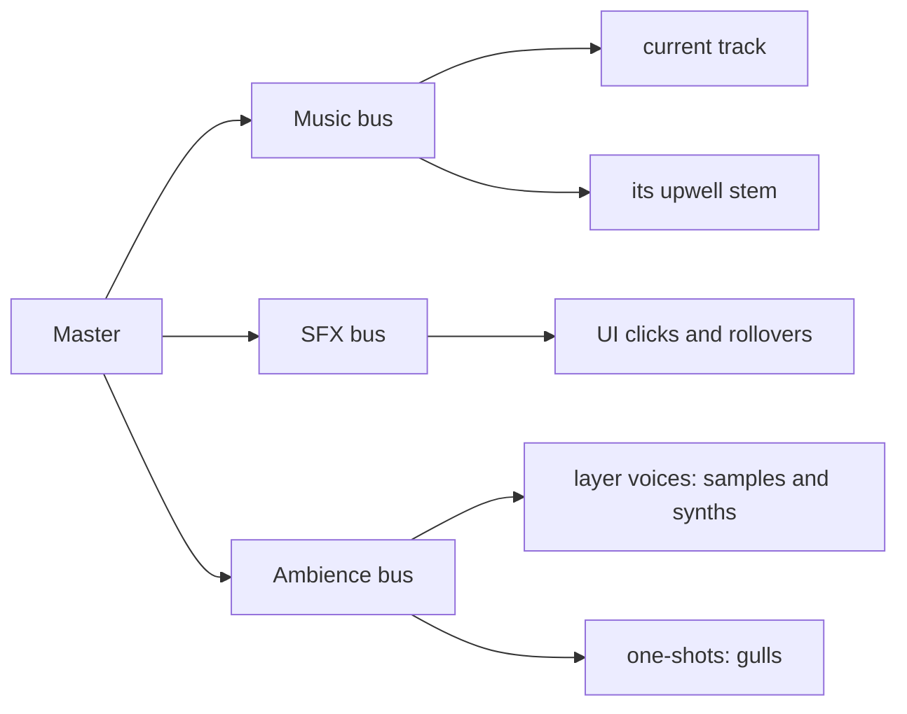
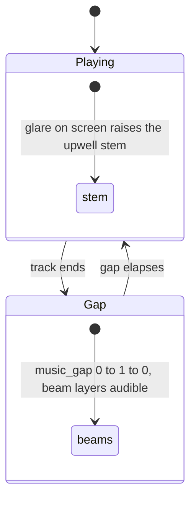

# Sound

SAT LIGHT SIM has two kinds of sound: a soundtrack, played by a small music player, and an ambience that
follows where the camera is and what it sees. This page explains how the two fit together and maps the
section. The details are on [Ambience](ambience.md) and [Music and tonality](music.md).

## The three buses

All audio goes through [miniaudio](https://miniaud.io) in `src/AudioSystem.cpp`. Every sound plays on one of
three sub-mixes (buses) under a master volume:

| Bus | What plays on it | User volume (Sound tab) | Automatic multiplier |
|---|---|---|---|
| Music | the playing track and its upwell stem | Music vol (default 0.6) | the altitude fade |
| SFX | UI button clicks and rollovers (`assets/sound/ui/`) | SFX vol (default 1.0) | none |
| Ambience | every ambience layer and one-shot | Ambience (default 0.8) | half during the intro |

The master volume defaults to 0.8. The automatic multipliers sit under the user's volume and are not
persisted.

## How music and ambience share the space

The ambience is designed to sit underneath the soundtrack, about 10 dB quieter than the music at every
place. Four mechanisms keep the two from fighting:

1. **A silent gap between tracks.** After a track ends, the player waits 30 s (the *Music gap* setting)
   before the next one starts. The ambience has the room to itself during that gap.
2. **The altitude fade.** Music plays at full volume up to 1500 km altitude, at half by 5000 km and is
   silent from 35 786 km (geostationary altitude) up, falling linearly in log altitude in between. The high
   orbits belong to two long ambience beds written for them. The fade moves at most a quarter of full scale
   per second, so a jump of thousands of kilometres fades over about four seconds.
3. **One key.** Every pitched ambience voice is a multiple of a single *tonal root*, and that root follows
   the key of the track that is playing. The soundtrack is analysed once to find its key, tuning and
   chords. See [Music and tonality](music.md#tonality-the-ambience-in-the-musics-key).
4. **Who answers the glare.** When many satellites flare on screen at once, something should respond in the
   sound. While a track plays, the *track itself* responds: each track has a companion *upwell stem*, a
   separate layer the composer wrote, which fades in under the music in proportion to the glare. Between
   tracks, the ambience's own beam sounds take over. The `music_gap` driver is the switch: it is 0 while a
   track plays and rises over the gap, and the beam layers are gated on it.

During the intro cinematic, which is cut to the first track, the whole ambience bus sits at half volume and
the upwell stem stays silent. Both return over about two seconds when the intro ends or is skipped.

## Where to go next

| Page | Covers |
|---|---|
| [Ambience](ambience.md) | the layer table (`assets/sound/ambience/ambience.json`) and its format, every context driver, the procedural synth voices, the samples, levels, the beam sounds, rain and thunder, offline rendering for the harness, `SoundTool` |
| [Music and tonality](music.md) | the playlist and its controls, upwell stems, the soundtrack analysis (`MusicAnalysis`), how the ambience's key follows the music, the Sound tab |

How a change *sounds* is for a person to judge. The [automation harness](../development/harness.md) can
read the layer gains back and render the mix to a WAV file deterministically, which checks that the right
layers are playing at the right levels, but it cannot say whether they sound good.

## Where in the code

| File | Role |
|---|---|
| `src/AudioSystem.h/.cpp` | miniaudio wrapper: the buses, the music player, upwell sync, ambience voices, offline rendering |
| `src/AmbientSynth.h/.cpp` | the procedural synth voices |
| `src/MusicAnalysis.h/.cpp` | the soundtrack analysis and its cache |
| `src/simulations/Ambience.h/.cpp` | the layer table: loading, evaluation, fades, events |
| `src/simulations/SatelliteSimAmbience.cpp` | the sim's side: context drivers, tonality, thunder, the upwell and altitude fades |
| `SatelliteSim::setAudio()` in `src/simulations/SatelliteSim.cpp` | builds the playlist and pairs each track with its stem |
| `assets/sound/` | `music/`, `ambience/` (the table, the samples, `CREDITS.txt`), `ui/` |
